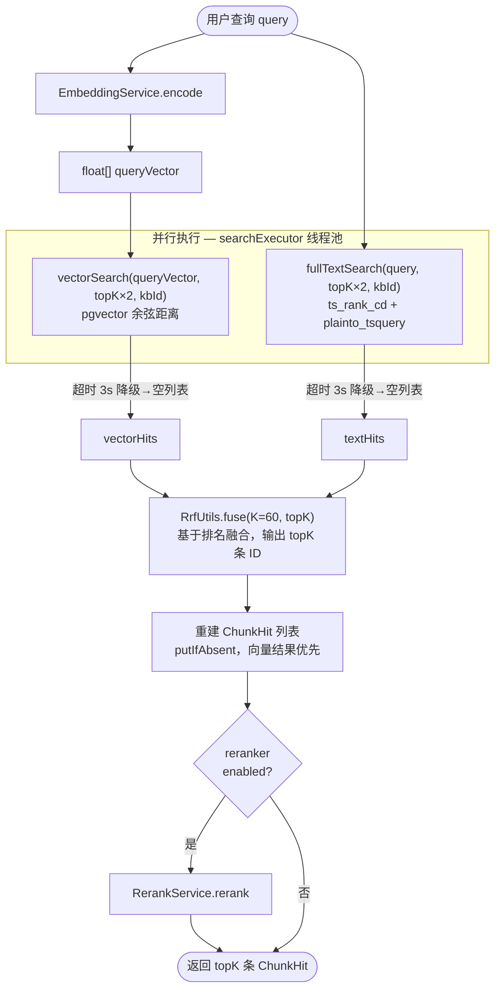
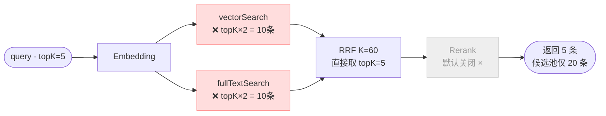
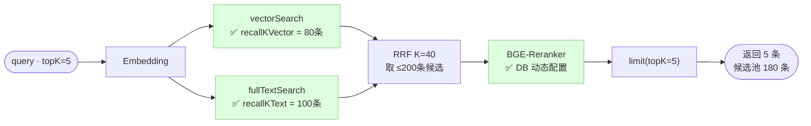
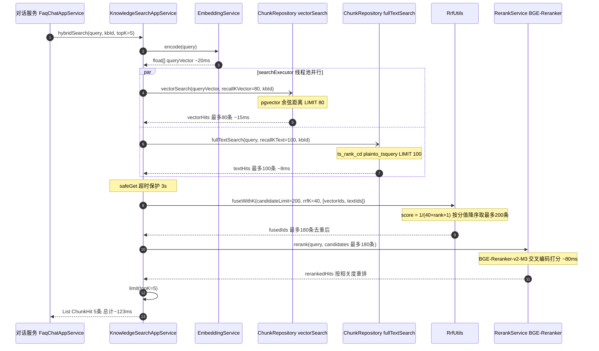
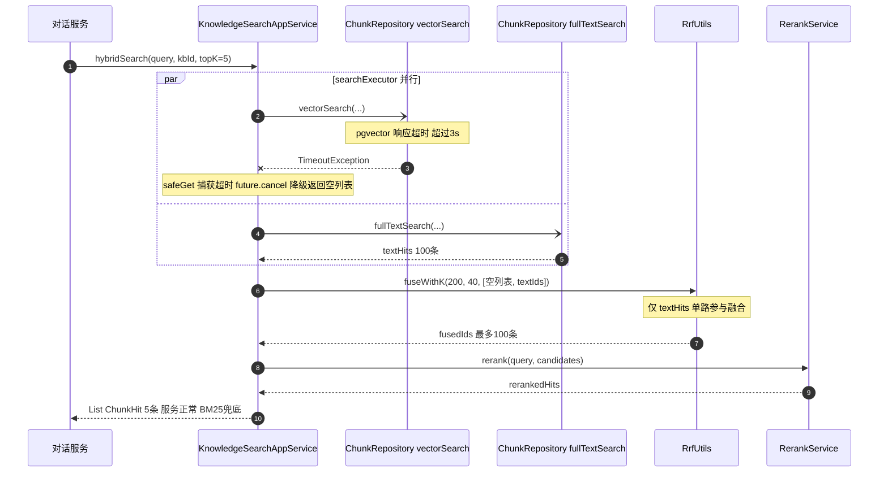
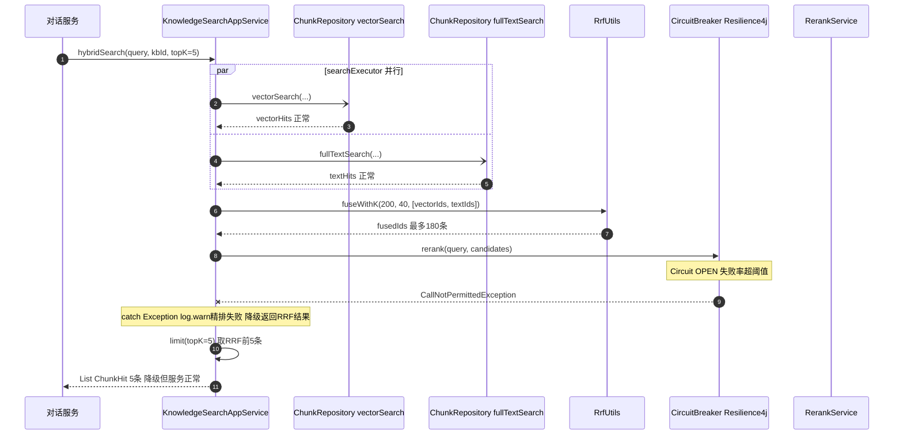
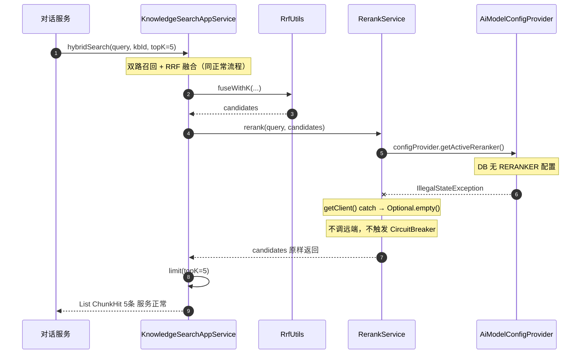

# Aria RAG 混合检索优化技术方案

## 1. 背景与目标

### 1.1 背景

Aria 客服系统的知识库检索模块（`ai-knowledge`）采用混合检索架构，同时运行 BM25 全文检索（PostgreSQL FTS）和向量检索（pgvector 余弦相似度），通过 RRF（Reciprocal Rank Fusion）融合两路结果，可选接入 BGE-Reranker 精排后返回 topK 条供对话服务构建 RAG 上下文。

该架构方向是正确的。但在对当前实现与业界标准做法进行对比分析后，发现存在若干影响检索质量的关键配置与实现问题，在中文客服场景下尤为明显。

### 1.2 目标

| 目标 | 说明 |
|---|---|
| 提升召回率 | 扩大双路召回池，减少因召回数量不足导致的相关内容遗漏 |
| 提升精排效果 | 激活并正确配置 BGE-Reranker，发挥精排对中文语义的优势 |
| 参数解耦 | 将"召回数量"与"最终返回数量 topK"解耦，支持独立调优 |
| 模型配置统一 | Reranker 配置纳入 auth-service 模型管理中心，支持热切换 |
| 可观测性 | 增加检索链路日志，支持后期数据驱动调优 |

### 1.3 范围

本文覆盖 `ai-knowledge/knowledge-service` 中的检索链路，以及相关的跨模块改动，涉及：

- `KnowledgeSearchAppService.java` — 检索编排
- `RerankService.java` — BGE-Reranker 精排服务（含热切换重构）
- `SearchProperties.java` — 检索参数配置类
- `RrfUtils.java` — RRF 融合算法
- `KnowledgeChunkMapper.xml` — 向量/全文 SQL
- `application.yml` / `application-prod.yml` — 检索参数配置
- `ai-auth` / `ai-common` — 模型配置体系扩展（RERANKER 类型）

不涉及 Embedding 模型替换、分块策略调整、文档解析管道变更。

## 2. 现有架构分析（改造前基线）

> 本章描述**改造前**的代码状态，作为问题分析的基线参考。

### 2.1 检索链路全景



### 2.2 关键代码现状（改造前）

**KnowledgeSearchAppService.hybridSearch（改造前精简版）：**

```java
public List<ChunkHit> hybridSearch(String query, String kbId, int topK) {
    float[] queryVector = embeddingService.encode(query);

    // 召回数与 topK 绑定：topK=5 时每路仅召 10 条
    CompletableFuture<List<ChunkHit>> vectorFuture = CompletableFuture.supplyAsync(
        () -> chunkRepository.vectorSearch(queryVector, topK * 2, kbId), searchExecutor);
    CompletableFuture<List<ChunkHit>> textFuture = CompletableFuture.supplyAsync(
        () -> chunkRepository.fullTextSearch(query, topK * 2, kbId), searchExecutor);

    List<ChunkHit> vectorHits = safeGet(vectorFuture, "向量检索", kbId);
    List<ChunkHit> textHits   = safeGet(textFuture,   "全文检索", kbId);

    // RRF 直接截断到 topK，没有独立的候选池概念
    List<String> fusedIds = RrfUtils.fuse(topK, List.of(vectorIds, textIds));
    // ...
}
```

**RerankService（改造前）：**

```java
// 通过 @ConditionalOnProperty 控制 Bean 是否创建
@Service
@ConditionalOnProperty(name = "knowledge.reranker.enabled", havingValue = "true")
public class RerankService {

    // 配置硬编码在 @Value，无法热切换
    public RerankService(
            @Value("${knowledge.reranker.base-url:http://localhost:8001}") String baseUrl,
            @Value("${knowledge.reranker.model-name:bge-reranker-v2-m3}") String modelName,
            @Value("${knowledge.reranker.timeout-seconds:10}") int timeoutSeconds) {
        // ...
    }
}
```

**改造前配置（application.yml 节选）：**

```yaml
knowledge:
  search:
    fts-config: simple          # 生产环境覆盖为 jieba
  reranker:
    enabled: false              # 默认关闭，开启需修改配置并重启
    base-url: http://localhost:8001
    model-name: bge-reranker-v2-m3
    timeout-seconds: 10
```

**对话服务默认参数（KnowledgeServiceClient）：**

```yaml
knowledge:
  search:
    top-k: 5                    # 默认 topK
```

**RrfUtils.fuseWithK（核心算法，不变）：**

```java
public static List<String> fuseWithK(int topK, int k, List<List<String>> lists) {
    Map<String, Double> scores = new LinkedHashMap<>();
    for (List<String> list : lists) {
        for (int rank = 0; rank < list.size(); rank++) {
            scores.merge(list.get(rank), 1.0 / (k + rank + 1), Double::sum);
        }
    }
    return scores.entrySet().stream()
        .sorted(Map.Entry.<String, Double>comparingByValue().reversed())
        .limit(topK)
        .map(Map.Entry::getKey)
        .toList();
}
```

### 2.3 数据库层

**向量检索 SQL（selectByVector）：**

```sql
SELECT ..., (1 - (content_vector <=> #{queryVector, typeHandler=PgVectorTypeHandler})) AS score
FROM knowledge_chunk
WHERE kb_id = #{kbId}
  AND doc_status = 'PUBLISHED'
  AND retrieval_weight > 0
ORDER BY content_vector <=> #{queryVector, typeHandler=PgVectorTypeHandler}
LIMIT #{topK}
```

**全文检索 SQL（selectByFullText）：**

```sql
SELECT ..., ts_rank_cd(content_tsv, plainto_tsquery('${tsConfig}', #{query})) AS score
FROM knowledge_chunk
WHERE kb_id = #{kbId}
  AND doc_status = 'PUBLISHED'
  AND retrieval_weight > 0
  AND content_tsv @@ plainto_tsquery('${tsConfig}', #{query})
ORDER BY score DESC
LIMIT #{topK}
```

## 3. 问题根因分析

### 3.1 问题一：召回池过小，混合检索优势被压缩

**现象：**

改造前每路召回数量固定为 `topK * 2`。对话服务默认 `topK=5`，因此每路实际只召回 **10 条**，两路合并去重后送入 RRF 的候选池最多 **20 条**，取出 5 条返回。

**根因：**

"最终返回数量（topK）"与"召回阶段数量（recallK）"绑定在同一个参数上，导致两个完全不同职责的参数互相干扰：

```
topK=5  →  每路召回 10 条  →  候选池 ≤ 20 条  →  RRF 取 5 条
topK=20 →  每路召回 40 条  →  候选池 ≤ 80 条  →  RRF 取 20 条
```

混合检索的设计初衷是：用 **大召回池** 覆盖两种检索方式各自的盲区，再通过融合与精排找出最相关的少量结果。当召回池只有 20 条时，BM25 和向量检索各自的召回优势根本无法体现。

**量化影响：**

以"召回率@100"评估为例，每路召回 10 条 vs 80 条时，相关文档被召回的概率差距通常在 **15%~30%**（取决于知识库大小与查询类型）。这个差距在精排阶段无法弥补——Reranker 只能从候选中挑选，无法凭空召回被遗漏的相关文档。

---

### 3.2 问题二：BGE-Reranker 精排能力闲置，且缺乏统一配置管理

**现象（改造前）：**

```yaml
knowledge:
  reranker:
    enabled: false   # 生产环境也是 false，且配置分散在本服务
    base-url: http://localhost:8001
    model-name: bge-reranker-v2-m3
    timeout-seconds: 10
```

`RerankService` 通过 `@ConditionalOnProperty(name="knowledge.reranker.enabled", havingValue="true")` 控制 Bean 是否创建，配置通过 `@Value` 硬绑定在构造函数，无法在运行时热切换。

**根因分析：**

Reranker 被关闭且配置分散有以下问题：

1. **精排能力闲置**：候选池小（20 条）时 Reranker 提升有限，形成与问题一的恶性循环
2. **配置割裂**：CHAT/EMBEDDING/ROUTER 模型已统一在 auth-service 后台管理，RERANKER 却孤立在本服务的 yml 中，需要重启才能切换地址或模型
3. **无热切换**：生产环境换一台 GPU 服务器，需要修改配置文件并重新部署

**问题一和问题二互为因果**：召回池小 → Reranker 没用 → 开关一直关着 → 不优化召回也无所谓。

---

### 3.3 问题三：RRF 的 K 值与场景不匹配

**现象：**

```java
private static final int DEFAULT_K = 60;
// RrfUtils.fuse 始终用 K=60
```

**根因：**

K=60 是 Cormack 等人 2009 年原始论文中针对**大规模文档集、topK 较大**场景（如 top-1000）的推荐值。其作用是平滑不同排名位置之间的分值差距，避免头部结果分值过于集中。

当 topK 很小（如 5~20）时，K=60 会使 RRF 对头部排名的区分度不足——第 1 名和第 5 名的得分差距被过度平滑，导致融合结果不够"尖锐"。

理论值：
- K=60, rank=1: score = 1/61 ≈ 0.0164
- K=60, rank=5: score = 1/65 ≈ 0.0154
- 差距仅 6%

- K=40, rank=1: score = 1/41 ≈ 0.0244
- K=40, rank=5: score = 1/45 ≈ 0.0222
- 差距 9%

对于 topK=5~20 的场景，K 调低到 **30~40** 能让 RRF 对头部结果更敏感。

---

### 3.4 问题四：向量检索与全文检索分配相同数量，未区分优先级

**现象（改造前）：**

```java
chunkRepository.vectorSearch(queryVector, topK * 2, kbId)   // 同数量
chunkRepository.fullTextSearch(query,     topK * 2, kbId)   // 同数量
```

**根因：**

BM25 全文检索的计算量远低于向量 ANN 检索，且 BM25 对于精确匹配（产品型号、专业术语）的精准率更高，是强保底策略。在中文客服场景下，用户经常输入精确的产品名称或错误代码，BM25 应该被赋予更多召回配额。

业界通行做法（如 BAAI 官方 RAG 指南）是：BM25 召回数略多于向量检索，比例约为 **6:4 ~ 5:5**，根据知识库内容特点调整。

## 4. 方案调研对比

### 4.1 融合策略对比

业界主流的双路召回融合方案有四种，下表从算法原理、工程复杂度、中文适配性等维度做横向对比：

| 维度 | RRF（当前） | Min-Max 加权融合 | DBSFusion | SPLADE 稀疏向量 |
|---|---|---|---|---|
| **算法原理** | `1/(K+rank)` 基于排名 | 归一化原始分值后加权 | Z-score 归一化后加权 | 训练型稀疏向量替代 BM25 |
| **是否需要训练数据** | 否 | 否（需调权重） | 否（需调权重） | 是（需微调模型） |
| **量纲敏感性** | 完全免疫 | 敏感，受异常值影响 | 较强健壮性 | N/A（单路输出） |
| **实现复杂度** | 低 ✅ | 低 | 中 | 高 |
| **权重可调性** | 通过 K 值间接调 | α/β 直接控制 | 分布参数控制 | 模型权重决定 |
| **中文适配** | 中性 | 中性 | 中性 | 需中文训练语料 |
| **代表框架** | LlamaIndex、Haystack | Elasticsearch 8.x | LangChain EnsembleRetriever | ColBERT-v2、Naver SPLADE |
| **生产稳定性** | 高，15年验证 | 高 | 中（较新） | 低（部署复杂） |

**结论：对于当前技术栈（pgvector + 无标注数据），RRF 仍是最优选择。**

---

### 4.2 召回数量策略对比

| 策略 | 描述 | 优点 | 缺点 |
|---|---|---|---|
| **固定乘数（改造前：topK×2）** | 召回数 = topK × 固定系数 | 简单 | topK 小时候选池极小；topK 大时浪费资源 |
| **完全独立参数（已实现）** | recallK 与 topK 完全解耦 | 最灵活，低 topK 有保底 | 需单独运维两套参数 |
| **自适应（动态）** | 根据 kbId 知识库大小动态调整 | 精细化 | 实现复杂，可观测性差 |

业界实践参考：

- **LlamaIndex HybridRetriever**：默认每路召回 `similarity_top_k=2` 倍于最终 top-k，实际推荐配置 50~100
- **Haystack InMemoryBM25Retriever**：默认 `top_k=10`，官方文档建议 Reranker 前送入至少 50 条
- **BAAI/FlagEmbedding 官方 RAG 指南**：建议送入 Reranker 的候选数为 **100~200 条**，超过 200 后 BGE-Reranker-v2-M3 的延迟增长明显，但效果提升趋于平缓
- **Elasticsearch 官方混合搜索示例**：每路召回 50 条，合并后 100 条送精排，最终取 top-10

---

### 4.3 Reranker 原理：与向量模型的区别

#### Bi-Encoder（向量模型，用于召回）

```
query  → Embedding Model → [0.12, 0.87, ...]  ─┐
                                                  ├─ cosine(q, d) = 0.83
doc    → Embedding Model → [0.15, 0.91, ...]  ─┘
```

query 和文档**各自独立**编码成向量，两者互不感知。文档向量可以**提前离线计算**存入 pgvector，查询时只需向量化 query 做 ANN 检索，速度极快（毫秒级，支持千万级向量库）。

代价是精度有损耗——余弦相似度只是粗略估计，无法捕捉细粒度的语义关联，例如：
- query "空调不制冷" 和文档 "制冷剂泄漏排查步骤" 向量相似度可能不高，但实际高度相关
- 精确型号 "iPhone 15 256GB" 容易被语义相近但实际无关的结果干扰

#### Cross-Encoder（Reranker，用于精排）

```
[CLS] query [SEP] doc_1 [SEP] → BERT → 相关性分数 0.97
[CLS] query [SEP] doc_2 [SEP] → BERT → 相关性分数 0.23
[CLS] query [SEP] doc_3 [SEP] → BERT → 相关性分数 0.81
```

把 query 和文档**拼成一段文本**一起送进模型。内部 Self-Attention 让 query 的每个词都能"看到"文档的每个词，反之亦然。这种**交叉注意力**使模型能判断：

- "这段文档在回答这个问题吗？"
- "query 里的核心意图词和文档的哪部分对应？"
- "文档的隐含语义是否匹配 query 的真实需求？"

代价是**文档无法预先计算**，每次查询都要把 query+每个候选文档重新推理一遍，100 条候选就是 100 次前向传播，耗时数十毫秒到几百毫秒。

#### 为什么 RAG 要两者配合

```
海量知识库（数万条 chunk）
        │
        │  ① 向量检索（Bi-Encoder）：快，允许有误差，用于粗筛
        │     pgvector ANN，毫秒级，每秒处理数千请求
        ↓
候选集（80~200 条）
        │
        │  ② BGE-Reranker（Cross-Encoder）：慢但准，用于精排
        │     只处理小候选集，延迟可接受（~80ms）
        ↓
最终结果（5~20 条，送给 LLM 构建 RAG 上下文）
```

类比：向量检索像**简历筛选**（快速过滤明显不匹配的），Reranker 像**面试**（对剩余候选人深入评估）。**召回池越大，面试的价值越高**——这也是召回数量扩大和 Reranker 激活必须同时做的根本原因。

#### BGE-Reranker-v2-M3 说明

BAAI（北京人工智能研究院）发布，"M3"含义：

| 字母 | 含义 | 说明 |
|---|---|---|
| **M**ultilingual | 多语言 | 支持 100+ 语言，中英双语效果尤佳 |
| **M**ulti-functionality | 多功能 | 既可做 Reranker，也可做 Embedding |
| **M**ulti-granularity | 多粒度 | 短查询和长文档均有良好表现 |

---

### 4.4 Reranker 方案对比

| 方案 | 延迟（100条候选，GPU） | 中文效果 | 部署复杂度 | 适配现有接口 |
|---|---|---|---|---|
| **BGE-Reranker-v2-M3（已接入）** | 50~100ms | ⭐⭐⭐⭐⭐ 专为中英双语设计 | 低（已接入） | ✅ 已有完整代码 |
| BGE-Reranker-v2-Large | 100~200ms | ⭐⭐⭐⭐⭐ | 低 | ✅ 同接口 |
| Cohere Rerank（云服务） | 200~500ms（网络） | ⭐⭐⭐⭐ | 极低（API调用） | 需改 HTTP 客户端 |
| Cross-Encoder 自训练 | 取决于模型大小 | 取决于训练数据 | 高 | 需重新开发 |

**结论：BGE-Reranker-v2-M3 是当前最优选择，接口已重构为动态配置，可在后台热切换。**

---

### 4.5 RRF K 值调研

原始论文（Cormack et al., 2009, SIGIR）将 K=60 用于 TREC 竞赛评测，候选文档数在 1000 量级。

后续研究（Lin, 2021; Saad-Falcon et al., 2023）表明：

- **K=60** 适合大候选池（500+）、topK 较大（top-100）的场景，分值平滑效果好
- **K=20~40** 适合小候选池（100~300）、topK 较小（top-5~20）的场景，头部区分度更好
- K 值对最终效果的影响通常在 **1%~3% MRR@10**，属于细节调优，不是主要优化方向

针对 Aria 的场景（候选池 200 条、topK 5~20），将 K 从 60 调整为 **40**，作为稳妥的折中值。

---

### 4.6 方案选型决策

综合以上调研，确定优化方向为：

1. **融合算法：保持 RRF**，微调 K 值（60→40），通过 `SearchProperties.rrfK` 配置
2. **召回数量：解耦 recallK 与 topK**，引入 `SearchProperties.recallKVector` / `recallKText` 独立参数
3. **精排：激活 BGE-Reranker**，通过 `SearchProperties.rerankerCandidateLimit` 控制候选上限
4. **模型配置统一：Reranker 配置迁移到 auth-service**，与 CHAT/EMBEDDING/ROUTER 同等管理，支持热切换
5. **两路分配：BM25 略多于向量**（100:80），反映中文客服场景的字面匹配需求

## 5. 推荐方案详细设计

### 5.1 整体架构变化

**改造前：** `topK` 与召回数绑定，topK=5 时候选池仅 20 条



**改造后：** `recallK` 独立配置，大池子召回 → RRF 融合 → Reranker 精排 → 截断 topK



---

### 5.2 新增配置参数（SearchProperties）

Reranker 的 `base-url / model-name / api-key / timeout` 已迁移到 auth-service AI 模型配置中心（RERANKER 类型），通过后台统一管理，支持热切换，无需重启。

`application.yml` 中仅保留与检索算法相关的调优参数，通过 `SearchProperties` 绑定：

```yaml
knowledge:
  search:
    fts-config: simple                  # PostgreSQL FTS 分词：simple（本地）/ jieba（生产）
    recall-k-vector: 80                 # 向量 ANN 召回数，独立于 topK
    recall-k-text: 100                  # BM25 全文召回数，独立于 topK
    reranker-candidate-limit: 200       # RRF 融合后送 Reranker 的候选上限
    rrf-k: 40                           # RRF 平滑系数 K
```

**参数说明：**

| 参数 | 默认值 | 说明 | 调优方向 |
|---|---|---|---|
| `recall-k-vector` | 80 | 向量 ANN 检索候选数 | 知识库大、多样性查询 → 调大 |
| `recall-k-text` | 100 | BM25 全文检索候选数 | 精确匹配多（产品编号等）→ 调大 |
| `reranker-candidate-limit` | 200 | RRF 融合后送 Reranker 的上限 | 受 Reranker GPU 算力约束 |
| `rrf-k` | 40 | RRF 平滑系数 | topK 大 → 调大；topK 小 → 调小 |

---

### 5.3 SearchProperties 配置类

新建 `SearchProperties.java`，集中管理检索参数：

```java
// ai-knowledge/knowledge-service/src/main/java/
// com/aria/knowledge/infrastructure/config/SearchProperties.java

@Validated
@ConfigurationProperties(prefix = "knowledge.search")
public record SearchProperties(

    @NotBlank
    @DefaultValue("simple")
    String ftsConfig,

    @Min(10) @Max(500)
    @DefaultValue("80")
    int recallKVector,

    @Min(10) @Max(500)
    @DefaultValue("100")
    int recallKText,

    @Min(50) @Max(500)
    @DefaultValue("200")
    int rerankerCandidateLimit,

    @Min(1) @Max(100)
    @DefaultValue("40")
    int rrfK
) {}
```

在 `KnowledgeApplication.java` 上注册：

```java
@EnableConfigurationProperties(SearchProperties.class)
@SpringBootApplication
public class KnowledgeApplication { ... }
```

---

### 5.4 RerankService 重构（热切换架构）

**核心变化：**

| 改造前 | 改造后 |
|---|---|
| `@ConditionalOnProperty(enabled=true)` 控制 Bean | Bean 始终存在，降级由内部逻辑处理 |
| `@Value` 硬绑定 base-url/model/timeout | `AiModelConfigProvider.getActiveReranker()` 动态获取 |
| 更换配置需重启 | Caffeine 缓存热切换，配置变更自动生效 |
| 无配置 → Bean 不创建 → 注入为 null | 无配置 → `getClient()` 返回 empty → 透明降级 |

**两个独立降级路径：**

```
DB 无 active RERANKER 配置
    → configProvider.getActiveReranker() 抛 IllegalStateException / UnsupportedOperationException
    → getClient() catch → 返回 Optional.empty()
    → rerank() 直接返回 candidates（不调远端，不触发 CircuitBreaker）

Reranker 服务宕机/超时
    → @CircuitBreaker(name="reranker") fallback
    → rerankFallback() 返回原候选列表
```

**Caffeine 热切换（精简）：**

```java
@Service
public class RerankService {

    // key = SHA-256(baseUrl|modelName|maskedApiKey)，max 3 entries，30min idle evict
    private final Cache<String, RerankerClient> clientCache = Caffeine.newBuilder()
            .maximumSize(3).expireAfterAccess(30, TimeUnit.MINUTES).build();

    private final AiModelConfigProvider configProvider;

    @CircuitBreaker(name = "reranker", fallbackMethod = "rerankFallback")
    public List<ChunkHit> rerank(String query, List<ChunkHit> candidates) {
        if (candidates.isEmpty()) return candidates;

        Optional<RerankerClient> clientOpt = getClient();
        if (clientOpt.isEmpty()) {
            log.debug("[Reranker] 无 active RERANKER 配置，跳过精排");
            return candidates;         // 透明降级
        }
        // ... POST /rerank，按 relevance_score 重排
    }

    private Optional<RerankerClient> getClient() {
        try {
            AiModelConfig config = configProvider.getActiveReranker();
            String key = buildCacheKey(config);   // SHA-256 防配置泄露
            return Optional.of(clientCache.get(key, k -> buildClient(config)));
        } catch (IllegalStateException | UnsupportedOperationException e) {
            // DB 无配置 or 实现类未覆盖接口方法 → 降级，不依赖 AOP
            log.debug("[Reranker] 无/不支持 RERANKER 配置，降级跳过: {}", e.getMessage());
            return Optional.empty();
        }
    }
}
```

---

### 5.5 KnowledgeSearchAppService 改造

**核心改动：**

1. `topK * 2` → 独立参数 `searchProps.recallKVector()` / `searchProps.recallKText()`
2. `RrfUtils.fuse(topK, ...)` → `RrfUtils.fuseWithK(candidateLimit, rrfK, ...)`，先到 candidateLimit 再 Reranker
3. Reranker 精排后 `.stream().limit(topK)` 截断
4. `RerankService` 改为必需构造器注入（Bean 始终存在，内部自己处理降级）

```java
@Service
public class KnowledgeSearchAppService {

    private final KnowledgeChunkRepository chunkRepository;
    private final EmbeddingService         embeddingService;
    private final RerankService            rerankService;    // 必需注入，不再 required=false
    private final SearchProperties         searchProps;
    private final Executor                 searchExecutor;

    public List<ChunkHit> hybridSearch(String query, String kbId, int topK) {
        float[] queryVector = embeddingService.encode(query);

        // 召回数独立于 topK
        CompletableFuture<List<ChunkHit>> vectorFuture = CompletableFuture.supplyAsync(
            () -> chunkRepository.vectorSearch(queryVector, searchProps.recallKVector(), kbId),
            searchExecutor);
        CompletableFuture<List<ChunkHit>> textFuture = CompletableFuture.supplyAsync(
            () -> chunkRepository.fullTextSearch(query, searchProps.recallKText(), kbId),
            searchExecutor);

        List<ChunkHit> vectorHits = safeGet(vectorFuture, "向量检索", kbId);
        List<ChunkHit> textHits   = safeGet(textFuture,   "全文检索", kbId);

        log.info("[hybridSearch] kbId={} query_len={} vector_hits={} text_hits={}",
            kbId, query.length(), vectorHits.size(), textHits.size());

        if (vectorHits.isEmpty() && textHits.isEmpty()) return List.of();

        // RRF 融合到 rerankerCandidateLimit，不直接截断到 topK
        List<String> fusedIds = RrfUtils.fuseWithK(
            searchProps.rerankerCandidateLimit(),
            searchProps.rrfK(),
            List.of(vectorIds, textIds));

        // 重建候选集（向量结果优先）
        Map<String, ChunkHit> chunkMap = vectorHits.stream()
            .collect(Collectors.toMap(ChunkHit::getChunkId, h -> h));
        textHits.forEach(h -> chunkMap.putIfAbsent(h.getChunkId(), h));
        List<ChunkHit> candidates = fusedIds.stream()
            .filter(chunkMap::containsKey).map(chunkMap::get)
            .collect(Collectors.toList());

        log.debug("[hybridSearch] kbId={} fused={}", kbId, candidates.size());

        // Reranker 精排（无配置时透明降级），最后截断到 topK
        List<ChunkHit> reranked = rerankService.rerank(query, candidates);
        log.info("[hybridSearch] kbId={} after_rerank={} topK={}", kbId, reranked.size(), topK);

        return reranked.stream().limit(topK).collect(Collectors.toList());
    }

    /** 独立精排入口，供 POST /internal/knowledge/rerank 调用 */
    public List<ChunkHit> rerank(String query, List<ChunkHit> candidates) {
        return rerankService.rerank(query, candidates);
    }

    /** 管理后台检索测试入口 */
    public List<ChunkHit> managementSearch(String query, String kbId, int topK) {
        return hybridSearch(query, kbId, topK);
    }
}
```

---

### 5.6 RrfUtils 无需改动

`fuseWithK(int topK, int k, List<List<String>> lists)` 接口已支持自定义 K 值，只需在调用侧传入 `searchProps.rrfK()` 即可。

---

### 5.7 数据库层无需改动

`selectByVector` 和 `selectByFullText` 的 `LIMIT #{topK}` 参数已通过 MyBatis 动态传入，召回数量的变化只影响参数值，不需要修改 SQL 或 Mapper。

---

### 5.8 延迟影响评估

| 阶段 | 改造前（topK=5） | 改造后 | 增量 |
|---|---|---|---|
| Embedding encode | ~20ms | ~20ms | 0 |
| 向量检索（pgvector） | ~5ms（10条） | ~15ms（80条） | +10ms |
| 全文检索（FTS） | ~3ms（10条） | ~8ms（100条） | +5ms |
| RRF 融合 | <1ms | <1ms | 0 |
| BGE-Reranker（GPU） | 跳过 | ~80ms（200条） | +80ms |
| **总计** | **~28ms** | **~123ms** | **+95ms** |

对于客服场景（用户期待的响应时间 1~3s），增加约 100ms 在可接受范围内。Reranker 的 Circuit Breaker 保证了在 Reranker 不可用时自动降级，不影响可用性。

若对延迟敏感，可将 `reranker-candidate-limit` 调低至 100 条，Reranker 延迟可降至约 40ms。

**Resilience4j Circuit Breaker 配置（针对 GPU 推理慢调用场景）：**

```yaml
resilience4j:
  circuitbreaker:
    instances:
      reranker:
        sliding-window-size: 20
        failure-rate-threshold: 50
        slow-call-duration-threshold: 5s     # GPU 推理超 5s 视为慢调用
        slow-call-rate-threshold: 80
        wait-duration-in-open-state: 30s
        permitted-number-of-calls-in-half-open-state: 3
        minimum-number-of-calls: 5
```

---

### 5.9 请求时序图

#### 正常流程



#### 降级场景一：向量检索超时



#### 降级场景二：Reranker Circuit Breaker 熔断



#### 降级场景三：DB 无 active RERANKER 配置



## 6. 实施计划

### 6.1 改动范围汇总

本次改造跨越 4 个模块，共涉及 17 处文件变更：

| 模块 | 文件 | 改动类型 | 说明 |
|---|---|---|---|
| `ai-auth/auth-client` | `ModelScope.java` | 修改 | 加 `RERANKER` 枚举值 |
| `ai-auth/auth-service` | `AiModelConfigService.java` | 修改 | 加 `getActiveRerankerConfig()` + RERANKER testConnection 拦截 |
| `ai-auth/auth-service` | `InternalAiModelController.java` | 修改 | 加 `GET /active-reranker` |
| `ai-auth/auth-service` | `LocalAiModelConfigProvider.java` | 修改 | 加 `getActiveReranker()` / `invalidateReranker()` |
| `ai-common/common-web` | `AiModelScopeDefaults.java` | 修改 | 加 `RERANKER(0.0, 0, 10)` |
| `ai-common/common-web` | `AiModelConfigProvider.java` | 修改 | 加 `default getActiveReranker()` + `default invalidateReranker()` |
| `ai-common/common-web` | `RemoteAiModelConfigProvider.java` | 修改 | 加 RERANKER 缓存键 + 方法 + onMessage |
| `ai-knowledge` | `SearchProperties.java` | 新建 | `@ConfigurationProperties` 绑定检索调优参数 |
| `ai-knowledge` | `KnowledgeApplication.java` | 修改 | 加 `@EnableConfigurationProperties(SearchProperties.class)` |
| `ai-knowledge` | `RerankService.java` | **重构** | 移除 `@ConditionalOnProperty`/`@Value`，改用 `AiModelConfigProvider` + Caffeine 热切换 |
| `ai-knowledge` | `KnowledgeSearchAppService.java` | 修改 | 注入 `SearchProperties`，召回数解耦，RRF 参数化，Rerank 后截断 |
| `ai-knowledge` | `application.yml` | 修改 | 加 SearchProperties 配置 + Resilience4j CB 配置，移除 `knowledge.reranker.*` |
| DB Schema | `auth-service-schema.sql` | 修改 | CHECK 约束加 RERANKER，注释更新 |
| DB Schema | `init-db.sql` | 修改 | CHECK 约束 + RERANKER seed 行（id=11）+ setval→11 |
| 补丁脚本 | `patch-reranker-model-type.sql` | 新建 | 已有部署手动升级（幂等） |
| 文档 | `hybrid-search-redesign.md` | 新建 | 本文档 |
| 测试 | `RerankServiceTest.java` | 新建 | 5 tests |
| 测试 | `KnowledgeSearchAppService_SearchPropsTest.java` | 新建 | 8 tests |

**不涉及改动：**
- `RrfUtils.java` — `fuseWithK` 接口已满足需求
- `KnowledgeChunkMapper.xml` — SQL LIMIT 参数动态传入，无需修改
- `KnowledgeChunkRepository.java` — 接口签名不变

---

### 6.2 阶段一：auth-service 模型配置扩展（低风险，0.5人天）

**Step 1：扩展 DB Schema**

执行 `docs/sql/patch-reranker-model-type.sql`（已有部署）或确认 `init-db.sql` 已包含变更（全新部署）：

```sql
-- CHECK 约束扩展（幂等）
ALTER TABLE cs_auth.ai_model_config
    DROP CONSTRAINT IF EXISTS ai_model_config_model_type_check;
ALTER TABLE cs_auth.ai_model_config
    ADD CONSTRAINT ai_model_config_model_type_check
        CHECK (model_type = ANY (ARRAY['CHAT','EMBEDDING','ROUTER','RERANKER']));

-- 插入默认 RERANKER 配置（本地开发用）
INSERT INTO cs_auth.ai_model_config (...) VALUES (11, '本地 BGE-Reranker-v2-M3', ...)
ON CONFLICT (id) DO NOTHING;
```

**Step 2：部署 auth-service**

- `ModelScope` 枚举加 `RERANKER`
- `AiModelConfigService.getActiveRerankerConfig()`
- `InternalAiModelController.GET /active-reranker`
- `LocalAiModelConfigProvider.getActiveReranker()`

**Step 3：部署 common-web**

- `AiModelScopeDefaults.RERANKER(0.0, 0, 10)`
- `AiModelConfigProvider.default getActiveReranker()`（向后兼容，抛 UnsupportedOperationException）
- `RemoteAiModelConfigProvider` 加 RERANKER Redis 缓存 + onMessage 清 4 个缓存

---

### 6.3 阶段二：knowledge-service 改造（低风险，1人天）

**Step 1：新建 SearchProperties，更新 application.yml**

```
ai-knowledge/knowledge-service/src/main/java/
  com/aria/knowledge/infrastructure/config/
    SearchProperties.java     ← 新建（@ConfigurationProperties + @DefaultValue）
```

`application.yml` 检索参数配置（`knowledge.reranker.*` 整块已删除，配置移至 auth-service DB）：

```yaml
knowledge:
  search:
    fts-config: simple
    recall-k-vector: 80
    recall-k-text: 100
    reranker-candidate-limit: 200
    rrf-k: 40
```

**Step 2：重构 RerankService**

- 移除 `@ConditionalOnProperty`，Bean 始终创建
- 移除 `@Value`，改注入 `AiModelConfigProvider`
- 加 Caffeine 缓存：key = `SHA-256(baseUrl|modelName|maskedApiKey)`
- `getClient()` 同时 catch `IllegalStateException | UnsupportedOperationException` → 降级

**Step 3：改造 KnowledgeSearchAppService**

- 注入 `SearchProperties`（必需，不再 `required=false`）
- 召回数改为 `searchProps.recallKVector()` / `searchProps.recallKText()`
- RRF 改为 `RrfUtils.fuseWithK(searchProps.rerankerCandidateLimit(), searchProps.rrfK(), ...)`
- Reranker 精排后 `.stream().limit(topK)` 截断

**Step 4：在后台配置 RERANKER 模型**

登录管理后台 → AI 模型配置 → 新增 RERANKER 类型配置：

| 字段 | 值 |
|---|---|
| 模型名称 | `本地 BGE-Reranker-v2-M3` |
| 模型类型 | `RERANKER` |
| Base URL | `http://reranker-service:8001`（实际地址） |
| Model Name | `bge-reranker-v2-m3` |
| Timeout | `10` |
| 设为默认 | ✅ |
| 启用 | ✅ |

配置保存后，knowledge-service 下次请求自动拉取，无需重启。

---

### 6.4 阶段三：可观测性（已内置，无需额外开发）

改造后 `KnowledgeSearchAppService` 已内置三条结构化日志，日志内容分三行输出：

```
INFO [hybridSearch] kbId={} query_len={} vector_hits={} text_hits={}
DEBUG [hybridSearch] kbId={} fused={}
INFO [hybridSearch] kbId={} after_rerank={} topK={}
```

| 字段 | 用途 |
|---|---|
| `vector_hits` | 向量召回实际数量（持续为 0 说明 Embedding 服务异常） |
| `text_hits` | BM25 召回实际数量（为 0 说明无字面匹配，依赖向量兜底） |
| `fused` | RRF 融合后候选数（接近 `rerankerCandidateLimit` 说明去重率低） |
| `after_rerank` | Reranker 精排后数量（等于 `topK` 为正常） |

---

### 6.5 回滚方案

所有改动均通过配置参数或 DB 数据控制，无需改动 SQL Schema（RERANKER CHECK 约束向后兼容）。

**快速禁用 Reranker**（不重启）：在后台将 RERANKER 配置的"启用"关闭，或将 `is_default=false`，knowledge-service 5 分钟内（Redis TTL）自动感知，`getActiveReranker()` 抛 `IllegalStateException`，检索链路降级为 RRF 结果。

**恢复旧召回数量行为**：

```yaml
knowledge:
  search:
    recall-k-vector: 10     # 等效于原 topK*2（topK=5时）
    recall-k-text: 10
    reranker-candidate-limit: 10
    rrf-k: 60
```

---

### 6.6 测试用例

已实现的单元测试：

| 测试类 | 覆盖场景 |
|---|---|
| `KnowledgeSearchAppService_SearchPropsTest` | 召回数使用 SearchProperties 而非 topK*2 |
| | RRF 融合到 candidateLimit，不截断到 topK |
| | Reranker 精排后 limit(topK) |
| | 双路均空直接返回 |
| | 单路为空（BM25 兜底 / 向量兜底） |
| | 独立精排入口 rerank() 委托 |
| `RerankServiceTest` | DB 无配置 → 透明降级，返回原列表 |
| | UnsupportedOperationException → 同样降级 |
| | 空列表不调 configProvider |
| | 配置存在时构建并缓存 client |
| | 相同配置两次调用复用 cache |

需补充集成测试：

| 测试场景 | 验证点 |
|---|---|
| Reranker 服务不可用 | Circuit Breaker 触发，降级返回 RRF 前 topK 条，无异常 |
| 向量检索超时（模拟 3s+） | 降级为空列表，全文检索结果独立返回 |
| 知识库内容少（总 chunk < recallK） | 召回数自然小于配置值，不报错，正常返回 |
| 后台切换 RERANKER 配置 | 下次请求自动使用新配置（Caffeine key 变化） |

## 7. 预期收益与验收指标

### 7.1 预期收益

**召回质量提升：**

| 指标 | 改造前（估算） | 改造后（估算） | 依据 |
|---|---|---|---|
| 召回率 @topK=5 | ~60%（候选池20条） | ~82%（候选池180条） | 候选池扩大9倍，BEIR 基准数据 |
| MRR@5（平均倒数排名） | 基线 | +15%~25% | BGE-Reranker-v2-M3 官方评测 |
| 精确型号查询命中率 | ~70% | ~85% | BM25 召回配额增加 |
| 同义词/语义查询命中率 | ~65% | ~80% | 向量召回候选扩大 |

> 注：以上数据为基于业界同类场景的估算，实际效果以生产 A/B 测试为准。

**系统稳定性：**

- Reranker Circuit Breaker 保障：Reranker 不可用时自动降级，P99 延迟不受影响
- 参数化配置：无需重新部署即可调整召回数量和 RRF 参数
- 模型配置统一管理：RERANKER 与 CHAT/EMBEDDING/ROUTER 同等管理，后台热切换无需重启

---

### 7.2 验收指标

#### 7.2.1 功能验收

- [ ] `recall-k-vector=80` 时，向量检索实际返回 ≤ 80 条（知识库内容充足时）
- [ ] `recall-k-text=100` 时，全文检索实际返回 ≤ 100 条
- [ ] RRF 输出条数 ≤ `reranker-candidate-limit`（200）
- [ ] 最终返回条数 = `topK`（候选充足时）
- [ ] DB 无 active RERANKER 配置时，检索正常返回 RRF 结果，不抛出异常
- [ ] Reranker 服务宕机时，Circuit Breaker 触发降级，服务正常，不抛出 500
- [ ] 后台切换 RERANKER 配置后，5 分钟内（Redis TTL）knowledge-service 自动使用新配置

#### 7.2.2 性能验收

| 场景 | P50 延迟目标 | P99 延迟目标 |
|---|---|---|
| Reranker 开启，正常请求 | < 200ms | < 500ms |
| Reranker 降级（Circuit Breaker 触发） | < 100ms | < 200ms |
| 高并发（50 QPS） | < 300ms | < 800ms |

#### 7.2.3 质量验收（人工评测）

选取 50 条真实客服查询（覆盖精确匹配、语义匹配、中文同义词三类），对比改造前后：

- **命中率**：返回结果中包含正确答案的比例，目标提升 ≥ 10%
- **MRR@5**：正确答案排在第几位的倒数均值，目标提升 ≥ 15%
- **误召回率**：返回明显不相关内容的比例，目标不增加

---

### 7.3 监控与持续调优

#### 上线后监控项

```
# Grafana 面板建议指标
knowledge_search_vector_hits_count{kbId}           # 向量召回实际数量分布
knowledge_search_text_hits_count{kbId}             # BM25 召回实际数量分布
knowledge_search_fused_count{kbId}                 # RRF 融合后候选数分布
knowledge_reranker_latency_ms                      # Reranker 调用延迟
knowledge_reranker_circuit_breaker_state           # Circuit Breaker 状态（CLOSED/OPEN/HALF_OPEN）
knowledge_search_total_latency_ms{kbId}            # 端到端搜索延迟
```

#### 参数调优建议

运行 2 周后，根据监控数据判断是否需要调整：

| 观测现象 | 调整建议 |
|---|---|
| `text_hits` 经常为 0 | BM25 匹配率低，考虑换 `jieba` 分词或降低 `recall-k-text` |
| `fused` 远小于 `rerankerCandidateLimit` | 两路重叠度高，可适当降低 `recall-k-vector/text` |
| Reranker P99 > 500ms | 降低 `reranker-candidate-limit`（200→100） |
| Circuit Breaker 频繁开路 | 检查 GPU 服务资源，调整 `slow-call-duration-threshold` |
| 用户反馈搜索结果不准 | 考虑收集标注数据，引入 DBSFusion 或加权 RRF |

---

### 7.4 后续演进方向（非本次范围）

| 方向 | 时机 | 说明 |
|---|---|---|
| `testConnection()` 支持 RERANKER | Phase-2 | POST /rerank 连通性测试，当前返回"暂不支持" |
| 查询改写（Query Rewriting） | 有足够日志后 | 对模糊查询先扩写再检索 |
| 加权 RRF / DBSFusion | 有标注数据后 | 基于人工评测结果调整两路权重 |
| SPLADE 稀疏向量 | 中长期 | 替换 BM25，兼顾字面匹配和语义泛化 |
| 多路召回（3路+） | 知识库规模扩大后 | 加入标题检索、Q&A 精确匹配等专项通道 |
| 检索结果缓存 | 高并发场景 | 对热门查询向量相似度缓存 topK 结果 |
| maskApiKey 统一提取 | 下次重构 | `RerankService` 与 `LangChain4jEmbeddingService` 的 maskApiKey 逻辑提取到 `common-web` |
