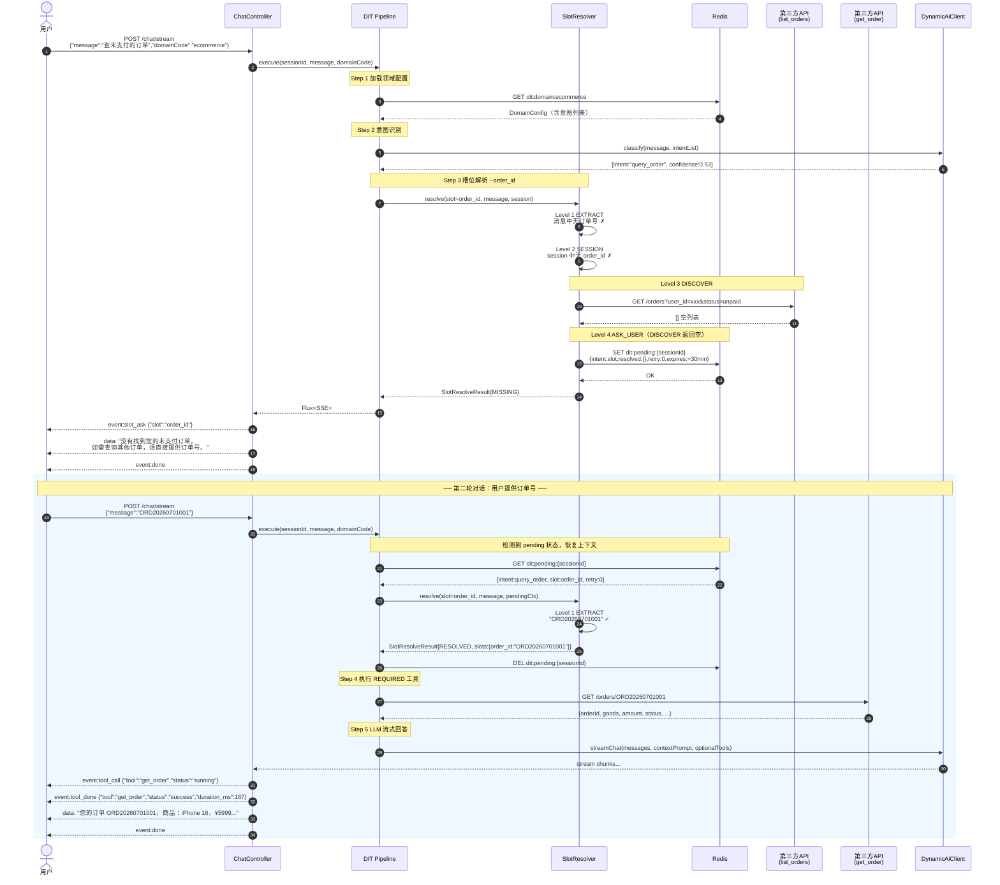
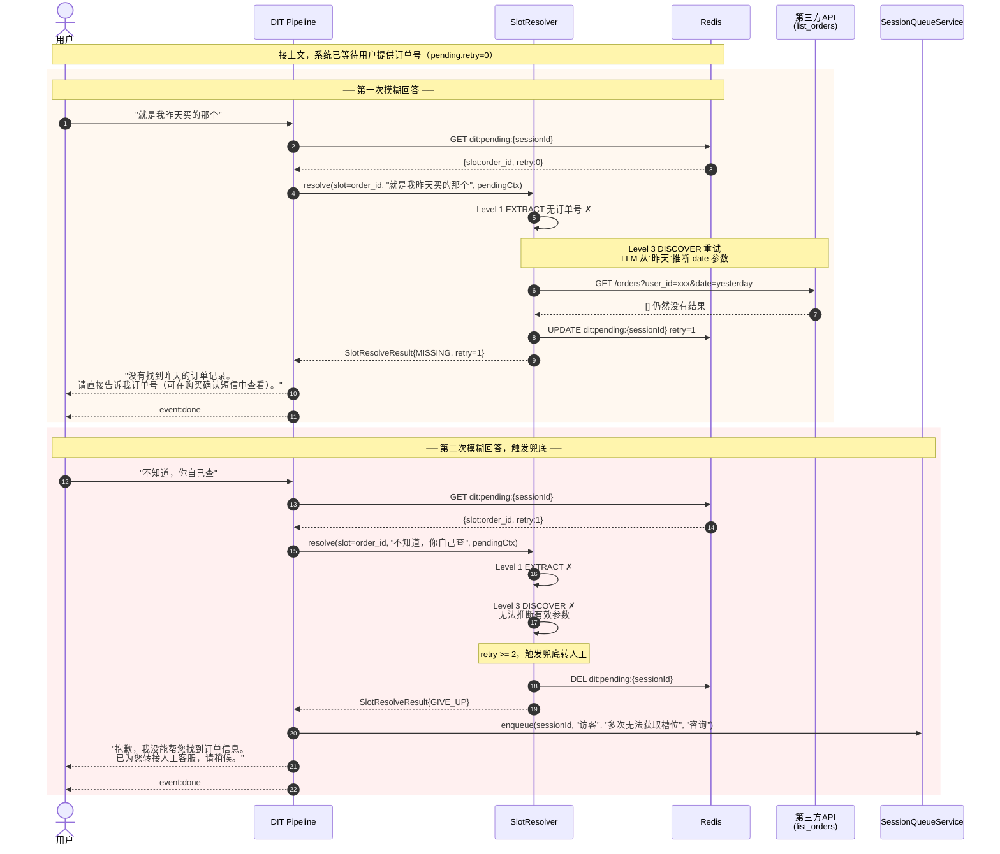
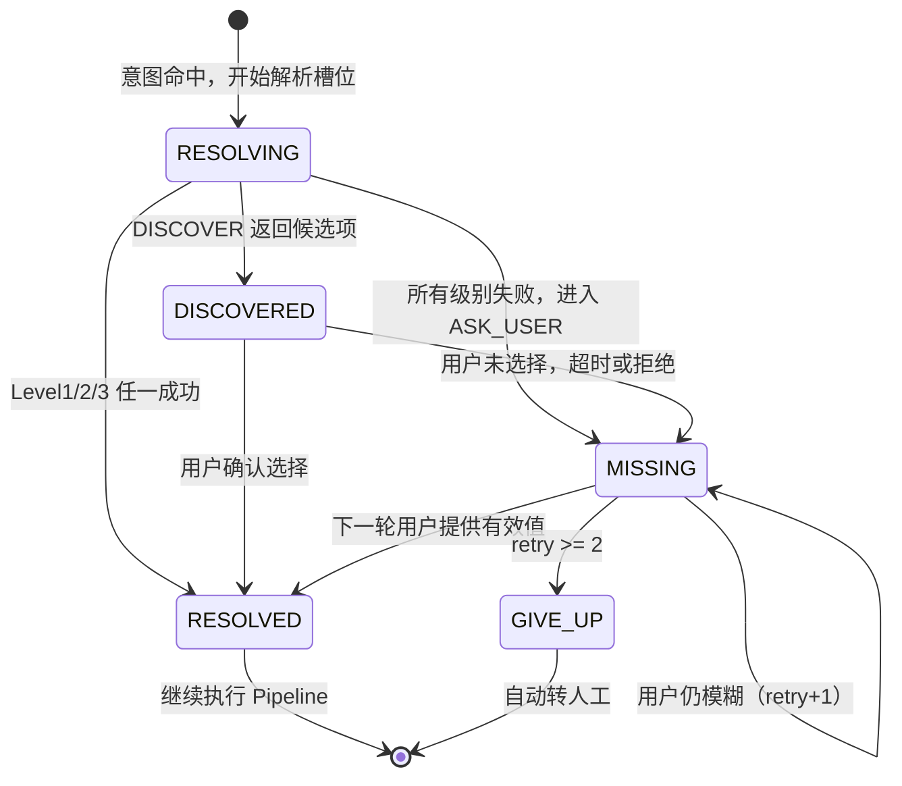

# 领域-意图-工具（Domain-Intent-Tool）架构设计文档

**版本：** v1.0  
**日期：** 2026-07-04  
**状态：** 草稿，待评审

---

## 1. 背景与目标

### 1.1 现状

当前 chat 流程是一条固定管道：

```
用户消息 → isActive 判断 → RAG 检索 → LLM 回答
```

缺少：领域上下文感知、意图路由、第三方工具调用能力。当 chat 被嵌入到不同业务场景（电商、金融、酒旅等）时，行为完全一样，无法针对性处理。

### 1.2 目标

构建 **领域-意图-工具（Domain-Intent-Tool，DIT）** 框架，实现：

1. **多场景支持**：前端传入 `domainCode`，系统加载对应配置，同一套代码支持不同业务场景
2. **意图路由**：在领域内识别用户具体意图，按意图走不同处理路径
3. **工具调用**：意图绑定工具（HTTP 接口或内置实现），自动执行或交给 LLM 决策
4. **智能槽位解析**：缺少参数时优先通过工具发现候选项，而非直接打断用户询问
5. **可配置**：场景、意图、工具均可在管理后台维护，无需重新部署

---

## 2. 整体架构

### 2.1 方案选择：Method C（混合工具调用）

```
前端请求（带 domainCode）
        │
        ▼
 ┌─────────────────────────────────────────────────────┐
 │                    DIT Pipeline                     │
 │                                                     │
 │  Step 1: 加载领域配置（Redis 缓存，DB 兜底）           │
 │          system_prompt 追加领域专属说明               │
 │          ↓                                          │
 │  Step 2: 意图识别                                    │
 │          LLM 分类（携带领域内意图列表 + 示例句子）      │
 │          → IntentCode + confidence                  │
 │          ↓                                          │
 │  Step 3: 槽位解析（4 级策略，见 2.3 节）               │
 │          EXTRACT → SESSION → DISCOVER → ASK_USER    │
 │          ↓                                          │
 │  Step 4: REQUIRED 工具执行                           │
 │          系统立即执行，结果注入 LLM context            │
 │          ↓                                          │
 │  Step 5: LLM 流式回答                                │
 │          携带 OPTIONAL 工具定义（function calling）   │
 │          LLM 自主决定是否调用 OPTIONAL 工具           │
 │          ↓                                          │
 │  Step 6: SSE 推送回客户端                            │
 └─────────────────────────────────────────────────────┘
```

### 2.2 与现有架构的关系

DIT Pipeline **包装**现有的 `ChatAppService`，而不是替换它：

- 没有 `domainCode` 的请求 → 走原有流程（向后兼容）
- 有 `domainCode` 的请求 → 走 DIT Pipeline
- RAG、历史管理、WebSocket 人工坐席等模块不变

---

## 3. 槽位解析策略（核心设计）

这是本方案最重要的用户体验设计点。

### 3.1 四级解析顺序

```
槽位缺失时，按以下顺序尝试，成功则停止：

Level 1: EXTRACT
  从当前消息 + 最近对话历史中提取
  例："帮我查订单 2026001" → order_id = "2026001"

Level 2: SESSION
  从会话上下文中获取（登录后注入的用户信息）
  例：user_id、手机号、账号等

Level 3: DISCOVER
  调用绑定的"发现工具"，获取候选列表，展示给用户确认
  例："查我未支付的订单" → 调 list_orders(user_id, status=unpaid)
       → 返回 [{"id":"001","amount":99},{"id":"002","amount":199}]
       → 展示列表，询问用户选哪个

Level 4: ASK_USER
  以上均失败，才直接询问用户补充参数
  例："请提供您的订单号，我来帮您查询"
```

### 3.2 DISCOVER 级详细流程

以"查未支付订单"为例：

```
用户: "帮我查查我还有哪些没付款的订单"
         │
         ▼
意图: query_order
槽位: order_id（REQUIRED，但未提取到）
         │
         ▼
槽位解析 Level 3: DISCOVER
  → 触发发现工具: list_orders
  → 参数: {user_id: session.user_id, status: "unpaid"}
  → 调用: GET /orders?user_id=xxx&status=unpaid
  → 结果: [
      {"order_id":"ORD001", "goods":"iPhone 16", "amount":5999},
      {"order_id":"ORD002", "goods":"AirPods", "amount":1299}
    ]
         │
         ▼
LLM 组织回答（将候选列表作为 context 注入）:
  "为您找到 2 笔待付款订单：
   1. ORD001 - iPhone 16，¥5999
   2. ORD002 - AirPods，¥1299
   请问您要查询哪笔订单的详情？或者直接说订单号也可以。"
         │
         ▼
用户: "第一个"
         │
         ▼
槽位解析 Level 1: EXTRACT（从上下文）
  → order_id = "ORD001"（LLM 从对话历史中提取）
         │
         ▼
REQUIRED 工具: get_order(order_id=ORD001)
  → 返回订单详情
         │
         ▼
LLM 回答订单详情
```

### 3.3 槽位解析结果的三种状态

```java
// 槽位解析结果
RESOLVED   — 已有值，继续执行
DISCOVERED — 已发现候选项，等待用户确认（中断当前 pipeline，进入等待状态）
MISSING    — 需要询问用户（中断当前 pipeline，进入等待状态）
```

当状态为 `DISCOVERED` 或 `MISSING` 时，当前 pipeline 进入等待，
下一轮对话继续从 Step 3 槽位解析恢复（通过 Redis 存储 pending 状态）。

---
---

## 4. 数据库设计

### 4.1 ER 图（文字描述）

```
cs_domain (1) ──< cs_intent (N) ──< cs_intent_slot (N)
                       │
                       └──< cs_intent_tool (N) >── cs_tool (1)
                                                        │
                                                   cs_tool_call_log
```

### 4.2 表结构详细定义

```sql
-- ============================================================
-- 1. 场景/领域表
-- ============================================================
CREATE TABLE cs_domain (
    id                  BIGSERIAL    PRIMARY KEY,
    code                VARCHAR(64)  NOT NULL UNIQUE,  -- 前端传入，如 "ecommerce"
    name                VARCHAR(128) NOT NULL,          -- 展示名，如 "电商客服"
    description         TEXT,
    -- 追加到 system prompt，如 "你是XX平台的专属客服助手，..."
    system_prompt_addon TEXT,
    -- 领域专属知识库 ID（可选，为空则用全局知识库）
    knowledge_base_id   BIGINT,
    enabled             BOOLEAN      NOT NULL DEFAULT TRUE,
    created_at          TIMESTAMP    NOT NULL DEFAULT NOW(),
    updated_at          TIMESTAMP    NOT NULL DEFAULT NOW()
);

-- ============================================================
-- 2. 意图表（属于某个领域）
-- ============================================================
CREATE TABLE cs_intent (
    id              BIGSERIAL    PRIMARY KEY,
    domain_id       BIGINT       NOT NULL REFERENCES cs_domain(id),
    code            VARCHAR(64)  NOT NULL,     -- 如 "query_order"
    name            VARCHAR(128) NOT NULL,     -- 如 "查询订单"
    description     TEXT         NOT NULL,     -- 给 LLM 的意图说明（用于分类 prompt）
    -- 少样本示例，JSON 数组，帮助 LLM 准确识别
    -- 例：["我的订单到哪了", "帮我查单号ORD001", "我买的东西发货没"]
    example_queries JSONB        NOT NULL DEFAULT '[]',
    -- 命中此意图时是否自动转人工（投诉/敏感操作）
    auto_transfer   BOOLEAN      NOT NULL DEFAULT FALSE,
    -- 命中此意图时是否跳过 RAG（有工具调用的确定性查询不需要知识库）
    skip_rag        BOOLEAN      NOT NULL DEFAULT FALSE,
    -- 工具全部执行失败时的兜底回复（为空则由 LLM 自由回答）
    fallback_reply  TEXT,
    enabled         BOOLEAN      NOT NULL DEFAULT TRUE,
    sort_order      INT          NOT NULL DEFAULT 0,
    UNIQUE(domain_id, code)
);

-- ============================================================
-- 3. 槽位定义表（意图需要从对话中解析的参数）
-- ============================================================
CREATE TABLE cs_intent_slot (
    id                    BIGSERIAL    PRIMARY KEY,
    intent_id             BIGINT       NOT NULL REFERENCES cs_intent(id),
    slot_name             VARCHAR(64)  NOT NULL,    -- 参数名，如 "order_id"
    slot_type             VARCHAR(32)  NOT NULL DEFAULT 'string', -- string/number/date/enum
    description           VARCHAR(256) NOT NULL,   -- 给 LLM 的提取说明
    required              BOOLEAN      NOT NULL DEFAULT FALSE,
    -- 解析策略优先级（见槽位解析 4 级策略）
    -- JSON 数组，按顺序尝试：["EXTRACT","SESSION","DISCOVER","ASK_USER"]
    resolve_strategy      JSONB        NOT NULL DEFAULT '["EXTRACT","SESSION","DISCOVER","ASK_USER"]',
    -- SESSION 级：从会话上下文取的 key，如 "user_id"
    session_key           VARCHAR(64),
    -- DISCOVER 级：调用的发现工具 code，如 "list_orders"
    discover_tool_code    VARCHAR(64),
    -- DISCOVER 工具的额外固定参数，JSON，如 {"status": "unpaid"}
    discover_fixed_params JSONB        DEFAULT '{}',
    -- ASK_USER 级：询问用户的话术
    ask_user_prompt       VARCHAR(256),
    -- enum 类型时的可选值，JSON 数组
    enum_values           JSONB,
    sort_order            INT          NOT NULL DEFAULT 0,
    UNIQUE(intent_id, slot_name)
);

-- ============================================================
-- 4. 工具注册表（全局，可被多个意图复用）
-- ============================================================
CREATE TABLE cs_tool (
    id                BIGSERIAL    PRIMARY KEY,
    code              VARCHAR(64)  NOT NULL UNIQUE,  -- 如 "get_order"
    name              VARCHAR(128) NOT NULL,
    -- 给 LLM 的工具说明（Function Calling 的 description 字段）
    description       TEXT         NOT NULL,
    -- HTTP: 通用 HTTP 调用 | BUILTIN: Java 内置实现（code 对应 Bean 名）
    tool_type         VARCHAR(32)  NOT NULL DEFAULT 'HTTP',
    -- HTTP 工具配置
    http_method       VARCHAR(16),                    -- GET/POST/PUT/DELETE
    -- URL 模板，支持 {slot_name} 路径参数占位符
    -- 如 "https://api.shop.com/orders/{order_id}"
    url_template      VARCHAR(512),
    -- 请求头模板，JSON，支持 {secret_key} 引用加密配置
    headers_template  JSONB        DEFAULT '{}',
    -- 请求体模板（POST），JSON，支持 {slot_name} 占位符
    body_template     JSONB,
    -- 参数 JSON Schema（告诉 LLM 这个工具的入参结构）
    -- 例：{"order_id":{"type":"string","description":"订单号","required":true}}
    param_schema      JSONB        NOT NULL DEFAULT '{}',
    -- 从响应中提取结果的 JSONPath，如 "$.data"，空则用完整响应
    response_jsonpath VARCHAR(256),
    -- 认证类型：NONE / API_KEY / BEARER / BASIC
    auth_type         VARCHAR(32)  NOT NULL DEFAULT 'NONE',
    -- 认证配置（AES 加密存储），JSON
    -- API_KEY 示例：{"header":"X-API-Key","value_encrypted":"xxx"}
    -- BEARER  示例：{"token_encrypted":"xxx"}
    auth_config       JSONB        DEFAULT '{}',
    -- 超时（毫秒），默认 5 秒
    timeout_ms        INT          NOT NULL DEFAULT 5000,
    -- 是否可作为发现工具（DISCOVER 级槽位解析）
    is_discover_tool  BOOLEAN      NOT NULL DEFAULT FALSE,
    enabled           BOOLEAN      NOT NULL DEFAULT TRUE,
    created_at        TIMESTAMP    NOT NULL DEFAULT NOW(),
    updated_at        TIMESTAMP    NOT NULL DEFAULT NOW()
);

-- ============================================================
-- 5. 意图-工具绑定表（多对多）
-- ============================================================
CREATE TABLE cs_intent_tool (
    id               BIGSERIAL   PRIMARY KEY,
    intent_id        BIGINT      NOT NULL REFERENCES cs_intent(id),
    tool_id          BIGINT      NOT NULL REFERENCES cs_tool(id),
    -- REQUIRED: 意图命中后系统立即执行，结果注入 context
    -- OPTIONAL: 作为 function definition 交给 LLM 自主决定是否调用
    execution_mode   VARCHAR(16) NOT NULL DEFAULT 'OPTIONAL',
    -- REQUIRED 工具的执行顺序（串行，前一个的结果可作为后一个的参数）
    execution_order  INT         NOT NULL DEFAULT 0,
    -- 参数来源映射，JSON
    -- key: 工具的参数名
    -- value: {"source": "slot|session|literal", "key": "xxx", "value": "xxx"}
    -- 例：{"order_id": {"source":"slot","key":"order_id"},
    --      "token":    {"source":"session","key":"api_token"}}
    param_mappings   JSONB       NOT NULL DEFAULT '{}',
    UNIQUE(intent_id, tool_id)
);

-- ============================================================
-- 6. 工具调用日志（调试 + 监控）
-- ============================================================
CREATE TABLE cs_tool_call_log (
    id           BIGSERIAL   PRIMARY KEY,
    session_id   VARCHAR(64) NOT NULL,
    tool_code    VARCHAR(64) NOT NULL,
    intent_code  VARCHAR(64),
    domain_code  VARCHAR(64),
    -- 实际发送的参数（脱敏处理，不存 token/password）
    params       JSONB,
    -- HTTP 原始响应摘要（截断至 2000 字符）
    response     TEXT,
    status       VARCHAR(16) NOT NULL,  -- SUCCESS / ERROR / TIMEOUT / SKIPPED
    http_status  INT,                   -- HTTP 状态码
    duration_ms  INT,
    error_msg    TEXT,
    created_at   TIMESTAMP   NOT NULL DEFAULT NOW()
);
CREATE INDEX idx_tool_call_log_session  ON cs_tool_call_log(session_id);
CREATE INDEX idx_tool_call_log_created  ON cs_tool_call_log(created_at);

-- ============================================================
-- 7. 对话 pipeline 待决状态表（槽位 DISCOVERED/MISSING 时挂起）
-- ============================================================
CREATE TABLE cs_pending_slot (
    session_id    VARCHAR(64) NOT NULL PRIMARY KEY,
    domain_code   VARCHAR(64) NOT NULL,
    intent_code   VARCHAR(64) NOT NULL,
    -- 当前等待用户确认的槽位名
    pending_slot  VARCHAR(64) NOT NULL,
    -- 挂起原因：DISCOVERED（展示候选项等待选择）/ MISSING（等待用户输入）
    pending_type  VARCHAR(16) NOT NULL,
    -- DISCOVERED 时的候选项 JSON
    candidates    JSONB,
    -- 已解析完成的槽位值（JSON Map）
    resolved_slots JSONB      NOT NULL DEFAULT '{}',
    expires_at    TIMESTAMP   NOT NULL,  -- TTL，超时自动清除
    created_at    TIMESTAMP   NOT NULL DEFAULT NOW()
);
```


---

## 5. 典型场景配置示例

### 场景一：电商客服（ecommerce）

| 意图 | 描述 | skip_rag | auto_transfer | 槽位 | 工具（模式） |
|---|---|---|---|---|---|
| query_order | 查询订单详情 | true | false | order_id（必填） | get_order（REQUIRED）, get_shipping（OPTIONAL） |
| apply_refund | 申请退款 | true | false | order_id（必填）、reason（可选） | get_order（REQUIRED）, create_refund（OPTIONAL） |
| product_inquiry | 商品咨询 | false | false | 无 | 无（走 RAG） |
| complaint | 投诉 | false | true | 无 | 无（转人工） |
| chitchat | 闲聊 | true | false | 无 | 无（直接 LLM） |

**关键槽位：order_id**
```
resolve_strategy: ["EXTRACT", "SESSION", "DISCOVER", "ASK_USER"]
discover_tool_code: "list_orders"           ← 发现工具
discover_fixed_params: {}                   ← 由 LLM 决定是否加 status 过滤
ask_user_prompt: "请提供订单号，我来帮您查询"
```

**工具：list_orders**（发现工具，is_discover_tool=true）
```
http_method:   GET
url_template:  https://api.shop.com/orders
body_template: {"user_id": "{user_id}", "page_size": 5}
description:   查询用户的订单列表，支持按状态过滤
param_schema:  {"user_id":{"type":"string"}, "status":{"type":"string","enum":["unpaid","shipped","completed"]}}
response_jsonpath: $.data.orders
```

**工具：get_order**（REQUIRED，意图命中后立即执行）
```
http_method:   GET
url_template:  https://api.shop.com/orders/{order_id}
description:   根据订单号获取订单详情
param_schema:  {"order_id":{"type":"string","required":true}}
param_mappings: {"order_id": {"source":"slot","key":"order_id"}}
```

**工具：get_shipping**（OPTIONAL，交给 LLM 决定要不要调）
```
http_method:   GET
url_template:  https://api.shop.com/shipping/{tracking_no}
description:   根据物流单号查询快递实时轨迹，当用户询问物流信息时调用
param_schema:  {"tracking_no":{"type":"string","required":true}}
```

---

### 场景二：金融客服（finance）

| 意图 | 描述 | skip_rag | auto_transfer | 槽位 | 工具（模式） |
|---|---|---|---|---|---|
| query_balance | 查账户余额 | true | false | account_id（SESSION取） | get_balance（REQUIRED） |
| query_bill | 查账单 | true | false | month（可选，默认当月） | get_bill（REQUIRED） |
| transfer_money | 转账汇款 | false | true | 无 | 无（转人工，敏感操作） |
| loan_inquiry | 贷款咨询 | false | false | 无 | 无（走 RAG） |

**槽位：account_id**
```
resolve_strategy: ["SESSION"]   ← 只从 session 取，不向用户暴露
session_key: "account_id"
```

---

### 场景三：酒旅客服（travel）

| 意图 | 描述 | skip_rag | auto_transfer | 槽位 | 工具（模式） |
|---|---|---|---|---|---|
| search_hotel | 搜索酒店 | true | false | city、check_in、check_out | search_hotel（REQUIRED） |
| make_booking | 预订房间 | true | false | hotel_id、room_type、guest_name | create_booking（REQUIRED） |
| query_booking | 查询预订 | true | false | booking_id | get_booking（REQUIRED） |
| cancel_booking | 取消预订 | false | true | 无 | 无（转人工确认） |

---

## 6. 代码模块设计

### 6.1 新增组件（infrastructure/dit/ 包）

```
infrastructure/dit/
├── domain/
│   ├── DomainConfig.java          — 领域配置 record（含意图列表）
│   ├── IntentConfig.java          — 意图配置 record
│   ├── SlotConfig.java            — 槽位配置 record
│   └── ToolConfig.java            — 工具配置 record
├── repository/
│   ├── DomainRepository.java      — 领域配置 DB 查询（带 Redis 缓存）
│   └── PendingSlotRepository.java — 挂起状态 Redis 存取
├── slot/
│   ├── SlotResolver.java          — 槽位解析编排器（4 级策略）
│   ├── SlotExtractService.java    — Level 1: LLM 提取
│   └── SlotResolveResult.java     — 解析结果（RESOLVED/DISCOVERED/MISSING）
├── tool/
│   ├── ToolExecutor.java          — 工具执行编排（REQUIRED 串行 + OPTIONAL FC）
│   ├── HttpToolRunner.java        — HTTP 工具通用执行器
│   ├── BuiltinToolRegistry.java   — 内置工具注册表（@Component Bean）
│   └── ToolCallResult.java        — 工具执行结果
└── pipeline/
    ├── DitPipeline.java           — 主 Pipeline 编排（Steps 1-6）
    └── PipelineContext.java       — 管道上下文（跨步骤共享状态）
```

### 6.2 修改现有组件

```
application/service/ChatAppService.java
  → 新增 streamChatWithDomain(sessionId, message, domainCode) 重载
  → 原有 streamChat() 保持不变（向后兼容）

interfaces/rest/ChatController.java
  → ChatRequest 新增可选字段 domainCode
  → streamChat 里判断：有 domainCode → DitPipeline，无 → 原流程
```

### 6.3 DIT Pipeline 执行流程（Java 伪代码）

```java
public Flux<String> execute(String sessionId, String message, String domainCode) {

    // Step 1: 加载领域配置
    DomainConfig domain = domainRepository.findByCode(domainCode);

    // Step 2: 意图识别
    IntentConfig intent = intentClassifier.classify(message, domain.intents());
    if (intent.autoTransfer()) {
        return handleAutoTransfer(sessionId, intent);
    }

    // Step 3: 槽位解析（可能挂起，等待用户下一轮输入）
    SlotResolveResult slotResult = slotResolver.resolve(sessionId, message, intent, domain);
    if (slotResult.isPending()) {
        // 存储挂起状态，返回询问/候选展示
        pendingSlotRepo.save(sessionId, slotResult.pendingState());
        return Flux.just(slotResult.promptMessage());
    }
    Map<String, Object> slots = slotResult.resolvedSlots();

    // Step 4: 执行 REQUIRED 工具
    List<ToolCallResult> requiredResults = toolExecutor.executeRequired(intent, slots);

    // Step 5: LLM 流式回答（带 OPTIONAL 工具定义）
    String context = buildContext(requiredResults, domain, intent);
    List<FunctionDefinition> optionalTools = buildFunctionDefs(intent.optionalTools());
    return aiClient.streamChatWithFunctions(buildMessages(sessionId, message),
                                             context, optionalTools)
                   .flatMap(chunk -> handleChunk(chunk, sessionId, intent, slots));
}
```

### 6.4 Function Calling 流程（OPTIONAL 工具）

```
LLM 流式输出中遇到 tool_call chunk：
  │
  ├─ 解析 tool_name + arguments（JSON）
  ├─ 查找对应工具配置
  ├─ HttpToolRunner.execute(toolConfig, arguments)
  ├─ 结果作为 tool message 追加到对话历史
  └─ 继续 LLM 流式输出（携带工具结果）

当前只支持单轮工具调用（一次 LLM 输出最多触发一次工具调用），
避免无限调用和过高成本。后续可升级为多轮。
```

---

## 7. API 变更

### 7.1 ChatRequest 新增字段

```json
// 请求体变更（向后兼容，domainCode 可选）
{
  "sessionId": "guest-xxx",
  "message": "帮我查一下我未支付的订单",
  "domainCode": "ecommerce"    // 新增，可选；为空则走原有流程
}
```

### 7.2 SSE 事件新增类型

```
// 原有事件（保持不变）
event: sources   → 知识库溯源
data: <token>    → AI 回复 token
event: done      → 结束

// 新增事件
event: tool_call → 工具调用开始（前端可展示"正在查询..."）
data: {"tool":"get_order","status":"running"}

event: tool_done → 工具调用完成
data: {"tool":"get_order","status":"success","duration_ms":234}

event: slot_ask  → 需要用户补充槽位（MISSING 状态）
data: {"slot":"order_id","prompt":"请提供订单号"}

event: candidates → 展示 DISCOVER 候选项（DISCOVERED 状态）
data: {"slot":"order_id","items":[{"id":"ORD001","label":"iPhone 16 ¥5999"}]}
```

---

## 8. 缓存策略

| 数据 | 缓存 Key | TTL | 说明 |
|---|---|---|---|
| 领域配置 | `dit:domain:{code}` | 10 分钟 | 管理后台修改后主动失效 |
| 意图列表 | `dit:intents:{domain_code}` | 10 分钟 | 随领域一起失效 |
| 工具配置 | `dit:tool:{code}` | 10 分钟 | 工具修改后主动失效 |
| 挂起状态 | `dit:pending:{session_id}` | 30 分钟 | 用户 30 分钟内未响应则清除 |

---

## 9. 错误处理策略

| 情况 | 处理方式 |
|---|---|
| domainCode 不存在 | 降级走原有无领域流程，记录 warn 日志 |
| 意图识别失败 | 降级为 UNKNOWN，走 RAG + LLM 通用回答 |
| REQUIRED 工具超时 | 返回 fallback_reply（配置值）或 "查询超时，请稍后重试" |
| REQUIRED 工具 HTTP 4xx | 日志记录，LLM 基于错误信息给用户友好提示 |
| REQUIRED 工具 HTTP 5xx | 返回 fallback_reply，不透传内部错误 |
| OPTIONAL 工具失败 | 忽略，LLM 基于已有 context 继续回答 |
| 槽位挂起超 30 分钟 | 自动清除，下次对话从头开始 pipeline |

---

## 10. 不在本期范围

- 工具调用的多轮 ReAct（本期只支持单轮工具调用）
- 意图置信度阈值配置（先不做，上线观察后再加）
- 工具调用结果的向量化索引（后期可将工具结果纳入知识库）
- 管理后台 UI（本期只做后端 + 数据模型，UI 单独迭代）
- 工具调用频率限制（防止滥用，后期加）


---

## 11. 槽位解析时序图（以"查未支付订单"为例）

### 11.1 完整流程：ASK_USER → 用户补充 → 工具执行 → LLM 回答



---

### 11.2 降级流程：用户回答模糊 → 重试 → 超阈值转人工



---

### 11.3 槽位解析状态机


