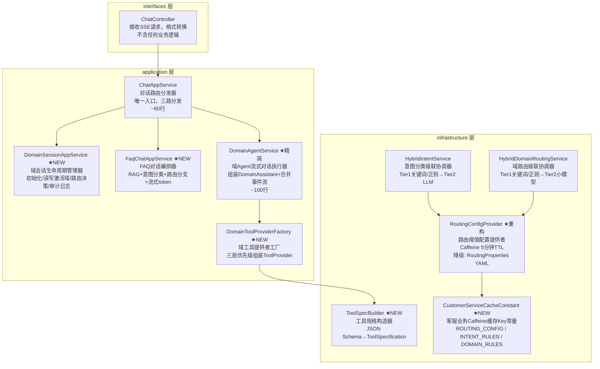
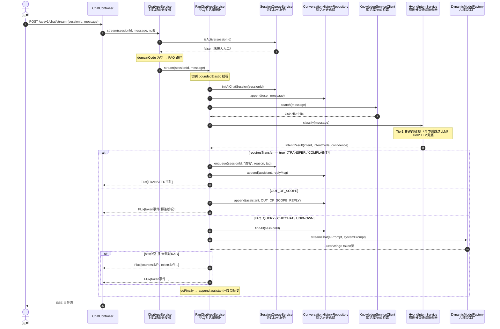
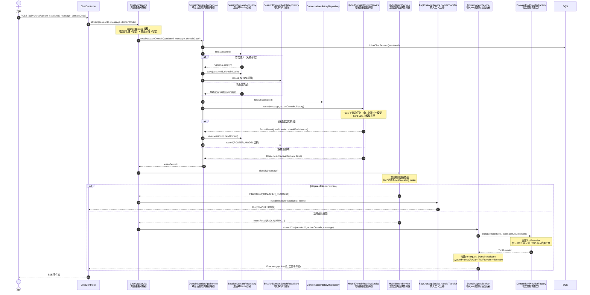
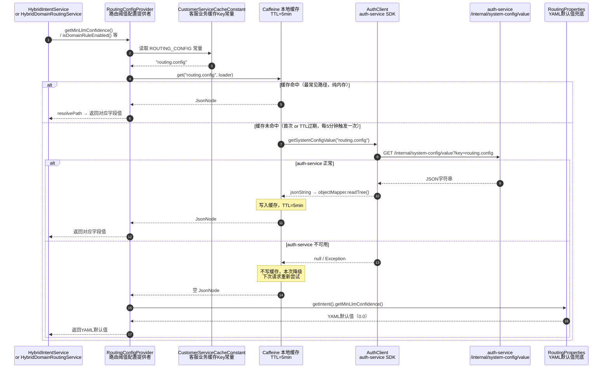
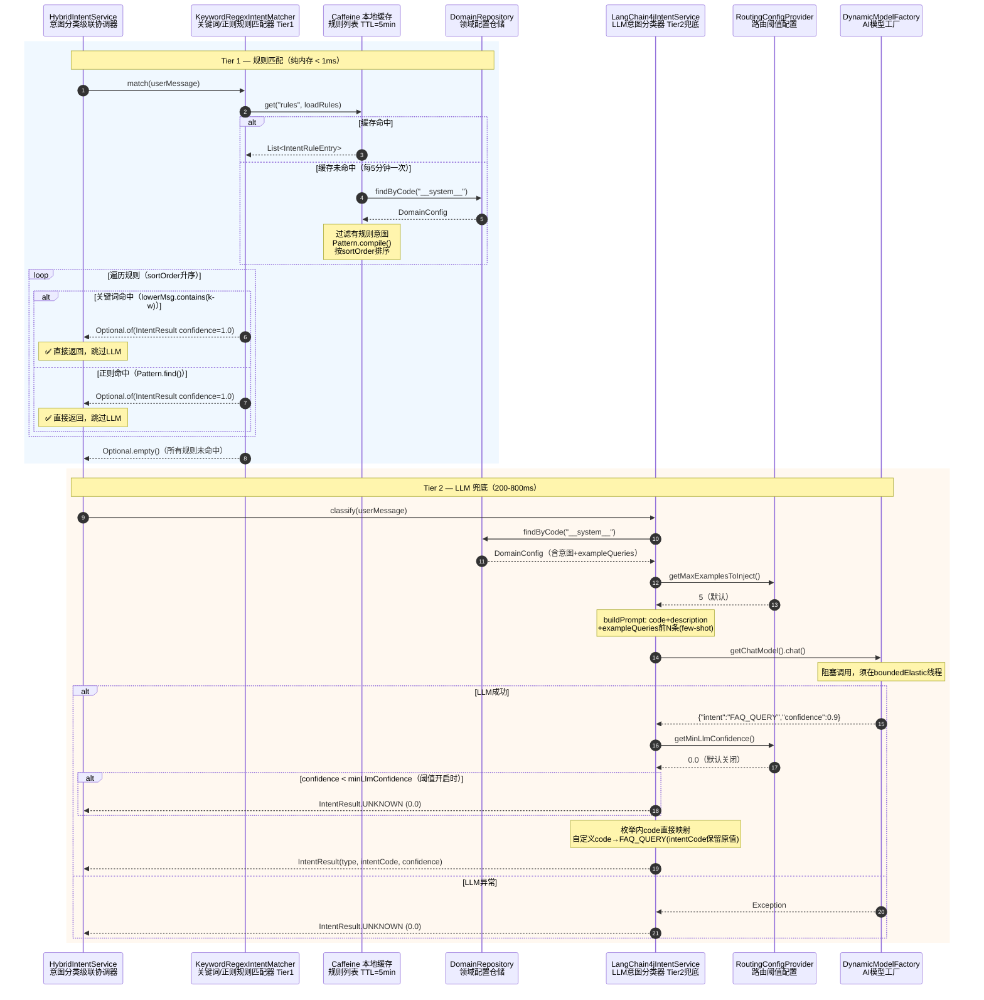
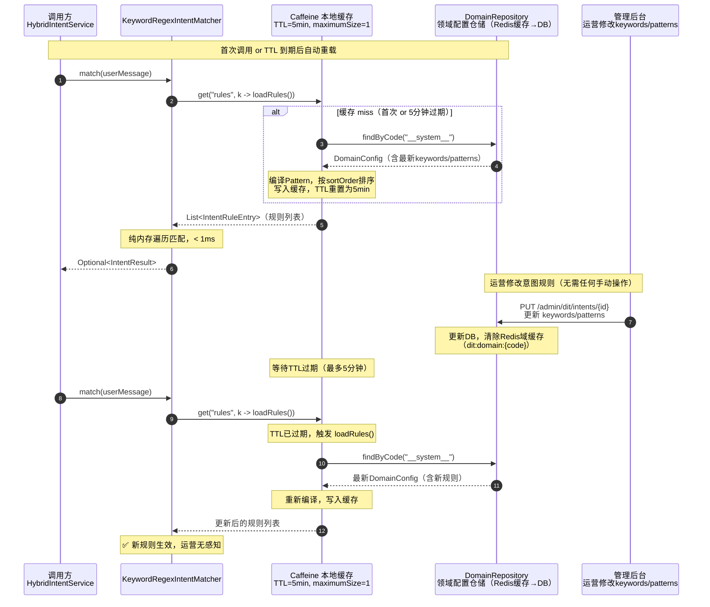

# 对话服务核心链路重构技术改造文档

## 1. 现状分析与问题诊断

### 1.1 改造背景

Aria 对话服务当前核心链路由 `ChatAppService`（506 行）和 `DomainAgentService`（506 行）承载，随着意图路由、域会话管理、function-calling 等能力的迭代叠加，两个类已严重违反单一职责原则，存在以下问题。

### 1.2 `ChatAppService` 现有问题

| 违规类型 | 具体表现 |
|---|---|
| 职责混杂 | 同一个类承担路由分发、域会话管理、FAQ 编排、转人工处理、格式化工具 5 项职责 |
| 构造函数过长 | 手写 10 个参数的构造函数，违反阿里巴巴规范（构造函数参数不超过 7 个） |
| 魔法字符串 | `"访客"`、`"faq_transfer"`、`"咨询"` 等硬编码在代码中 |
| 重复定义 | `BASE_SYSTEM_PROMPT` 与 `SystemPromptBuilder.DEFAULT_BASE_PROMPT` 内容重复 |
| 访问修饰符不当 | `buildSourcesJson()`、`searchHits()` 是 `public` 但仅内部使用，应为 `private` |
| DDD 分层违规 | Application Service 直接操作两个 Repository（Redis + DB），域会话管理逻辑散落在私有方法中，应提取为独立服务 |

### 1.3 `DomainAgentService` 现有问题

| 违规类型 | 具体表现 |
|---|---|
| 职责混杂 | 流式对话编排 + 工具规格构造 + ToolProvider 组装 + MCP 事件包装全混在一起 |
| 方法职责不清 | `buildToolSpec()`、`parseProperties()`、`mapTypeToSchema()`、`parseRequired()` 等工具方法直接写在业务服务里 |
| 测试性差 | ToolSpecification 构造逻辑无法独立测试，必须依赖整个 DomainAgentService |

### 1.4 `RoutingConfigProvider` 现有问题

| 违规类型 | 具体表现 |
|---|---|
| 过度设计 | 依赖 Redis Pub/Sub + `RedisCacheHelper` + `ObjectProvider<RedisMessageListenerContainer>`，仅为读取 5 个配置项 |
| 缓存策略不一致 | 同模块的 `KeywordRegexIntentMatcher` 在启动时一次性加载规则，无统一缓存策略 |

### 1.5 规则匹配器现有问题

`KeywordRegexIntentMatcher` 和 `KeywordRegexDomainMatcher` 使用 `@PostConstruct` 启动预热 + `@EventListener` 热更新，引入了不必要的复杂性：

- 与 `RoutingConfigProvider` 缓存策略不统一
- `DomainCacheEvictedEvent` 被规则层"借用"，事件含义模糊
- 运营场景下 5 分钟内生效完全满足需求，无需秒级热更新

## 2. 改造目标与非目标

### 2.1 改造目标

**代码质量目标：**
- 每个类单一职责，行数控制在 150 行以内
- 严格遵循 DDD 分层：interfaces → application → domain → infrastructure
- 遵循阿里巴巴 Java 开发手册：构造函数参数 ≤ 7、无魔法字符串、`public` 方法必须有 Javadoc
- 消除所有重复代码（DRY）

**缓存策略目标：**
- 统一使用 Caffeine 本地缓存，TTL 5 分钟，无需 Redis Pub/Sub
- 缓存 Key 集中管理，禁止魔法字符串散落

**可测试性目标：**
- 工具规格构造逻辑独立可测
- 每个新增类有对应单元测试

### 2.2 非目标

- 不改变对外 API 签名（`ChatController` 不变）
- 不改变数据库表结构
- 不引入新的第三方框架（Caffeine 已在依赖中）
- 不实现 embedding 向量层（第二阶段规划）
- 不修改 `DomainAgentService` 与前端的 SSE 事件格式

### 2.3 改造原则

1. **单一职责**：一个类只做一件事，类名即是功能的完整描述
2. **依赖倒置**：Application Service 依赖 Domain 接口，不直接依赖 Infrastructure 实现
3. **最小改动**：现有测试全部保持绿色，新增测试覆盖新类
4. **统一缓存策略**：全部使用 Caffeine TTL，不用 `@PostConstruct` 预热，不用事件驱动刷新
5. **常量集中管理**：魔法字符串提取为常量类，按业务域分类

## 3. 整体架构设计

### 3.1 改造后包结构

```
com.aria.conversation
├── interfaces/rest/                        # 接口层（不变）
│   └── ChatController.java
│
├── application/service/                    # 应用层
│   ├── ChatAppService.java                 # 【精简】对话路由分发器，~80行
│   ├── DomainSessionAppService.java        # 【新增】域会话生命周期管理器
│   ├── FaqChatAppService.java              # 【新增】FAQ对话编排器
│   ├── DomainAgentService.java             # 【精简】域Agent流式对话执行器，~100行
│   ├── SystemPromptBuilder.java            # 【不变】System Prompt构造工具类
│   ├── tool/
│   │   ├── DomainToolProviderFactory.java  # 【新增】域工具提供者工厂
│   │   ├── BuiltinTools.java               # 【不变】内置工具（switch_domain/transfer_to_agent）
│   │   ├── DomainSummary.java              # 【不变】域摘要值对象
│   │   └── InvocationParameters.java       # 【不变】工具调用参数
│   └── payload/                            # 【不变】SSE事件载荷
│
├── domain/                                 # 领域层（不变）
│   ├── model/
│   │   ├── IntentResult.java
│   │   └── IntentType.java
│   └── service/
│       ├── IntentService.java
│       └── DomainRoutingService.java
│
└── infrastructure/
    ├── ai/                                 # AI基础设施
    │   ├── HybridIntentService.java        # 【精简】意图分类级联协调器
    │   ├── HybridDomainRoutingService.java # 【精简】域路由级联协调器
    │   ├── KeywordRegexIntentMatcher.java  # 【重构】改用Caffeine TTL
    │   ├── KeywordRegexDomainMatcher.java  # 【重构】改用Caffeine TTL
    │   ├── LangChain4jIntentService.java   # 【不变】
    │   ├── LangChain4jDomainRoutingService.java # 【不变】
    │   ├── RoutingConfigProvider.java      # 【重构】改用Caffeine，去除Redis依赖
    │   ├── RoutingConfig.java              # 【新增】路由阈值配置值对象，JSON→POJO
    │   ├── RoutingProperties.java          # 【不变】YAML默认值兜底
    │   └── tool/
    │       └── ToolSpecBuilder.java        # 【新增】工具规格构造器
    └── config/
        └── CustomerServiceCacheConstant.java # 【新增】客服业务Caffeine缓存Key常量
                                              #   仅收录本服务Caffeine key
                                              #   Redis key由各Provider私有管理
```

### 3.2 组件职责总览



### 3.3 DDD 分层依赖规则

```
interfaces   → application（调用 AppService）
application  → domain（调用 Service 接口）
application  → infrastructure（调用 Repository、Client）
domain       → 不依赖任何层
infrastructure → domain（实现 Service 接口）
```

**禁止：**
- application 层直接 `new` infrastructure 的实现类
- infrastructure 层导入 application 层的类
- 跨越层级的直接调用（如 interfaces 直接调用 Repository）

## 4. 应用层组件详细设计

### 4.1 `ChatAppService` — 对话路由分发器

**职责：** 唯一入口，只做三路分发。不含任何业务逻辑，不直接操作 Repository。

```java
/**
 * 对话路由分发器。
 *
 * <p>统一流式对话入口，根据会话状态和请求参数将请求分发到三条处理路径：
 * <ol>
 *   <li>已接入人工 → 直接返回提示，不走 AI</li>
 *   <li>有 domainCode → 域会话路径（DomainSessionAppService + DomainAgentService）</li>
 *   <li>无 domainCode → 通用 FAQ 路径（FaqChatAppService）</li>
 * </ol>
 *
 * <p>本类只做路由决策，不含业务编排逻辑。所有具体实现委托给对应 Service。
 *
 * @author aria
 */
@Slf4j
@Service
@RequiredArgsConstructor
public class ChatAppService {

    /** 会话队列服务，用于判断是否已接入人工及入队操作 */
    private final SessionQueueService        sessionQueueService;
    /** 域会话生命周期管理器，封装激活域读写和小模型路由决策 */
    private final DomainSessionAppService    domainSessionService;
    /** FAQ 对话编排器，封装 RAG + 意图路由 + LLM 流程 */
    private final FaqChatAppService          faqChatService;
    /** 域 Agent 流式对话执行器，处理携带工具的域内对话 */
    private final DomainAgentService         domainAgentService;
    /** 意图分类服务，Tier1 关键词/正则 → Tier2 LLM 兜底 */
    private final IntentService              intentService;
    /** JSON 序列化工具，用于构造 SSE 事件载荷 */
    private final ObjectMapper               objectMapper;

    /**
     * 统一流式对话入口，返回 {@link ChatEvent} 流供 Controller 转换为 SSE。
     *
     * @param sessionId  会话 ID
     * @param message    用户消息
     * @param domainCode 领域标识（可选，null 走通用 FAQ 流程）
     * @return ChatEvent 流
     */
    public Flux<ChatEvent> stream(String sessionId, String message, String domainCode) {
        // 1. 已接入人工 → 存历史，返回提示
        if (sessionQueueService.isActive(sessionId)) {
            return faqChatService.appendAndHint(sessionId, message);
        }
        // 2. 有 domainCode → 域路径
        if (StringUtils.isNotBlank(domainCode)) {
            return streamDomain(sessionId, message, domainCode);
        }
        // 3. 通用 FAQ 路径
        return faqChatService.stream(sessionId, message);
    }

    /**
     * 域路径处理：在 boundedElastic 线程完成阻塞操作（域会话管理 + 意图分类），
     * 再根据意图决策走转人工或 DomainAgentService。
     *
     * <p>意图分类在域会话解析完成后执行，用于快速拦截 TRANSFER_REQUEST/COMPLAINT，
     * 避免消耗 function-calling token。
     *
     * @param sessionId  会话 ID
     * @param message    用户消息
     * @param domainCode 前端传入的默认域标识
     * @return ChatEvent 流
     */
    private Flux<ChatEvent> streamDomain(String sessionId, String message, String domainCode) {
        return Mono.fromCallable(() -> {
                    // 阻塞操作：Redis读写 + 小模型推理 + 意图分类
                    String activeDomain = domainSessionService.resolveActiveDomain(
                            sessionId, message, domainCode);
                    IntentResult intent  = intentService.classify(message);
                    return new DomainRouteContext(activeDomain, intent);
                })
                .subscribeOn(Schedulers.boundedElastic())
                .flatMapMany(ctx -> {
                    if (ctx.intent().requiresTransfer()) {
                        return faqChatService.handleTransfer(sessionId, ctx.intent());
                    }
                    return domainAgentService.streamChat(sessionId, ctx.activeDomain(), message);
                });
    }

    /**
     * 域路径路由阶段中间结果，携带最终确定的活跃域编码和意图分类结果。
     *
     * @param activeDomain 经域路由决策后的最终活跃域编码
     * @param intent       意图分类结果，决定后续走转人工还是 DomainAgentService
     */
    private record DomainRouteContext(String activeDomain, IntentResult intent) {}
}
```

---

### 4.2 `DomainSessionAppService` — 域会话生命周期管理器

**职责：** 完整编排域会话的三步初始化流程：幂等建档 → 读写激活域 → 小模型路由决策。所有 Redis 读写和路由决策均在此类完成，`ChatAppService` 无需感知细节。

```java
/**
 * 域会话生命周期管理器。
 *
 * <p>封装域对话的三步初始化编排：
 * <ol>
 *   <li>幂等初始化 AI_CHAT 会话记录</li>
 *   <li>读取或首次写入 session 激活域（Redis）</li>
 *   <li>ROUTER 小模型域路由决策，必要时切换域并写审计日志</li>
 * </ol>
 *
 * <p><b>注意：</b>本类包含阻塞操作（Redis 读写、小模型 HTTP 调用），
 * 调用方必须在 {@link Schedulers#boundedElastic()} 线程上调用。
 */
@Slf4j
@Service
@RequiredArgsConstructor
public class DomainSessionAppService {

    /** 会话队列服务，提供幂等初始化 AI_CHAT 会话记录的能力 */
    private final SessionQueueService            sessionQueueService;
    /** 激活域 Redis 仓储，存储 sessionId → domainCode 的映射关系，TTL 跟随会话 */
    private final SessionDomainRepository        sessionDomainRepo;
    /** 域切换审计仓储，记录每次域变更的原因、来源和时间，供数据分析使用 */
    private final SessionDomainSwitchRepository  domainSwitchRepo;
    /** 对话历史仓储，提供最近 N 轮历史作为域路由的多轮上下文 */
    private final ConversationHistoryRepository  historyRepository;
    /** 域路由服务（@Primary 实现为 HybridDomainRoutingService），Tier1 规则 → Tier2 小模型 */
    private final DomainRoutingService           domainRoutingService;

    /**
     * 解析当前会话的活跃域，完整编排三步初始化流程。
     *
     * <p><b>执行步骤：</b>
     * <ol>
     *   <li>幂等初始化 AI_CHAT 会话记录（首条消息时建档，已存在则跳过）</li>
     *   <li>读取 Redis 中已有激活域；首次进入时以 {@code domainCode} 初始化并写切换日志</li>
     *   <li>调用域路由服务决策，若建议切换则更新 Redis 并写 ROUTER_MODEL 切换日志</li>
     * </ol>
     *
     * <p><b>线程要求：</b>包含阻塞操作（Redis 读写、HTTP 调用），
     * 调用方必须在 {@link Schedulers#boundedElastic()} 线程上调用。
     *
     * @param sessionId  会话 ID
     * @param message    用户消息（用于路由上下文和审计记录）
     * @param domainCode 前端传入的默认域标识，仅首次进入时使用
     * @return 最终确定的活跃域编码
     */
    public String resolveActiveDomain(String sessionId, String message, String domainCode) {
        sessionQueueService.initAiChatSession(sessionId);
        String activeDomain = resolveOrInitDomain(sessionId, message, domainCode);
        return routeDomainIfNeeded(sessionId, message, activeDomain);
    }

    /**
     * 读取 session 当前激活域；若不存在（首次进入），则以 {@code domainCode} 初始化
     * 并写入一条 {@link SwitchType#INITIAL} 类型的域切换记录。
     *
     * @param sessionId  会话 ID
     * @param message    用户消息，记录到切换审计日志
     * @param domainCode 默认域标识，仅首次进入时使用
     * @return 当前激活域编码
     */
    private String resolveOrInitDomain(String sessionId, String message, String domainCode) {
        return sessionDomainRepo.find(sessionId).orElseGet(() -> {
            saveDomainSwitch(sessionId, null, domainCode, SwitchType.INITIAL, message, "用户进入服务入口");
            log.info("[DomainSession] sessionId={} 初始化激活域={}", sessionId, domainCode);
            return domainCode;
        });
    }

    /**
     * 调用域路由服务进行路由决策；若建议切换则更新 Redis 激活域并写审计日志，
     * 路由过程异常时降级保持当前域，不中断对话流程。
     *
     * @param sessionId    会话 ID
     * @param message      用户消息，作为路由上下文
     * @param activeDomain 当前激活域编码
     * @return 路由决策后的活跃域编码（切换则为新域，否则为原域）
     */
    private String routeDomainIfNeeded(String sessionId, String message, String activeDomain) {
        try {
            List<ConversationMessage> history = historyRepository.findAll(sessionId);
            DomainRoutingService.RouteResult routing =
                    domainRoutingService.route(message, activeDomain, history);
            if (!routing.shouldSwitch()) {
                return activeDomain;
            }
            String newDomain = routing.suggestedDomain();
            saveDomainSwitch(sessionId, activeDomain, newDomain,
                    SwitchType.ROUTER_MODEL, message, "小模型检测切换");
            log.info("[DomainSession] sessionId={} 域切换 {} -> {}", sessionId, activeDomain, newDomain);
            return newDomain;
        } catch (Exception e) {
            log.warn("[DomainSession] sessionId={} 路由异常，降级保持当前域={}", sessionId, activeDomain, e);
            return activeDomain;
        }
    }

    /**
     * 原子化保存域绑定关系并记录域切换审计日志。
     * 每次域变更必须同时更新 Redis 绑定和审计记录，确保两者一致。
     *
     * @param sessionId  会话 ID
     * @param fromDomain 切换前的域（首次进入时为 null）
     * @param toDomain   切换后的目标域
     * @param switchType 切换类型，见 {@link SwitchType}
     * @param message    触发切换的用户消息
     * @param reason     切换原因描述，用于审计分析
     */
    private void saveDomainSwitch(String sessionId, String fromDomain, String toDomain,
                                  String switchType, String message, String reason) {
        sessionDomainRepo.save(sessionId, toDomain);
        domainSwitchRepo.record(new DomainSwitchRecord(
                sessionId, fromDomain, toDomain, switchType, message, reason, null));
    }
}
```

---

### 4.3 `FaqChatAppService` — FAQ 对话编排器

**职责：** 编排通用 FAQ 流程（RAG + 意图分类 + 路由分支 + 流式 token），同时提供 `handleTransfer()` 供 Domain 路径共用。

```java
/**
 * FAQ 对话编排器。
 *
 * <p>编排通用 FAQ 链路：知识库检索（RAG）→ 意图分类 → 路由分支 → 流式 token 生成。
 * {@link #handleTransfer} 方法同时被 Domain 路径复用，实现转人工的统一处理。
 */
@Slf4j
@Service
@RequiredArgsConstructor
public class FaqChatAppService {

    /** 超出业务范围时的统一拒答回复，所有 OUT_OF_SCOPE 意图均返回此文案 */
    private static final String OUT_OF_SCOPE_REPLY =
            "抱歉，我是专业的客服助手，只能回答业务相关的问题，无法帮您解答这个问题。";
    /** 系统自动触发转人工时写入队列的原因描述，用于座席侧展示 */
    private static final String TRANSFER_AUTO_REASON = "系统识别到用户需要人工服务";
    /** 转人工队列条目的默认标签，用于座席分组路由 */
    private static final String TRANSFER_DEFAULT_TAG = "咨询";
    /** FAQ 路径转人工时的 intentCode 占位符，区别于 DIT 域路径使用真实意图 code */
    private static final String FAQ_TRANSFER_INTENT_CODE = "faq_transfer";
    /** 会话已接入人工时的提示文案，告知用户消息已转发给座席 */
    private static final String AGENT_HINT_MSG = "（消息已发送给人工客服）";

    /** AI 模型工厂，提供流式对话 ChatModel 实例 */
    private final DynamicModelFactory            aiClient;
    /** 对话历史仓储，负责追加和读取多轮对话上下文 */
    private final ConversationHistoryRepository  historyRepository;
    /** 知识库 RAG 检索客户端，根据用户消息向量检索相关知识块 */
    private final KnowledgeServiceClient         knowledgeServiceClient;
    /** 意图分类服务（@Primary 实现为 HybridIntentService），Tier1 规则 → Tier2 LLM */
    private final IntentService                  intentService;
    /** 会话队列服务，提供幂等初始化、入队和状态查询能力 */
    private final SessionQueueService            sessionQueueService;
    /** JSON 序列化工具，用于构造 TransferPayload、sources 等 SSE 载荷 */
    private final ObjectMapper                   objectMapper;

    /**
     * 已接入人工时的消息处理：仅追加历史记录并返回提示，不调用 AI。
     *
     * <p>此路径跳过所有 AI 流程，确保人工接入后不会产生 LLM 调用费用。
     *
     * @param sessionId 会话 ID
     * @param message   用户消息
     * @return 仅含提示文案的单元素 token 事件流
     */
    public Flux<ChatEvent> appendAndHint(String sessionId, String message) {
        historyRepository.append(sessionId, MessageRole.USER.getValue(), message);
        return Flux.just(ChatEvent.token(AGENT_HINT_MSG, objectMapper));
    }

    /**
     * 通用 FAQ 流程：RAG 检索 + 意图分类 + 路由分支 + 流式 token 生成。
     *
     * <p>阻塞操作（RAG 检索、意图分类）在 {@link Schedulers#boundedElastic()} 线程执行，
     * 不阻塞 Netty 事件循环。路由分支逻辑见 {@link #buildEventStream}。
     *
     * @param sessionId 会话 ID
     * @param message   用户消息
     * @return ChatEvent 流，包含 token 事件，RAG 命中时首先发送 sources 事件
     */
    public Flux<ChatEvent> stream(String sessionId, String message) {
        return Mono.fromCallable(() -> {
                    sessionQueueService.initAiChatSession(sessionId);
                    historyRepository.append(sessionId, MessageRole.USER.getValue(), message);
                    List<KnowledgeSearchResult.Hit> hits = knowledgeServiceClient.search(message);
                    IntentResult intent = intentService.classify(message);
                    log.debug("[FAQ] sessionId={} intent={} confidence={}",
                            sessionId, intent.intent(), intent.confidence());
                    return new FaqContext(hits, intent);
                })
                .subscribeOn(Schedulers.boundedElastic())
                .flatMapMany(ctx -> buildEventStream(sessionId, message, ctx));
    }

    /**
     * 转人工处理，FAQ 路径和 Domain 路径共用。
     *
     * <p>入队操作失败时仅打 warn 日志，不抛出异常，确保 TRANSFER 事件始终能发送给前端。
     * COMPLAINT 意图会附加道歉语，TRANSFER_REQUEST 使用标准转接话术。
     *
     * @param sessionId 会话 ID
     * @param intent    触发转人工的意图分类结果，用于区分 COMPLAINT 和 TRANSFER_REQUEST 回复文案
     * @return 单元素 TRANSFER 语义事件流；序列化失败时降级为 token 事件流
     */
    public Flux<ChatEvent> handleTransfer(String sessionId, IntentResult intent) {
        try {
            sessionQueueService.enqueue(sessionId, "访客", TRANSFER_AUTO_REASON, TRANSFER_DEFAULT_TAG);
        } catch (Exception e) {
            log.warn("[FAQ] 自动转人工入队失败 sessionId={}", sessionId, e);
        }
        String reply = intent.intent() == IntentType.COMPLAINT
                ? "非常抱歉给您带来了不好的体验，我已为您转接人工客服，请稍候。"
                : "好的，我已为您转接人工客服，请稍候。";
        historyRepository.append(sessionId, MessageRole.ASSISTANT.getValue(), reply);
        try {
            String json = objectMapper.writeValueAsString(
                    new TransferPayload(FAQ_TRANSFER_INTENT_CODE, reply));
            return Flux.just(ChatEvent.transfer(json));
        } catch (JsonProcessingException e) {
            log.warn("[FAQ] transfer payload 序列化失败 sessionId={}", sessionId, e);
            return Flux.just(ChatEvent.token(reply, objectMapper));
        }
    }

    /**
     * 根据意图分类结果选择路由分支。
     *
     * <ul>
     *   <li>requiresTransfer → 转人工（TRANSFER_REQUEST / COMPLAINT）</li>
     *   <li>OUT_OF_SCOPE     → 返回拒答模板，不调用 LLM</li>
     *   <li>其他            → 进入 LLM 流式生成（CHITCHAT 跳过 RAG）</li>
     * </ul>
     *
     * @param sessionId 会话 ID
     * @param message   用户原始消息，传递给 LLM 路径使用
     * @param ctx       FAQ 阶段中间结果，含 RAG 命中列表和意图分类结果
     * @return ChatEvent 流
     */
    private Flux<ChatEvent> buildEventStream(String sessionId, String message, FaqContext ctx) {
        if (ctx.intent().requiresTransfer()) {
            return handleTransfer(sessionId, ctx.intent());
        }
        if (ctx.intent().intent() == IntentType.OUT_OF_SCOPE) {
            historyRepository.append(sessionId, MessageRole.ASSISTANT.getValue(), OUT_OF_SCOPE_REPLY);
            return Flux.just(ChatEvent.token(OUT_OF_SCOPE_REPLY, objectMapper));
        }
        return buildLlmStream(sessionId, message, ctx);
    }

    /**
     * 构建 LLM 流式回复事件流。
     *
     * <p>CHITCHAT 意图跳过 RAG（effectiveHits 为空），其余意图使用检索结果增强 system prompt。
     * RAG 有命中时先发 sources 事件（包含文档来源），再发 AI token 流。
     * LLM 调用异常时降级返回 error 事件，不抛出异常中断流。
     * 流结束（doFinally）时将完整回复追加到对话历史。
     *
     * @param sessionId 会话 ID
     * @param message   用户消息，拼入 AI prompt
     * @param ctx       FAQ 中间结果，含 hits 和意图
     * @return 包含 token 事件（RAG命中时前置 sources 事件）的 ChatEvent 流
     */
    private Flux<ChatEvent> buildLlmStream(String sessionId, String message, FaqContext ctx) {
        List<KnowledgeSearchResult.Hit> effectiveHits =
                ctx.intent().skipRag() ? List.of() : ctx.hits();
        String systemPrompt = SystemPromptBuilder.build(effectiveHits);
        List<ChatMessage> aiPrompt = toAiPrompt(historyRepository.findAll(sessionId));
        StringBuilder replyBuf = new StringBuilder();

        Flux<ChatEvent> tokenStream = aiClient.streamChat(aiPrompt, systemPrompt)
                .map(token -> {
                    replyBuf.append(token);
                    return ChatEvent.token(token, objectMapper);
                })
                .onErrorResume(e -> {
                    log.warn("[FAQ] LLM 调用失败 sessionId={}", sessionId, e);
                    return Flux.just(ChatEvent.error("抱歉，AI 服务暂时不可用，请稍后重试。", objectMapper));
                })
                .doFinally(s -> {
                    if (!replyBuf.isEmpty()) {
                        historyRepository.append(sessionId, MessageRole.ASSISTANT.getValue(),
                                replyBuf.toString());
                    }
                });

        if (effectiveHits.isEmpty()) {
            return tokenStream;
        }
        ChatEvent sourcesEvent = buildSourcesEvent(effectiveHits);
        return tokenStream.switchOnFirst((signal, flux) -> {
            if (signal.hasValue()) {
                String type = signal.get() != null ? signal.get().eventType() : null;
                if (ChatEvent.EventType.ERROR.equals(type)) {
                    return flux;
                }
            }
            return Flux.concat(Flux.just(sourcesEvent), flux);
        });
    }

    /**
     * 将 RAG 命中结果序列化为 sources SSE 事件。
     *
     * <p>sources 事件格式：{@code [{"docId":"...","label":"..."},...]}<br>
     * label 优先使用文档面包屑（breadcrumb），缺失时降级为"文档片段"。
     * 序列化失败时返回空数组 sources 事件，不中断主流程。
     *
     * @param hits RAG 检索命中列表，调用方保证非空
     * @return sources 类型的 {@link ChatEvent}
     */
    private ChatEvent buildSourcesEvent(List<KnowledgeSearchResult.Hit> hits) {
        List<Map<String, String>> sources = hits.stream()
                .map(h -> Map.of(
                        "docId", h.getDocId() != null ? h.getDocId() : "",
                        "label", StringUtils.isNotBlank(h.getBreadcrumb())
                                ? h.getBreadcrumb() : "文档片段"))
                .toList();
        try {
            return ChatEvent.sources(objectMapper.writeValueAsString(sources));
        } catch (JsonProcessingException e) {
            log.warn("[FAQ] sources 序列化失败，降级返回空数组", e);
            return ChatEvent.sources("[]");
        }
    }

    /**
     * 将领域对话历史转换为 AI 模型所需的 ChatMessage 列表。
     *
     * @param history 领域对话历史（含 role 和 content）
     * @return 适配 {@link DynamicModelFactory#streamChat} 的消息列表
     */
    private List<ChatMessage> toAiPrompt(List<ConversationMessage> history) {
        return history.stream()
                .map(m -> new ChatMessage(m.role(), m.content()))
                .toList();
    }

    /**
     * FAQ 路由阶段的中间结果，携带 RAG 命中列表和意图分类结果。
     *
     * @param hits   知识库检索命中列表，CHITCHAT/OUT_OF_SCOPE 路径不使用
     * @param intent 意图分类结果，驱动后续路由分支选择
     */
    private record FaqContext(List<KnowledgeSearchResult.Hit> hits, IntentResult intent) {}
}
```

---

### 4.4 `DomainToolProviderFactory` — 域工具提供者工厂

**职责：** 按三层优先级组装 `ToolProvider`，与 `DomainAgentService` 解耦。

```java
/**
 * 域工具提供者工厂。
 *
 * <p>按优先级组装三层 ToolProvider：
 * <ul>
 *   <li>低优先级：MCP 工具（外部服务动态工具）</li>
 *   <li>中优先级：域 HTTP 工具（由 ToolSpecBuilder 构造规格）</li>
 *   <li>高优先级：内置工具（switch_domain / transfer_to_agent）</li>
 * </ul>
 *
 * <p>所有工具统一通过 ToolProvider 注册，避免 {@code .tools()} + {@code .toolProvider()}
 * 混合使用时 LangChain4j 1.1.0 executor 合并缺失导致 NPE。
 */
@Slf4j
@Component
@RequiredArgsConstructor
public class DomainToolProviderFactory {

    /** MCP 工具注册表，聚合所有外部 MCP 服务端提供的动态工具 */
    private final McpClientRegistry mcpClientRegistry;
    /** 域 HTTP 工具执行器，负责模板渲染、HTTP 调用和结果提取 */
    private final HttpToolRunner    httpToolRunner;
    /** 工具规格构造器，将 ToolConfig.paramSchema JSON Schema 转换为 LangChain4j ToolSpecification */
    private final ToolSpecBuilder   toolSpecBuilder;
    /** JSON 序列化工具，用于构造 tool_call / tool_done SSE 事件载荷 */
    private final ObjectMapper      objectMapper;

    /**
     * 构建当前请求独立的 ToolProvider，供 DomainAgentService 挂载到 AiServices。
     *
     * <p>工具按优先级后写覆盖先写的原则注册到同一个 {@link LinkedHashMap}：
     * MCP 工具先写（低优先级），域 HTTP 工具覆盖同名 MCP 工具（中优先级），
     * 内置工具最后写（高优先级，不可被覆盖）。
     *
     * <p><b>per-request 原则：</b>每次请求必须调用此方法重新构建 ToolProvider，
     * 不可复用，因为 {@code builtinTools} 和 {@code eventSink} 均携带请求级上下文。
     *
     * @param domainTools  当前域的 HTTP 工具配置列表，来自 DomainConfig
     * @param eventSink    SSE 事件发射器，工具执行前后向前端推送 tool_call / tool_done 事件
     * @param builtinTools 内置工具实例（per-request），含 sessionId / domainCode 等会话上下文
     * @return 组装完成的三层 ToolProvider
     */
    public ToolProvider build(List<ToolConfig> domainTools,
                              Sinks.Many<ChatEvent> eventSink,
                              BuiltinTools builtinTools) {
        return request -> {
            Map<ToolSpecification, ToolExecutor> toolMap = new LinkedHashMap<>();
            loadMcpTools(toolMap, eventSink);
            loadDomainTools(toolMap, domainTools, eventSink);
            toolMap.putAll(builtinTools.buildToolSpecs());
            log.debug("[ToolFactory] 工具总数={}", toolMap.size());
            return new ToolProviderResult(toolMap);
        };
    }

    /**
     * 加载 MCP 工具并用 SSE 事件包装器包裹，失败时跳过不影响域工具和内置工具。
     *
     * @param toolMap   工具注册表，MCP 工具写入低优先级位置
     * @param eventSink SSE 事件发射器，用于包装 MCP 工具的 tool_call / tool_done 事件
     */
    private void loadMcpTools(Map<ToolSpecification, ToolExecutor> toolMap,
                               Sinks.Many<ChatEvent> eventSink) {
        try {
            ToolProviderResult mcp = mcpClientRegistry.getToolProvider().provideTools(null);
            if (mcp != null && mcp.tools() != null) {
                mcp.tools().forEach((spec, exec) ->
                        toolMap.put(spec, wrapWithSseEvents(spec.name(), exec, eventSink)));
            }
        } catch (Exception e) {
            log.warn("[ToolFactory] MCP 工具加载失败，已跳过", e);
        }
    }

    /**
     * 加载当前域的 HTTP 工具，覆盖同名 MCP 工具（中优先级）。
     *
     * @param toolMap   工具注册表
     * @param tools     当前域的工具配置列表
     * @param eventSink SSE 事件发射器，用于发射 tool_call / tool_done 事件
     */
    private void loadDomainTools(Map<ToolSpecification, ToolExecutor> toolMap,
                                  List<ToolConfig> tools,
                                  Sinks.Many<ChatEvent> eventSink) {
        for (ToolConfig tc : tools) {
            toolMap.put(toolSpecBuilder.build(tc), buildHttpExecutor(tc, eventSink));
        }
    }

    /**
     * 构建域 HTTP 工具的执行器。
     * 执行前发射 tool_call 事件，执行后发射 tool_done 事件，与 MCP 工具保持一致的前端体验。
     * 工具执行失败时返回错误描述字符串，不抛出异常，由 LLM 自行决策是否重试。
     *
     * @param tc        工具配置，含 URL 模板、参数 Schema、认证配置等
     * @param eventSink SSE 事件发射器
     * @return 可被 LangChain4j AiServices 直接使用的 ToolExecutor
     */
    private ToolExecutor buildHttpExecutor(ToolConfig tc, Sinks.Many<ChatEvent> eventSink) {
        return (req, memId) -> {
            emitToolCall(tc.code(), eventSink);
            try {
                Map<String, Object> args = parseArgs(req.arguments());
                ToolCallResult result = httpToolRunner.execute(tc, args, Map.of());
                emitToolDone(tc.code(), result, eventSink);
                return result.isSuccess() ? result.getResponse() : "工具执行失败: " + result.getErrorMsg();
            } catch (Exception e) {
                log.error("[ToolFactory] HTTP 工具执行异常 tool={}", tc.code(), e);
                return "工具执行失败: " + e.getMessage();
            }
        };
    }

    /**
     * 用 SSE 事件包装器包裹 MCP 工具执行器。
     *
     * <p>执行前发射 tool_call 事件，执行后发射 tool_done 事件，
     * 与域 HTTP 工具保持一致的前端体验，座席侧无需区分工具来源。
     * 执行失败时先发射 tool_done（失败状态）再重新抛出异常，
     * 确保前端不会因工具失败而停在 loading 状态。
     *
     * @param name      工具名称，用于 tool_call / tool_done 事件的 toolCode 字段
     * @param delegate  原始 MCP ToolExecutor
     * @param eventSink SSE 事件发射器
     * @return 包裹了 SSE 事件的 ToolExecutor
     */
    private ToolExecutor wrapWithSseEvents(String name, ToolExecutor delegate,
                                            Sinks.Many<ChatEvent> eventSink) {
        return (req, memId) -> {
            emitToolCallEvent(name, eventSink);
            try {
                String result = delegate.execute(req, memId);
                emitToolDoneEvent(name, true, null, eventSink);
                return result;
            } catch (Exception e) {
                emitToolDoneEvent(name, false, e.getMessage(), eventSink);
                throw e;
            }
        };
    }

    // emitToolCall / emitToolDone 等辅助方法省略（序列化 ToolCallPayload/ToolDonePayload）
}
```

## 5. 基础设施层组件详细设计

### 5.1 `ToolSpecBuilder` — 工具规格构造器

**职责：** 将 JSON Schema 字符串解析为 LangChain4j `ToolSpecification`，从 `DomainAgentService` 中提取，独立可测。

```java
/**
 * 工具规格构造器。
 *
 * <p>将 {@link ToolConfig#paramSchema()} 定义的 JSON Schema 字符串解析为
 * LangChain4j {@link ToolSpecification}，支持的类型映射：
 * <ul>
 *   <li>string / object / 未知 → {@link JsonStringSchema}（降级）</li>
 *   <li>integer → {@link JsonIntegerSchema}</li>
 *   <li>number  → {@link JsonNumberSchema}</li>
 *   <li>boolean → {@link JsonBooleanSchema}</li>
 *   <li>array   → {@link JsonArraySchema}（items 默认 string）</li>
 * </ul>
 */
@Slf4j
@Component
@RequiredArgsConstructor
public class ToolSpecBuilder {

    /** JSON 反序列化工具，用于解析 paramSchema JSON Schema 字符串 */
    private final ObjectMapper objectMapper;

    /**
     * 将工具配置转换为 LangChain4j 工具规格。
     *
     * <p>paramSchema 为空或 JSON 解析失败时，参数 Schema 为空（无参数工具），
     * 不抛出异常，降级为可用状态，确保工具列表构建不被单个异常中断。
     *
     * @param tc 工具配置，含工具 code（唯一标识）、description（LLM 使用说明）、paramSchema（参数定义）
     * @return LangChain4j {@link ToolSpecification}，供 AiServices ToolProvider 注册使用
     */
    public ToolSpecification build(ToolConfig tc) {
        JsonObjectSchema.Builder schemaBuilder = JsonObjectSchema.builder();
        if (StringUtils.isNotBlank(tc.paramSchema())) {
            try {
                Map<String, Object> schema = objectMapper.readValue(
                        tc.paramSchema(), new TypeReference<>() {});
                parseProperties(schema, schemaBuilder);
                parseRequired(schema, schemaBuilder);
            } catch (Exception e) {
                log.error("[ToolSpecBuilder] paramSchema 解析失败 tool={}", tc.code(), e);
            }
        }
        return ToolSpecification.builder()
                .name(tc.code())
                .description(tc.description())
                .parameters(schemaBuilder.build())
                .build();
    }

    /**
     * 解析 JSON Schema 的 "properties" 节点，将每个属性按类型映射为对应的 JsonSchemaElement。
     *
     * <p>属性定义格式示例：{@code {"orderId": {"type": "string", "description": "订单号"}}}
     * 非 Map 类型的属性定义降级为无描述的 string 类型。
     *
     * @param schema  JSON Schema 根节点（已解析为 Map）
     * @param builder 目标 JsonObjectSchema 构造器
     */
    private void parseProperties(Map<String, Object> schema, JsonObjectSchema.Builder builder) {
        @SuppressWarnings("unchecked")
        Map<String, Object> props = (Map<String, Object>) schema.getOrDefault("properties", Map.of());
        props.forEach((name, def) -> {
            if (!(def instanceof Map<?, ?> propDef)) {
                builder.addProperty(name, JsonStringSchema.builder().build());
                return;
            }
            String desc = safeString(propDef.get("description"));
            builder.addProperty(name, mapType(safeString(propDef.get("type")), desc));
        });
    }

    /**
     * 解析 JSON Schema 的 "required" 数组并设置到 builder，指定哪些参数为 LLM 必填。
     *
     * @param schema  JSON Schema 根节点
     * @param builder 目标 JsonObjectSchema 构造器
     */
    private void parseRequired(Map<String, Object> schema, JsonObjectSchema.Builder builder) {
        @SuppressWarnings("unchecked")
        List<String> required = (List<String>) schema.get("required");
        if (required != null && !required.isEmpty()) {
            builder.required(required);
        }
    }

    /**
     * 将 JSON Schema type 字符串映射为对应的 LangChain4j JsonSchemaElement。
     *
     * <p>映射规则：integer → IntegerSchema，number → NumberSchema，
     * boolean → BooleanSchema，array → ArraySchema（items 默认 string），
     * 其余（string / object / null / 未知）统一降级为 StringSchema。
     *
     * @param type        JSON Schema type 值，如 "string"、"integer"
     * @param description 属性描述文本，作为 LLM 的参数使用说明
     * @return 对应的 {@link JsonSchemaElement} 实例
     */
    private JsonSchemaElement mapType(String type, String description) {
        return switch (type) {
            case "integer" -> JsonIntegerSchema.builder().description(description).build();
            case "number"  -> JsonNumberSchema.builder().description(description).build();
            case "boolean" -> JsonBooleanSchema.builder().description(description).build();
            case "array"   -> JsonArraySchema.builder().description(description)
                    .items(JsonStringSchema.builder().build()).build();
            default        -> JsonStringSchema.builder().description(description).build();
        };
    }

    /**
     * 安全地将 Object 转换为 String，null 或非 String 类型返回空串，避免 NPE。
     *
     * @param value 待转换的对象
     * @return String 值，或空串
     */
    private String safeString(Object value) {
        return value instanceof String s ? s : "";
    }
}
```

---

### 5.2 `RoutingConfig` — 路由阈值配置值对象

**职责：** 对应 `system_config.routing.config` 的 JSON 结构，Jackson 反序列化后直接使用，字段缺失时保持默认值，无需 `JsonNode` 路径导航。

```java
/**
 * 路由阈值配置值对象。
 *
 * <p>对应 system_config 中 config_key = 'routing.config' 的 JSON 结构：
 * <pre>{@code
 * {
 *   "intent": {
 *     "embeddingEnabled": false,
 *     "embeddingThreshold": 0.75,
 *     "minLlmConfidence": 0.0,
 *     "maxExamplesToInject": 5
 *   },
 *   "domain": {
 *     "ruleEnabled": true
 *   }
 * }
 * }</pre>
 *
 * <p>Jackson 反序列化时字段缺失不报错（默认值兜底），无需手动 JsonNode 路径导航。
 */
@Getter
@Setter
@NoArgsConstructor
public class RoutingConfig {

    private Intent intent = new Intent();
    private Domain domain  = new Domain();

    @Getter
    @Setter
    @NoArgsConstructor
    public static class Intent {
        /** 是否启用向量相似度匹配层（Tier 2），默认关闭；第二阶段开启 */
        private boolean embeddingEnabled    = false;
        /** 向量相似度命中阈值，低于此值继续走 LLM，范围 0.0~1.0，推荐 0.75 */
        private double  embeddingThreshold  = 0.75;
        /** LLM 意图分类置信度下限，低于此值降级为 UNKNOWN；0.0 表示关闭阈值检查 */
        private double  minLlmConfidence    = 0.0;
        /** few-shot prompt 中每个意图最多注入的示例句子条数，过多会增加 token 消耗 */
        private int     maxExamplesToInject = 5;
    }

    @Getter
    @Setter
    @NoArgsConstructor
    public static class Domain {
        /** 是否启用域路由关键词/正则规则层（Tier 1），false=跳过规则直接走 LLM 小模型 */
        private boolean ruleEnabled = true;
    }

    /**
     * 从 {@link RoutingProperties} YAML 默认值构造，auth-service 不可用时降级使用。
     *
     * @param p YAML 绑定的默认配置
     * @return 等价的 RoutingConfig 实例
     */
    public static RoutingConfig fromProperties(RoutingProperties p) {
        RoutingConfig c = new RoutingConfig();
        c.getIntent().setEmbeddingEnabled(p.getIntent().isEmbeddingEnabled());
        c.getIntent().setEmbeddingThreshold(p.getIntent().getEmbeddingThreshold());
        c.getIntent().setMinLlmConfidence(p.getIntent().getMinLlmConfidence());
        c.getIntent().setMaxExamplesToInject(p.getIntent().getMaxExamplesToInject());
        c.getDomain().setRuleEnabled(p.getDomain().isRuleEnabled());
        return c;
    }
}
```

---

### 5.3 `RoutingConfigProvider` — 路由阈值配置提供者（简化版）

**职责：** 用 Caffeine 本地缓存管理 `RoutingConfig`，TTL 5 分钟，auth-service 不可用时降级 YAML 默认值。职责单一：**只负责缓存管理和降级，不含任何类型转换逻辑**。

```java
/**
 * 路由阈值配置提供者。
 *
 * <p>从 auth-service system_config 表读取 {@code routing.config} JSON 并反序列化为
 * {@link RoutingConfig}，Caffeine 本地缓存 TTL 5 分钟。
 * auth-service 不可用时降级返回 {@link RoutingProperties} YAML 默认值构造的配置对象。
 *
 * <p>运营在管理后台修改配置后，最多 5 分钟内自动生效，无需手动刷新或重启。
 *
 * <p>调用方示例：
 * <pre>{@code
 * // 读取意图置信度阈值
 * double threshold = routingConfigProvider.getConfig().getIntent().getMinLlmConfidence();
 * // 读取域路由规则开关
 * boolean enabled = routingConfigProvider.getConfig().getDomain().isRuleEnabled();
 * }</pre>
 */
@Slf4j
@Component
@RequiredArgsConstructor
public class RoutingConfigProvider {

    /** auth-service SDK 客户端，用于拉取 system_config 表中的配置值 */
    private final AuthClient        authClient;
    /** JSON 反序列化工具，将 routing.config 字符串转换为 {@link RoutingConfig} 对象 */
    private final ObjectMapper      objectMapper;
    /** YAML 绑定的默认配置，auth-service 不可用时作为降级兜底，永远不为 null */
    private final RoutingProperties defaults;

    /**
     * Caffeine 本地缓存，单条记录，TTL 5 分钟。
     * maximumSize=1 确保内存占用可预期；TTL 过期后由 Caffeine 自动触发重新加载。
     */
    private final Cache<String, RoutingConfig> localCache = Caffeine.newBuilder()
            .expireAfterWrite(5, TimeUnit.MINUTES)
            .maximumSize(1)
            .build();

    /**
     * 获取当前路由配置。缓存命中直接返回，未命中时从 auth-service 拉取并缓存。
     *
     * @return {@link RoutingConfig}，auth-service 不可用时返回 YAML 默认值
     */
    public RoutingConfig getConfig() {
        return localCache.get(CustomerServiceCacheConstant.ROUTING_CONFIG, k -> load());
    }

    private RoutingConfig load() {
        try {
            String json = authClient.getSystemConfigValue(
                    CustomerServiceCacheConstant.ROUTING_CONFIG);
            if (json != null && !json.isBlank()) {
                return objectMapper.readValue(json, RoutingConfig.class);
            }
        } catch (Exception e) {
            log.warn("[RoutingConfig] 拉取配置失败，降级使用 YAML 默认值", e);
        }
        return RoutingConfig.fromProperties(defaults);
    }
}
```

---

### 5.3 `KeywordRegexIntentMatcher` — 关键词/正则意图规则匹配器（Caffeine 版）

**职责：** Tier 1 意图快速匹配，Caffeine TTL 缓存规则列表，无启动预热，无事件监听，与 `RoutingConfigProvider` 缓存策略完全统一。

```java
/**
 * 关键词/正则意图规则匹配器（Tier 1）。
 *
 * <p>规则列表通过 Caffeine 本地缓存维护（TTL 5 分钟），
 * 运营修改配置后最多 5 分钟内自动生效，无需手动刷新或重启。
 *
 * <p><b>ReDoS 防护：</b>patterns 在管理后台 API 层由 {@link ValidRegexPatterns}
 * 校验合法性（长度 ≤ 200 字符，禁止嵌套量词），本类不重复校验。
 *
 * <p><b>中文关键词说明：</b>纯子串匹配，建议关键词至少 3 个汉字，
 * 高敏感意图（TRANSFER_REQUEST）建议使用正则而非短关键词。
 */
@Slf4j
@Component
@RequiredArgsConstructor
public class KeywordRegexIntentMatcher {

    /** 领域配置仓储，提供 __system__ 域意图列表（含 keywords / patterns / sortOrder 字段） */
    private final DomainRepository domainRepository;

    /**
     * Caffeine 本地缓存，存储编译后的意图规则列表，TTL 5 分钟，单条记录。
     * TTL 过期后由 Caffeine 自动触发 loadRules() 重新拉取，与 RoutingConfigProvider 策略统一。
     */
    private final Cache<String, List<IntentRuleEntry>> rulesCache = Caffeine.newBuilder()
            .expireAfterWrite(5, TimeUnit.MINUTES)
            .maximumSize(1)
            .build();

    /**
     * 尝试用规则匹配用户消息（纯内存操作，< 1ms）。
     *
     * <p>遍历规则列表（已按 sortOrder 升序排列），依次执行关键词包含匹配和正则匹配，
     * 第一个命中即返回，不继续匹配剩余规则。
     *
     * @param userMessage 用户消息，null 或空白直接返回 empty
     * @return 命中返回 {@link IntentResult}（confidence=1.0，intentCode 小写），未命中返回 empty
     */
    public Optional<IntentResult> match(String userMessage) {
        if (StringUtils.isBlank(userMessage)) {
            return Optional.empty();
        }
        String lower = userMessage.toLowerCase();
        for (IntentRuleEntry entry : loadRules()) {
            for (String kw : entry.keywords()) {
                if (lower.contains(kw.toLowerCase())) {
                    log.debug("[RuleMatcher] 关键词命中 intent={} kw={}", entry.intentCode(), kw);
                    return Optional.of(new IntentResult(entry.intentType(),
                            entry.intentCode().toLowerCase(), 1.0));
                }
            }
            for (Pattern p : entry.compiledPatterns()) {
                if (p.matcher(userMessage).find()) {
                    log.debug("[RuleMatcher] 正则命中 intent={} pattern={}", entry.intentCode(), p.pattern());
                    return Optional.of(new IntentResult(entry.intentType(),
                            entry.intentCode().toLowerCase(), 1.0));
                }
            }
        }
        return Optional.empty();
    }

    /**
     * 从 Caffeine 缓存加载规则列表，缓存未命中时从 __system__ 域拉取并编译。
     *
     * <p>加载过程：过滤有 keywords 或 patterns 的意图 → 按 sortOrder 升序排序
     * → Pattern.compile()（CASE_INSENSITIVE | DOTALL）→ 写入缓存。
     * __system__ 域不存在时返回空列表，规则层降级为无效（全部透传到 LLM）。
     *
     * @return 编译后的规则条目列表，按 sortOrder 升序排列，不可修改
     */
    private List<IntentRuleEntry> loadRules() {
        return rulesCache.get(CustomerServiceCacheConstant.INTENT_RULES, k -> {
            DomainConfig system = domainRepository
                    .findByCode(DomainCodes.SYSTEM_DOMAIN).orElse(null);
            if (system == null) {
                log.warn("[RuleMatcher] __system__ 域不存在，规则层不可用");
                return List.of();
            }
            List<IntentRuleEntry> rules = system.intents().stream()
                    .filter(i -> hasRules(i))
                    .sorted(Comparator.comparingInt(IntentConfig::sortOrder))
                    .map(this::compile)
                    .toList();
            log.info("[RuleMatcher] 加载意图规则 {} 条", rules.size());
            return rules;
        });
    }

    /**
     * 判断意图配置是否含有可用的规则（keywords 或 patterns 任一非空即为有规则）。
     *
     * @param i 意图配置
     * @return true 表示该意图有规则，需要加入规则列表
     */
    private boolean hasRules(IntentConfig i) {
        return (i.keywords() != null && !i.keywords().isEmpty())
                || (i.patterns() != null && !i.patterns().isEmpty());
    }

    /**
     * 将意图配置编译为运行时规则条目。
     *
     * <p>patterns 使用 {@code CASE_INSENSITIVE | DOTALL} 编译，使 {@code .} 匹配换行符，
     * 中文大小写均可匹配。自定义业务 code（不在 IntentType 枚举内）映射为 FAQ_QUERY 分叉，
     * intentCode 保留原始小写值，供下游业务 dispatch 使用。
     *
     * @param i 意图配置，含 code、keywords、patterns
     * @return 编译后的 {@link IntentRuleEntry}
     */
    private IntentRuleEntry compile(IntentConfig i) {
        List<Pattern> patterns = i.patterns() == null ? List.of()
                : i.patterns().stream()
                        .map(p -> Pattern.compile(p, Pattern.CASE_INSENSITIVE | Pattern.DOTALL))
                        .toList();
        IntentType type;
        try {
            type = IntentType.valueOf(i.code().toUpperCase());
        } catch (IllegalArgumentException e) {
            // 自定义业务 code 不在枚举内，按 FAQ_QUERY 分叉（走 RAG+LLM）
            type = IntentType.FAQ_QUERY;
        }
        return new IntentRuleEntry(i.code(), type,
                i.keywords() == null ? List.of() : i.keywords(), patterns);
    }

    /**
     * 编译后的意图规则条目，内存不可变，线程安全。
     *
     * @param intentCode       意图原始 code（如 "TRANSFER_REQUEST" 或自定义 "query_order"）
     * @param intentType       管道分叉枚举，驱动路由决策（转人工 / 拒答 / FAQ 等）
     * @param keywords         关键词列表，大小写不敏感子串匹配
     * @param compiledPatterns 预编译正则列表，CASE_INSENSITIVE | DOTALL
     */
    record IntentRuleEntry(
            String intentCode, IntentType intentType,
            List<String> keywords, List<Pattern> compiledPatterns
    ) {}
}
```

---

### 5.4 缓存常量类

#### `CustomerServiceCacheConstant` — 客服业务缓存 Key 常量

```java
package com.aria.conversation.infrastructure.config;

/**
 * 客服业务本地缓存 Key 常量。
 *
 * <p>所有与客服运营配置相关的 Caffeine 缓存键统一在此维护，
 * 禁止在代码中直接使用字符串字面量作为缓存键。
 *
 * <p>命名规范：{模块}.{子模块}.{资源}，与 system_config.config_key 保持一致。
 */
public final class CustomerServiceCacheConstant {

    /** 路由阈值配置缓存键，对应 system_config.config_key = 'routing.config' */
    public static final String ROUTING_CONFIG = "routing.config";

    /** 意图规则列表缓存键（Caffeine 内部 key，无对应 DB 记录） */
    public static final String INTENT_RULES = "rules";

    /** 域路由规则列表缓存键（Caffeine 内部 key，无对应 DB 记录） */
    public static final String DOMAIN_RULES = "domain_rules";

    private CustomerServiceCacheConstant() {
        // 工具类，禁止实例化
    }
}
```

## 6. 时序图

### 6.1 FAQ 路径完整链路

**适用场景：** 用户通过通用入口发起咨询，无绑定业务域。系统完成意图识别、RAG 检索、LLM 生成完整链路，意图分类结果驱动路由分支。阻塞操作（RAG + 意图分类）在 `boundedElastic` 线程执行，避免阻塞 Netty 事件循环。



---

### 6.2 Domain 路径完整链路

**适用场景：** 用户已绑定业务域（如电商、金融）。系统先完成域会话管理（激活域读写 + 小模型路由决策），再通过意图规则快速拦截转人工请求，最后将正常消息交给 `DomainAgentService` 执行携带工具的流式对话。



---

### 6.3 RoutingConfig 读取（Caffeine 本地缓存）

**适用场景：** 意图分类和域路由每次调用都需要读取路由阈值参数（置信度下限、示例注入数、规则开关）。采用 Caffeine 本地缓存 TTL 5 分钟，避免频繁 HTTP 调用 auth-service。



---

### 6.4 意图识别完整级联（自定义规则 → LLM 兜底）

**适用场景：** FAQ 路径和 Domain 路径共同调用的意图识别核心链路。Tier 1 纯内存操作（< 1ms）优先，命中即返回跳过 LLM；Tier 2 在规则未命中时触发 LLM few-shot 分类，并做置信度阈值检查（默认关闭，可通过 system_config 动态开启）。



---

### 6.5 规则缓存生命周期（Caffeine TTL 统一策略）

**适用场景：** 规则匹配器采用 Caffeine TTL 统一管理，无启动预热，无事件监听，miss 时同步加载，TTL 过期后自动重新拉取。运营修改规则后最多 5 分钟内自动生效。



## 7. 改造步骤与注意事项

### 7.1 改造任务拆分

| 序号 | 任务 | 涉及文件 | 预估工时 | 依赖 |
|---|---|---|---|---|
| T1 | 新增缓存常量类 | `CustomerServiceCacheConstant`（Caffeine key 统一管理，不含 Redis key） | 0.5h | 无 |
| T2 | 新增 `RoutingConfig` + 重构 `RoutingConfigProvider` | `RoutingConfig`（JSON→POJO）、`RoutingConfigProvider`（去除Redis/PubSub，改用Caffeine + POJO反序列化） | 1h | T1 |
| T3 | 重构 `KeywordRegexIntentMatcher` | 去除 `@PostConstruct`/`@EventListener`，改用 Caffeine TTL | 1h | T1 |
| T4 | 重构 `KeywordRegexDomainMatcher` | 同 T3 | 1h | T1 |
| T5 | 新增 `ToolSpecBuilder` | 提取 JSON Schema 解析逻辑 | 1h | 无 |
| T6 | 新增 `DomainToolProviderFactory` | 提取三层工具组装逻辑 | 1.5h | T5 |
| T7 | 精简 `DomainAgentService` | 工具构建委托给 T6，仅保留流式对话编排 | 1h | T6 |
| T8 | 新增 `DomainSessionAppService` | 提取域会话管理全部逻辑 | 1.5h | 无 |
| T9 | 新增 `FaqChatAppService` | 提取 FAQ 编排全部逻辑 | 1.5h | 无 |
| T10 | 精简 `ChatAppService` | 仅保留路由分发，依赖 T8、T9 | 1h | T8、T9 |
| T11 | 清理 `DomainCacheEvictedEvent` | 评估是否保留（规则层不再监听此事件） | 0.5h | T3、T4 |
| T12 | 单元测试补充 | 为 T5、T6、T8、T9 新增测试 | 3h | T5~T9 |

**总预估工时：约 14 小时**

### 7.2 改造执行顺序

```
T1（常量类）
  ↓
T2（RoutingConfigProvider）→ T3（IntentMatcher）→ T4（DomainMatcher）
  ↓
T5（ToolSpecBuilder）→ T6（DomainToolProviderFactory）→ T7（DomainAgentService精简）
  ↓
T8（DomainSessionAppService）→ T9（FaqChatAppService）→ T10（ChatAppService精简）
  ↓
T11（事件清理）→ T12（测试补充）
```

每个 Task 完成后立即运行全量测试：

```bash
mvn -pl ai-conversation/conversation-service test -q
```

Expected：`BUILD SUCCESS`，所有已有测试保持绿色。

### 7.3 关键注意事项

**1. `DomainCacheEvictedEvent` 的去留**

重构后规则匹配器改用 Caffeine TTL，不再监听 `DomainCacheEvictedEvent`。但该事件仍被 `DomainRepository.evict()` 发布，原来的目的是通知规则层刷新。

处理方式：
- 保留 `DomainCacheEvictedEvent` 和 `DomainRepository.evict()` 中的发布代码，作为扩展点
- 删除 `KeywordRegexIntentMatcher` 和 `KeywordRegexDomainMatcher` 中的 `@EventListener` 方法
- 后续若需要秒级热更新（如 VIP 场景），可在此基础上扩展，不影响现有逻辑

**2. `@RequiredArgsConstructor` 使用规范**

重构后每个 Service 依赖项控制在 7 个以内，全部使用 `@RequiredArgsConstructor` 自动生成构造函数，禁止手写多参数构造函数。

**3. Caffeine 缓存的线程安全**

`Caffeine.newBuilder().build()` 返回的 `Cache` 是线程安全的，`cache.get(key, loader)` 对同一 key 的并发加载会自动去重（只执行一次 loader），无需额外同步。

**4. `MessageRole` 常量使用**

重构后统一使用 `MessageRole.USER.getValue()` 和 `MessageRole.ASSISTANT.getValue()`，禁止直接写 `"user"`、`"assistant"` 字符串字面量。

**5. 测试改造**

| 测试文件 | 改造内容 |
|---|---|
| `ChatAppServiceIntentTest` | 构造参数从 10 个减少为 6 个（`FaqChatAppService`、`DomainSessionAppService`、`DomainAgentService`、`SessionQueueService`、`IntentService`、`ObjectMapper`） |
| `LangChain4jIntentServiceTest` | 构造参数新增 `RoutingConfigProvider` mock（已有，无需大改） |
| `KeywordRegexIntentMatcherTest` | 去除 `reload()` 手动调用，改为 mock `DomainRepository` 使 Caffeine loader 自动触发 |
| `KeywordRegexDomainMatcherTest` | 同上 |
| `ToolSpecBuilderTest`（新增） | 覆盖：空 schema、各类型映射、required 字段、解析异常降级 |
| `DomainSessionAppServiceTest`（新增） | 覆盖：首次进入、已有激活域、域切换、路由异常降级 |
| `FaqChatAppServiceTest`（新增） | 覆盖：转人工、拒答、闲聊跳过RAG、FAQ流程、sources事件 |

**6. 禁止事项（阿里巴巴规范）**

- 禁止在 Service 类中出现字符串字面量作为日志 tag 或缓存 key（统一用常量）
- 禁止 `catch (Exception e)` 后不打日志直接忽略
- 禁止 `public` 方法缺少 Javadoc（新增类的 `public` 方法必须有注释）
- 禁止在循环中访问数据库（`DomainToolProviderFactory` 中工具列表应批量处理）
- 禁止在 Reactor 事件循环线程（非 `boundedElastic`）调用阻塞操作

### 7.4 改造前后对比

| 指标 | 改造前 | 改造后 |
|---|---|---|
| `ChatAppService` 行数 | 506 行 | ~80 行 |
| `DomainAgentService` 行数 | 506 行 | ~100 行 |
| `RoutingConfigProvider` 外部依赖 | Redis + PubSub + AuthClient + RedisCacheHelper | Caffeine + AuthClient |
| 规则层缓存策略 | `@PostConstruct` 预热 + `@EventListener` 刷新 | Caffeine TTL 5min 统一策略 |
| 构造函数最大参数数 | 10 个（`ChatAppService`） | 6 个 |
| 魔法字符串 | 多处散落 | 全部提取为常量类 |
| 新增可独立测试的类 | 0 | 4（ToolSpecBuilder、DomainSessionAppService、FaqChatAppService、DomainToolProviderFactory） |

### 7.5 回滚方案

本次改造为纯代码重构，不涉及数据库变更和 API 变更：

- **回滚条件**：任意一个改造 Task 导致测试失败且短期内无法修复
- **回滚方式**：`git revert` 对应提交，每个 Task 独立 commit，支持按粒度回滚
- **回滚影响**：对外 API 不变，前端无感知，无需协同发布
