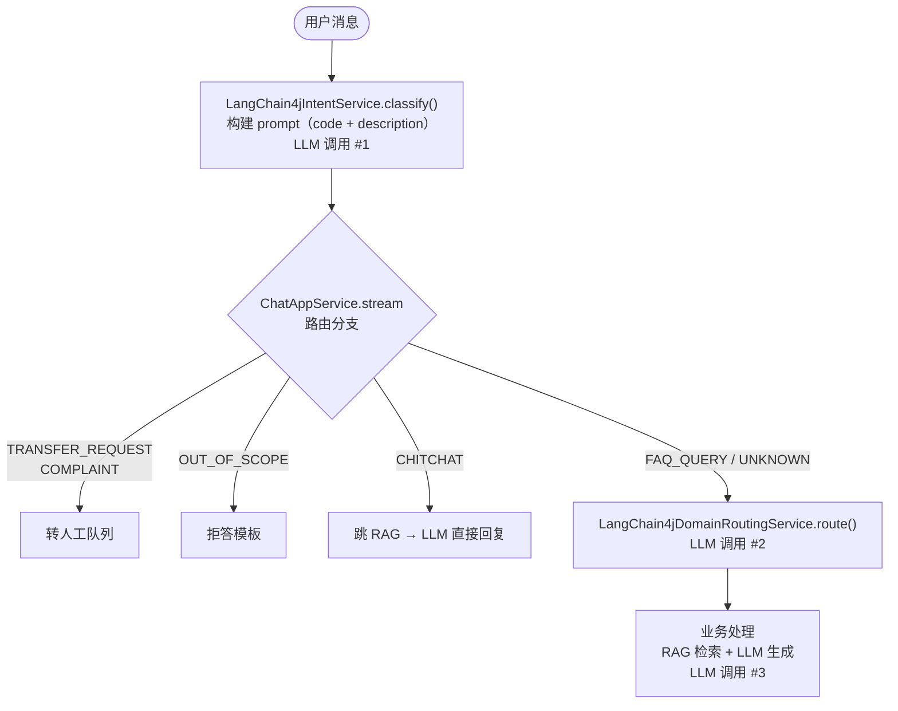
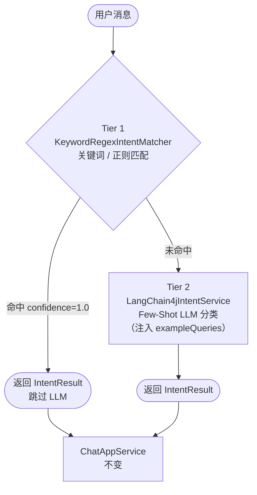
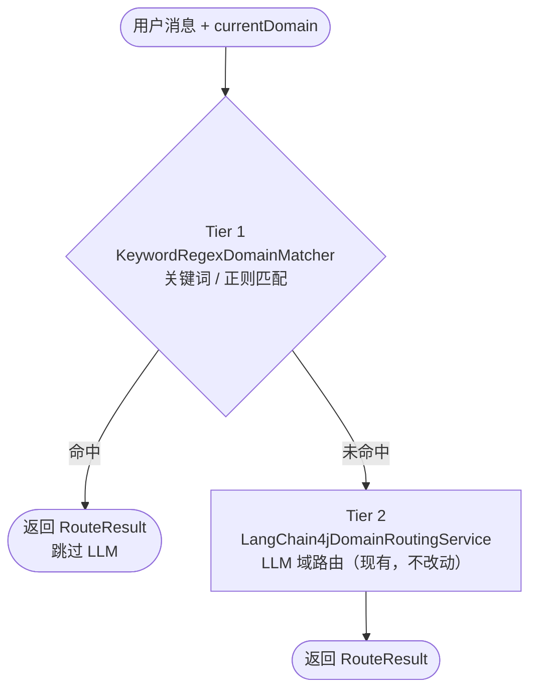
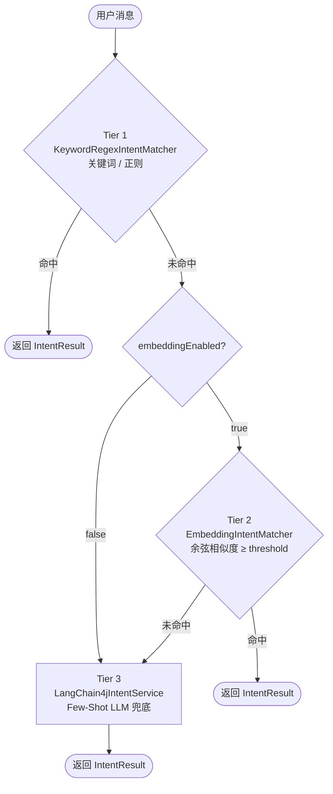

# 意图路由增强技术方案

## 1. 概述与背景

### 1.1 背景

Aria 对话服务当前使用两层纯 LLM 路由策略：用户每条消息都经过意图分类 LLM 和域路由 LLM 两次模型调用，才能进入实际业务处理流程。随着接入域和意图数量的增长，这种方式暴露出三个问题：

1. **延迟累积**：每次对话至少 2 次 LLM 调用（意图分类 + 域路由），高并发下 p99 延迟显著上升。
2. **成本线性增长**：所有消息不分复杂度一律走 LLM，高频简单意图（如"转人工""查订单"）浪费大量 token。
3. **准确率天花板**：当前 `buildPrompt()` 只向 LLM 提供意图描述文本，没有利用数据库中已存储的 `exampleQueries` 示例数据，LLM 在意图边界处容易出错。

### 1.2 参考调研

调研了 Rasa NLU、Botpress、Dify、FastGPT 四个主流对话/LLM 平台的意图处理机制：

- **Rasa / Botpress**：采用多级级联管道（关键词/正则 → ML 分类器 → 置信度兜底），越确定性的检查越靠前，越贵的计算越靠后。
- **Dify / FastGPT**：纯 LLM 分类节点，通过精心设计 class description 和 few-shot 示例提升准确率，不做规则预过滤。

业界共识是**成本有序的级联（cost-ordered cascade）**：便宜/确定性的检查先执行，贵/灵活的计算作为兜底。

### 1.3 方案定位

本方案采用分两阶段落地的级联架构，复用项目现有基础设施（`LangChain4jEmbeddingService`、`cs_intent` 表），不引入新的中间件依赖。

## 2. 现状分析

### 2.1 当前调用链



### 2.2 现有数据结构

**`cs_intent` 表（关键字段）**

| 字段 | 类型 | 当前使用情况 |
|---|---|---|
| `code` | VARCHAR | 用于 prompt 拼接，LLM 返回此值 |
| `description` | TEXT | 用于 prompt 拼接 |
| `example_queries` | JSONB | **存储但未使用**，如 `["查订单","我的包裹到哪了"]` |
| `auto_transfer` | BOOLEAN | ChatAppService 读取 |
| `skip_rag` | BOOLEAN | ChatAppService 读取 |

**`cs_domain` 表（关键字段）**

| 字段 | 类型 | 当前使用情况 |
|---|---|---|
| `code` | VARCHAR | 域路由 prompt + 返回值校验 |
| `description` | TEXT | 域路由 prompt 拼接 |
| `system_prompt_addon` | TEXT | 业务处理时追加到 system prompt |

### 2.3 现有问题量化

| 问题 | 影响 |
|---|---|
| 每条消息固定 2 次路由 LLM 调用 | 路由层增加 ~200–800ms 延迟 |
| `exampleQueries` 未参与匹配 | few-shot 信息白白存储，准确率损失 |
| 无置信度阈值判断 | LLM 返回非法值时才降级，没有"低置信度兜底"机制 |
| 关键词/正则能力缺失 | "转人工""退款"这类高频明确词每次都走 LLM |

### 2.4 核心领域模型

```
IntentService (接口，domain 层)
  └── LangChain4jIntentService (实现，infrastructure 层)

DomainRoutingService (接口，domain 层)
  └── LangChain4jDomainRoutingService (实现，infrastructure 层)

IntentResult(IntentType intent, String intentCode, double confidence)
RouteResult(String suggestedDomain, boolean shouldSwitch)
```

> **注意 `intentCode` 字段**：`IntentType` 枚举只有 6 个固定值（FAQ_QUERY/TRANSFER_REQUEST/COMPLAINT/CHITCHAT/OUT_OF_SCOPE/UNKNOWN），仅用于驱动管道分叉（转人工 vs RAG vs 拒答）。运营在 `cs_intent` 中配置的业务意图 code（如 `query_order`、`product_return`）通过 `intentCode` 字段传递，供下游业务 dispatch 使用，不需要映射到枚举。

DDD 分层清晰，接口与实现分离，新增的匹配层只需在 infrastructure 层扩展，**domain 层接口不变**。

## 3. 目标与非目标

### 3.1 目标

**第一阶段（短期，2–3 周）**

- [ ] 为意图分类增加关键词/正则规则前置层（方案 A），高频确定性意图跳过 LLM
- [ ] 将 `exampleQueries` 注入 LLM prompt 作为 few-shot 示例（方案 C），提升边界情况准确率
- [ ] 为 `cs_intent` 表增加 `keywords`、`patterns` 两列，支持运营通过管理后台自助配置规则
- [ ] 域路由（`DomainRoutingService`）同步增加关键词/正则前置匹配
- [ ] 单元测试覆盖所有新增 matcher，覆盖率不低于现有水平

**第二阶段（中期，4–6 周）**

- [ ] 基于 `exampleQueries` 向量化缓存实现嵌入相似度匹配层（方案 B）
- [ ] 三层级联：规则 → 向量相似 → LLM，可通过配置项按域/意图独立开关各层
- [ ] 向量缓存热更新：意图配置变更时自动刷新，无需重启服务

### 3.2 非目标

- 不引入独立的 NLU 模型服务（如 Rasa、Bert-as-Service）
- 不修改 `IntentService` / `DomainRoutingService` 接口签名（保持向后兼容）
- 不改变 `ChatAppService` 的路由分支逻辑（只改分类器，不改消费方）
- 不做多轮上下文感知的意图修正（当前单轮分类已满足需求）
- 第一阶段不做向量相似度层（避免过早引入复杂性）

### 3.3 成功指标

| 指标 | 当前 | 第一阶段目标 | 第二阶段目标 |
|---|---|---|---|
| 路由层 p99 延迟 | ~800ms | ≤600ms（高频词命中后<5ms） | ≤200ms（大部分走向量层） |
| 意图分类准确率（人工抽样） | ~85% | ≥90% | ≥95% |
| LLM 路由调用减少比例 | 0% | ~30%（规则层命中） | ~70%（规则+向量层命中） |
| 运营可自助配置 | 否 | 是（关键词/正则） | 是（关键词/正则/示例） |

## 4. 整体架构设计

### 4.1 目标架构（第一阶段）

**意图分类级联：**



**域路由级联：**



### 4.2 目标架构（第二阶段）



### 4.3 组件职责划分

| 组件 | 职责 | 层 | 阶段 |
|---|---|---|---|
| `IntentService` | 意图分类接口（不变） | domain | 现有 |
| `DomainRoutingService` | 域路由接口（不变） | domain | 现有 |
| `KeywordRegexIntentMatcher` | 关键词/正则意图匹配 | infrastructure | 第一阶段 |
| `KeywordRegexDomainMatcher` | 关键词/正则域路由 | infrastructure | 第一阶段 |
| `HybridIntentService` | 意图分类级联协调器 | infrastructure | 第一阶段 |
| `HybridDomainRoutingService` | 域路由级联协调器 | infrastructure | 第一阶段 |
| `EmbeddingIntentMatcher` | 向量相似度意图匹配 | infrastructure | 第二阶段 |
| `IntentEmbeddingCache` | 意图向量缓存管理 | infrastructure | 第二阶段 |
| `RoutingProperties` | 各 tier 阈值配置 | infrastructure/config | 第一阶段 |

### 4.4 关键设计决策

**决策 1：`HybridIntentService` 替换 `LangChain4jIntentService` 注册为 Bean**

通过 `@Primary` 注解或直接替换，让 Spring 注入 `HybridIntentService`，内部持有 `LangChain4jIntentService` 引用，`ChatAppService` 代码零改动。

**决策 2：Tier 1 置信度固定为 1.0，同时返回 intentCode**

关键词/正则命中视为完全确定，`IntentResult` 同时携带 `intentType`（管道分叉用）和 `intentCode`（业务 dispatch 用）。同时命中多个意图规则时，按意图的 `sort_order` 取最小（优先级最高）的那个。

**决策 3：`DomainDO` 复用 `keywords`/`patterns` 字段**

域路由的规则字段与意图表同构，便于统一的管理后台编辑组件复用。

## 5. 数据模型变更

### 5.1 `cs_intent` 表新增字段

```sql
-- V{next}__add_intent_routing_rules.sql
ALTER TABLE cs_intent
    ADD COLUMN IF NOT EXISTS keywords    JSONB    DEFAULT '[]'::jsonb,
    ADD COLUMN IF NOT EXISTS patterns    JSONB    DEFAULT '[]'::jsonb;

COMMENT ON COLUMN cs_intent.keywords IS '关键词列表，JSON 字符串数组，如 ["退款","退货","不想要了"]，大小写不敏感全文包含匹配';
COMMENT ON COLUMN cs_intent.patterns IS '正则表达式列表，JSON 字符串数组，如 ["^我要.*投诉",".*转.*人工.*"]，Java Pattern 语法，DOTALL|CASE_INSENSITIVE';
```

### 5.2 `cs_domain` 表新增字段

```sql
ALTER TABLE cs_domain
    ADD COLUMN IF NOT EXISTS keywords    JSONB    DEFAULT '[]'::jsonb,
    ADD COLUMN IF NOT EXISTS patterns    JSONB    DEFAULT '[]'::jsonb;

COMMENT ON COLUMN cs_domain.keywords IS '域路由关键词列表，命中则直接路由到该域，跳过 LLM';
COMMENT ON COLUMN cs_domain.patterns IS '域路由正则列表，命中则直接路由到该域，跳过 LLM';
```

### 5.3 Java DO 对象变更

**`IntentDO` 新增字段**

```java
/** 关键词列表，JSON 数组，大小写不敏感包含匹配 */
@TableField(typeHandler = JsonbTypeHandler.class)
private String keywords;   // e.g. ["退款","退货"]

/** 正则表达式列表，JSON 数组，Java Pattern 语法 */
@TableField(typeHandler = JsonbTypeHandler.class)
private String patterns;   // e.g. ["^我要.*投诉"]
```

**`DomainDO` 新增字段（同构）**

```java
@TableField(typeHandler = JsonbTypeHandler.class)
private String keywords;

@TableField(typeHandler = JsonbTypeHandler.class)
private String patterns;
```

### 5.4 `IntentConfig` record 变更（含完整 call site 清单）

当前 `IntentConfig` 的 `exampleQueries` 是 `String`（原始 JSON 字符串，如 `["查订单","我的包裹到哪了"]`）。本方案将其在 Repository 层统一解析为 `List<String>`，并同步新增 `keywords`、`patterns`、`sortOrder` 三个字段：

```java
// IntentConfig.java — 完整 record 定义
public record IntentConfig(
    String code,
    String name,
    String description,
    List<String> exampleQueries,   // 原 String，改为 List<String>，由 Repository 解析
    boolean autoTransfer,
    boolean skipRag,
    String fallbackReply,
    List<SlotConfig> slots,
    List<IntentToolBinding> toolBindings,
    List<String> keywords,         // 新增
    List<String> patterns,         // 新增
    int sortOrder                  // 新增，来自 IntentDO.sortOrder
) implements Serializable { ... }
```

**`DomainRepository.buildDomainConfig()` 对应变更**（必须同步修改，否则编译报错）：

```java
// 原来
intents.add(new IntentConfig(
    intentDO.getCode(),
    intentDO.getName(),
    intentDO.getDescription(),
    intentDO.getExampleQueries(),          // String 原始 JSON
    Boolean.TRUE.equals(intentDO.getAutoTransfer()),
    Boolean.TRUE.equals(intentDO.getSkipRag()),
    intentDO.getFallbackReply(),
    slots,
    bindings
));

// 修改后（使用已有的 parseJsonArray() 工具方法）
intents.add(new IntentConfig(
    intentDO.getCode(),
    intentDO.getName(),
    intentDO.getDescription(),
    parseJsonArray(intentDO.getExampleQueries()),  // ★ String → List<String>
    Boolean.TRUE.equals(intentDO.getAutoTransfer()),
    Boolean.TRUE.equals(intentDO.getSkipRag()),
    intentDO.getFallbackReply(),
    slots,
    bindings,
    parseJsonArray(intentDO.getKeywords()),         // ★ 新增
    parseJsonArray(intentDO.getPatterns()),          // ★ 新增
    intentDO.getSortOrder() != null ? intentDO.getSortOrder() : 0  // ★ 新增
));
```

**其他受影响 call site**：

| 位置 | 变更内容 |
|---|---|
| `LangChain4jIntentService.buildPrompt()` | `exampleQueries` 已是 `List<String>`，可直接使用，删去 JSON 解析步骤 |
| `LangChain4jIntentServiceTest` factory 方法 | 补充新增字段的默认值（`List.of(), List.of(), 0`） |

### 5.5 数据示例

运营在管理后台为"转人工"意图配置规则后，数据库中存储如下：

```json
// cs_intent 某行
{
  "code": "TRANSFER_REQUEST",
  "description": "用户明确或隐含要求转接人工客服",
  "keywords": ["转人工", "找真人", "真人客服", "人工", "转接客服"],
  "patterns": ["^(我要|帮我|请)?转.*人工", "^.*不想.*机器人.*"],
  "example_queries": ["我要找真人", "转客服", "你听不懂我说什么", "能不能让人来接待我"]
}
```

### 5.6 索引与性能

`keywords` / `patterns` 字段均为 JSONB，数据量小（每个意图通常 ≤ 20 条规则），**不需要额外索引**。规则在应用启动时全量加载到内存，运行期匹配完全在 JVM 内完成，不产生额外数据库查询。

## 6. 规则层实现（方案 A，第一阶段）

### 6.1 `KeywordRegexIntentMatcher`

```java
/**
 * 关键词 + 正则意图匹配器（Tier 1）。
 *
 * <p>启动时将所有意图的规则预编译缓存，运行期纯内存匹配，无 IO 开销。
 * 命中置信度固定为 1.0；同时命中多个意图时取 sortOrder 最小（优先级最高）的那个。
 *
 * <p><b>ReDoS 防护：</b>patterns 由运营通过管理后台填写，保存时须通过以下校验：
 * (1) 长度 ≤ 200 字符；(2) 禁止嵌套量词（如 {@code (a+)+}）；
 * (3) 不允许 {@code .*.*} 连续通配。校验逻辑在管理后台 API 层实现，非本服务职责。
 *
 * <p><b>中文关键词误匹配说明：</b>纯子串匹配对中文无词边界，关键词应至少包含 3 个汉字，
 * 避免单字或双字关键词（如"转"会误匹配"流转""转账"）。高敏感意图（TRANSFER_REQUEST）
 * 建议使用正则而非关键词。
 */
@Component
@RequiredArgsConstructor
@Slf4j
public class KeywordRegexIntentMatcher {

    private final DomainRepository domainRepository;

    /**
     * 编译后的规则条目，按 sortOrder 升序排列。
     * IntentDO.sortOrder 已由 IntentMapper.findByDomainId() 按 sort_order ASC 返回，
     * DomainRepository 保留顺序，此处无需重复排序。
     */
    private volatile List<IntentRuleEntry> compiledRules = List.of();

    @PostConstruct
    public void init() {
        reload();
    }

    /** 支持热更新：意图配置变更后由 DomainCacheEvictedEvent 触发（见第 6.5 节） */
    public void reload() {
        DomainConfig system = domainRepository.findByCode(DomainCodes.SYSTEM_DOMAIN).orElse(null);
        if (system == null) {
            log.warn("[RuleMatcher] __system__ 域不存在，规则层不可用");
            return;
        }
        List<IntentRuleEntry> entries = system.intents().stream()
                .filter(this::hasRules)
                .map(this::compile)
                .toList();
        this.compiledRules = entries;
        log.info("[RuleMatcher] 加载意图规则 {} 条", entries.size());
    }

    /**
     * 尝试用规则匹配用户消息。
     * @return Optional.empty() 表示无命中，由下一层处理
     */
    public Optional<IntentResult> match(String userMessage) {
        if (userMessage == null || userMessage.isBlank()) {
            return Optional.empty();
        }
        String lowerMessage = userMessage.toLowerCase();

        for (IntentRuleEntry entry : compiledRules) {
            // 关键词匹配（大小写不敏感，全文包含）
            for (String kw : entry.keywords()) {
                if (lowerMessage.contains(kw.toLowerCase())) {
                    log.debug("[RuleMatcher] 关键词命中 intent={} keyword={}", entry.intentCode(), kw);
                    // intentCode 携带原始业务 code，intentType 携带管道分叉枚举
                    return Optional.of(new IntentResult(entry.intentType(), entry.intentCode(), 1.0));
                }
            }
            // 正则匹配
            for (Pattern p : entry.compiledPatterns()) {
                if (p.matcher(userMessage).find()) {
                    log.debug("[RuleMatcher] 正则命中 intent={} pattern={}", entry.intentCode(), p.pattern());
                    return Optional.of(new IntentResult(entry.intentType(), entry.intentCode(), 1.0));
                }
            }
        }
        return Optional.empty();
    }

    private boolean hasRules(IntentConfig i) {
        return (i.keywords() != null && !i.keywords().isEmpty())
                || (i.patterns() != null && !i.patterns().isEmpty());
    }

    private IntentRuleEntry compile(IntentConfig i) {
        List<Pattern> compiled = i.patterns() == null ? List.of()
                : i.patterns().stream()
                        .map(p -> Pattern.compile(p, Pattern.CASE_INSENSITIVE | Pattern.DOTALL))
                        .toList();
        // 尝试将业务 code 映射到管道分叉枚举；未知 code 降级为 UNKNOWN（仍走 FAQ 流程）
        IntentType type;
        try {
            type = IntentType.valueOf(i.code().toUpperCase());
        } catch (IllegalArgumentException e) {
            // 自定义业务意图（如 query_order）不在枚举内，视为 FAQ_QUERY 分叉（走 RAG+LLM）
            type = IntentType.FAQ_QUERY;
        }
        return new IntentRuleEntry(
                i.code(),      // 原始业务 code，如 "query_order"
                type,          // 管道分叉枚举，如 FAQ_QUERY
                i.keywords() == null ? List.of() : i.keywords(),
                compiled
        );
    }

    record IntentRuleEntry(
            String intentCode,
            IntentType intentType,
            List<String> keywords,
            List<Pattern> compiledPatterns
    ) {}
}
```

### 6.2 `KeywordRegexDomainMatcher`

域路由的规则匹配逻辑与意图匹配同构，差异在于返回的是域 code 而非 `IntentType`：

```java
@Component
@RequiredArgsConstructor
@Slf4j
public class KeywordRegexDomainMatcher {

    private final DomainRepository domainRepository;
    private volatile List<DomainRuleEntry> compiledRules = List.of();

    @PostConstruct
    public void init() { reload(); }

    public void reload() {
        List<DomainRuleEntry> entries = domainRepository.findAllEnabledSummary().stream()
                .filter(d -> hasRules(d))
                .map(this::compile)
                .toList();
        this.compiledRules = entries;
        log.info("[DomainRuleMatcher] 加载域规则 {} 条", entries.size());
    }

    /** @return Optional.empty() 表示未命中，继续走 LLM 路由 */
    public Optional<String> matchDomain(String userMessage) {
        if (userMessage == null || userMessage.isBlank()) return Optional.empty();
        String lower = userMessage.toLowerCase();
        for (DomainRuleEntry entry : compiledRules) {
            for (String kw : entry.keywords()) {
                if (lower.contains(kw.toLowerCase())) return Optional.of(entry.domainCode());
            }
            for (Pattern p : entry.compiledPatterns()) {
                if (p.matcher(userMessage).find()) return Optional.of(entry.domainCode());
            }
        }
        return Optional.empty();
    }

    // compile / hasRules 逻辑同 KeywordRegexIntentMatcher，略
    record DomainRuleEntry(String domainCode, List<String> keywords, List<Pattern> compiledPatterns) {}
}
```

> **注意**：`RoutingProperties.domain.minLlmConfidence` 配置项预留用于未来域路由返回置信度评分时使用。当前 `LangChain4jDomainRoutingService` 返回裸 domain code，无置信度字段，该配置**暂不生效**，不在规则层或 LLM 层消费。第一阶段保留配置项但注释说明其状态。

### 6.3 `HybridIntentService`（级联协调器）

```java
/**
 * 意图分类级联协调器，实现 IntentService 接口。
 * 通过 @Primary 替换 LangChain4jIntentService 作为注入 Bean。
 *
 * 级联顺序：
 *   Tier 1 规则匹配（关键词/正则）
 *   Tier 2 LLM 分类（few-shot prompt，现有逻辑）
 */
@Primary
@Component
@RequiredArgsConstructor
@Slf4j
public class HybridIntentService implements IntentService {

    private final KeywordRegexIntentMatcher ruleMatcher;
    private final LangChain4jIntentService llmClassifier;

    @Override
    public IntentResult classify(String userMessage) {
        // Tier 1: 规则层
        Optional<IntentResult> ruleResult = ruleMatcher.match(userMessage);
        if (ruleResult.isPresent()) {
            log.debug("[HybridIntent] Tier1 规则命中，跳过 LLM. intent={}",
                    ruleResult.get().intent());
            return ruleResult.get();
        }
        // Tier 2: LLM 分类（兜底）
        return llmClassifier.classify(userMessage);
    }
}
```

### 6.4 `HybridDomainRoutingService`（级联协调器）

```java
@Primary
@Component
@RequiredArgsConstructor
@Slf4j
public class HybridDomainRoutingService implements DomainRoutingService {

    private final KeywordRegexDomainMatcher ruleMatcher;
    private final LangChain4jDomainRoutingService llmRouter;

    @Override
    public RouteResult route(String userMessage, String currentDomain,
                             List<ConversationMessage> recentHistory) {
        // Tier 1: 规则层
        Optional<String> matched = ruleMatcher.matchDomain(userMessage);
        if (matched.isPresent()) {
            String target = matched.get();
            boolean shouldSwitch = !target.equalsIgnoreCase(currentDomain);
            log.debug("[HybridDomain] Tier1 规则命中，跳过 LLM. domain={} shouldSwitch={}",
                    target, shouldSwitch);
            return new RouteResult(target, shouldSwitch);
        }
        // Tier 2: LLM 路由（兜底）
        return llmRouter.route(userMessage, currentDomain, recentHistory);
    }
}
```

### 6.5 规则缓存热更新（第一阶段必须实现）

`DomainRepository.evict()` 清 Redis 后，`KeywordRegexIntentMatcher` 和 `KeywordRegexDomainMatcher` 的内存规则不会自动刷新。需在 `DomainRepository.evict()` 中发布一个 Spring 应用事件，由两个 Matcher 监听并触发 `reload()`：

```java
// DomainRepository.evict() 修改
public void evict(String domainCode) {
    cache.delete(CACHE_KEY_PREFIX + domainCode);
    log.info("[DIT] 领域配置缓存已失效 code={}", domainCode);
    // ★ 新增：通知规则层刷新
    applicationContext.publishEvent(new DomainCacheEvictedEvent(this, domainCode));
}

// DomainCacheEvictedEvent.java（新增）
public class DomainCacheEvictedEvent extends ApplicationEvent {
    private final String domainCode;
    public DomainCacheEvictedEvent(Object source, String domainCode) {
        super(source);
        this.domainCode = domainCode;
    }
    public String getDomainCode() { return domainCode; }
}

// KeywordRegexIntentMatcher 中监听
@EventListener
public void onDomainEvicted(DomainCacheEvictedEvent event) {
    // 只有 __system__ 域变更才影响意图规则
    if (DomainCodes.SYSTEM_DOMAIN.equals(event.getDomainCode())) {
        log.info("[RuleMatcher] 检测到 __system__ 域配置变更，刷新意图规则缓存");
        reload();
    }
}

// KeywordRegexDomainMatcher 中监听
@EventListener
public void onDomainEvicted(DomainCacheEvictedEvent event) {
    log.info("[DomainRuleMatcher] 检测到域 {} 配置变更，刷新域规则缓存", event.getDomainCode());
    reload();
}
```

## 7. LLM 增强实现（方案 C，第一阶段）

### 7.1 改造 `buildPrompt()`

将 `exampleQueries` 注入 prompt 作为 few-shot 示例。随着 5.4 节 `IntentConfig.exampleQueries` 已从 `String` 改为 `List<String>`（Repository 层统一解析），`buildPrompt()` 可直接使用，**不再需要 JSON 解析**：

```java
// ✅ 改造后（exampleQueries 已是 List<String>，无需 JSON 解析）
private String buildPrompt(List<IntentConfig> intents) {
    StringBuilder sb = new StringBuilder("""
            你是一个用户意图分类器。分析用户的输入，返回以下 JSON 格式，不要输出任何其他内容：
            {"intent": "<意图>", "confidence": <0.0到1.0的小数>}

            意图取值说明：
            """);
    int maxExamples = routingProperties.getIntent().getMaxExamplesToInject();
    for (IntentConfig intent : intents) {
        sb.append("- ").append(intent.code());
        if (intent.description() != null && !intent.description().isBlank()) {
            sb.append("：").append(intent.description());
        }
        // ★ 注入 exampleQueries 作为 few-shot 示例（已是 List<String>，无需解析）
        List<String> examples = intent.exampleQueries();
        if (examples != null && !examples.isEmpty()) {
            List<String> sample = examples.size() > maxExamples
                    ? examples.subList(0, maxExamples) : examples;
            sb.append("（示例：").append(String.join("、", sample)).append("）");
        }
        sb.append("\n");
    }
    sb.append("- UNKNOWN：无法判断\n\n只输出 JSON，不要解释。");
    return sb.toString();
}
```

### 7.2 改造后 Prompt 示例

```
你是一个用户意图分类器。分析用户的输入，返回以下 JSON 格式，不要输出任何其他内容：
{"intent": "<意图>", "confidence": <0.0到1.0的小数>}

意图取值说明：
- FAQ_QUERY：知识类问题（示例：退款政策是什么、怎么查物流、商品质量有问题、发货要多久、如何申请售后）
- TRANSFER_REQUEST：用户明确或隐含要求转接人工客服（示例：我要找真人、转客服、你听不懂我说什么、能不能让人来接待我）
- COMPLAINT：投诉（示例：你们服务太差了、我要投诉、我非常不满意、这什么破系统）
- CHITCHAT：闲聊/问候（示例：你好、你是谁、今天天气怎么样、聊聊天）
- OUT_OF_SCOPE：与业务无关（示例：帮我解道数学题、翻译一段英文、写首诗）
- UNKNOWN：无法判断

只输出 JSON，不要解释。
```

### 7.3 置信度低于阈值时的处理

改造后的 LLM 调用同时引入置信度阈值判断。`parseResponse()` 同步补充 `intentCode` 字段（保留 LLM 返回的原始 code 字符串），当 `confidence` 低于配置阈值时降级为 UNKNOWN：

```java
IntentResult parseResponse(String response) {
    // ... 现有 JSON 解析逻辑 ...
    String intentStr = node.path("intent").asText("UNKNOWN").toUpperCase();
    double confidence = node.path("confidence").asDouble(1.0);

    IntentType intent;
    try {
        intent = IntentType.valueOf(intentStr);
    } catch (IllegalArgumentException ex) {
        log.warn("[Intent] 未知意图值: {}, 降级为 UNKNOWN", intentStr);
        // 自定义业务意图 code（如 query_order）不在枚举内，按 FAQ_QUERY 分叉
        intent = IntentType.FAQ_QUERY;
    }

    // ★ 新增：低置信度降级为 UNKNOWN
    double minConfidence = routingProperties.getIntent().getMinLlmConfidence();
    if (confidence < minConfidence) {
        log.debug("[Intent] LLM 置信度 {} < 阈值 {}，降级为 UNKNOWN", confidence, minConfidence);
        return IntentResult.UNKNOWN;
    }

    // intentCode 携带原始小写 code（如 "faq_query" 或自定义 "query_order"）
    return new IntentResult(intent, intentStr.toLowerCase(), confidence);
}
```

`IntentResult` domain model 对应变更：

```java
// IntentResult.java — 新增 intentCode 字段
public record IntentResult(IntentType intent, String intentCode, double confidence) {

    /**
     * 兜底结果。
     * confidence=0.0 而非 1.0，语义上"什么都不知道"不应携带高置信度。
     */
    public static final IntentResult UNKNOWN =
            new IntentResult(IntentType.UNKNOWN, "UNKNOWN", 0.0);

    public boolean requiresTransfer() {
        return intent == IntentType.TRANSFER_REQUEST || intent == IntentType.COMPLAINT;
    }

    public boolean skipRag() {
        return intent == IntentType.CHITCHAT || intent == IntentType.OUT_OF_SCOPE;
    }
}
```

### 7.4 `exampleQueries` 示例数量策略

| 每个意图示例数 | 效果 | Token 消耗 |
|---|---|---|
| 0 条 | 基线（当前） | 最低 |
| 3–5 条 | 显著提升边界准确率 | +~50 tokens/意图 |
| 10+ 条 | 边际效益递减，prompt 显著变长 | 成本过高 |

**建议：** 每个意图维护 5–8 条高质量示例，prompt 注入时取前 5 条。示例应覆盖典型说法、口语化变体、边界情况三类。

### 7.5 域路由的 Few-Shot 增强

`LangChain4jDomainRoutingService.buildPrompt()` 同步改造，将 `DomainDO` 的 `exampleQueries`（需同步新增此字段，与意图同构）注入 prompt：

```java
for (DomainDO d : enabledDomains) {
    sb.append("- ").append(d.getCode());
    if (d.getDescription() != null) sb.append("：").append(d.getDescription());
    // ★ 新增示例注入（域级别）
    if (d.getExampleQueries() != null && !d.getExampleQueries().isEmpty()) {
        sb.append("（示例：").append(String.join("、", d.getExampleQueries())).append("）");
    }
    sb.append("\n");
}
```

## 8. 向量相似度层（方案 B，第二阶段）

### 8.1 设计思路

向量相似度层的核心思路：将每个意图的 `exampleQueries` 在服务启动时向量化并缓存到内存，运行期对用户消息做向量化后与缓存做余弦相似度计算，超过阈值即命中，无需调用 LLM。

**跨模块依赖解决方案**：`EmbeddingService` 接口和 `LangChain4jEmbeddingService` 实现均在 `ai-knowledge/knowledge-service`，`conversation-service` 不应直接引用该模块。已有 `KnowledgeServiceClient`（conversation-service 内部的 HTTP 客户端）访问 knowledge-service，Phase 2 在此基础上新增一个 `encode` 端点，由 `conversation-service` 通过 HTTP 调用。

```mermaid
flowchart LR
    subgraph conversation-service
        EIM[EmbeddingIntentMatcher]
        KSC[KnowledgeServiceClient\n.encode&#40;text&#41;]
        EIM --> KSC
    end
    subgraph knowledge-service
        IEC["InternalEmbeddingController\nPOST /internal/embedding/encode"]
        ES[EmbeddingService\n.encode&#40;text&#41;]
        IEC --> ES
    end
    KSC -->|HTTP| IEC
```



不需要提取 `EmbeddingService` 接口到 `ai-common`，也不需要新增 Maven 模块依赖。

### 8.2 knowledge-service 新增 encode 端点

```java
// InternalEmbeddingController.java（knowledge-service 新增）
@RestController
@RequestMapping("/internal/embedding")
@RequiredArgsConstructor
public class InternalEmbeddingController {

    private final EmbeddingService embeddingService;

    @PostMapping("/encode")
    public float[] encode(@RequestBody String text) {
        return embeddingService.encode(text);
    }
}
```

### 8.3 `KnowledgeServiceClient` 新增 encode 方法

```java
// KnowledgeServiceClient.java（conversation-service 已有，追加方法）

/**
 * 向量化单个文本，用于意图相似度匹配。
 * 失败时抛 RuntimeException，由调用方决定降级策略。
 */
float[] encode(String text);
```

### 8.4 `IntentEmbeddingCache`

```java
/**
 * 意图向量缓存。
 * 启动时将所有意图的 exampleQueries 通过 KnowledgeServiceClient.encode() 向量化存入内存。
 * 支持热更新（监听 DomainCacheEvictedEvent）。
 */
@Component
@RequiredArgsConstructor
@Slf4j
public class IntentEmbeddingCache {

    private final DomainRepository domainRepository;
    private final KnowledgeServiceClient knowledgeClient;  // 已有，新增 encode 方法

    /**
     * intentCode → 该意图所有示例的向量列表
     * volatile + 整体替换保证可见性，无需锁
     */
    private volatile Map<String, List<float[]>> cache = Map.of();
    private volatile Map<String, IntentType> codeToType = Map.of();

    @PostConstruct
    public void init() { reload(); }

    @EventListener
    public void onDomainEvicted(DomainCacheEvictedEvent event) {
        if (DomainCodes.SYSTEM_DOMAIN.equals(event.getDomainCode())) {
            log.info("[EmbeddingCache] __system__ 域变更，刷新向量缓存");
            reload();
        }
    }

    public void reload() {
        DomainConfig system = domainRepository.findByCode(DomainCodes.SYSTEM_DOMAIN).orElse(null);
        if (system == null || system.intents().isEmpty()) {
            log.warn("[EmbeddingCache] __system__ 域不存在，向量层不可用");
            return;
        }

        Map<String, List<float[]>> newCache = new HashMap<>();
        Map<String, IntentType> newCodeToType = new HashMap<>();

        for (IntentConfig intent : system.intents()) {
            if (intent.exampleQueries() == null || intent.exampleQueries().isEmpty()) continue;
            try {
                // exampleQueries 已是 List<String>，直接向量化
                List<float[]> vectors = intent.exampleQueries().stream()
                        .map(knowledgeClient::encode)
                        .toList();
                newCache.put(intent.code(), vectors);
                // 自定义业务意图 code 不在枚举内，同规则层处理：降级为 FAQ_QUERY
                IntentType type;
                try {
                    type = IntentType.valueOf(intent.code().toUpperCase());
                } catch (IllegalArgumentException e) {
                    type = IntentType.FAQ_QUERY;
                }
                newCodeToType.put(intent.code(), type);
            } catch (Exception e) {
                log.warn("[EmbeddingCache] 意图 {} 向量化失败，跳过", intent.code(), e);
            }
        }

        this.cache = Map.copyOf(newCache);
        this.codeToType = Map.copyOf(newCodeToType);
        log.info("[EmbeddingCache] 向量缓存就绪，共 {} 个意图", newCache.size());
    }

    public Map<String, List<float[]>> getCache() { return cache; }
    public Map<String, IntentType> getCodeToType() { return codeToType; }
}
```

### 8.5 `EmbeddingIntentMatcher`

```java
/**
 * 向量相似度意图匹配器（Tier 2）。
 * 对用户消息向量化后，与缓存中各意图的示例向量做余弦相似度计算，
 * 取各意图最高相似度，超过阈值即命中。
 */
@Component
@RequiredArgsConstructor
@Slf4j
public class EmbeddingIntentMatcher {

    private final IntentEmbeddingCache embeddingCache;
    private final KnowledgeServiceClient knowledgeClient;
    private final RoutingProperties routingProperties;

    public Optional<IntentResult> match(String userMessage) {
        double threshold = routingProperties.getIntent().getEmbeddingThreshold();

        float[] queryVec;
        try {
            queryVec = knowledgeClient.encode(userMessage);
        } catch (Exception e) {
            log.warn("[EmbeddingMatcher] 用户消息向量化失败，跳过向量层", e);
            return Optional.empty();
        }

        String bestCode = null;
        double bestScore = 0.0;

        for (Map.Entry<String, List<float[]>> entry : embeddingCache.getCache().entrySet()) {
            for (float[] exVec : entry.getValue()) {
                double sim = cosineSimilarity(queryVec, exVec);
                if (sim > bestScore) {
                    bestScore = sim;
                    bestCode = entry.getKey();
                }
            }
        }

        if (bestCode != null && bestScore >= threshold) {
            IntentType type = embeddingCache.getCodeToType()
                    .getOrDefault(bestCode, IntentType.FAQ_QUERY);
            log.debug("[EmbeddingMatcher] 向量命中 intent={} score={:.4f}", bestCode, bestScore);
            return Optional.of(new IntentResult(type, bestCode, bestScore));
        }
        return Optional.empty();
    }

    private double cosineSimilarity(float[] a, float[] b) {
        double dot = 0, normA = 0, normB = 0;
        for (int i = 0; i < a.length; i++) {
            dot   += a[i] * b[i];
            normA += a[i] * a[i];
            normB += b[i] * b[i];
        }
        // 零向量（embedding 模型返回全零时）不可计算，安全返回 0.0
        if (normA == 0 || normB == 0) return 0.0;
        return dot / (Math.sqrt(normA) * Math.sqrt(normB));
    }
}
```

### 8.6 第二阶段 `HybridIntentService` 升级

```java
@Override
public IntentResult classify(String userMessage) {
    // Tier 1: 规则层
    Optional<IntentResult> ruleResult = ruleMatcher.match(userMessage);
    if (ruleResult.isPresent()) return ruleResult.get();

    // Tier 2: 向量相似度层（第二阶段，由 embeddingEnabled 控制）
    if (routingProperties.getIntent().isEmbeddingEnabled()) {
        Optional<IntentResult> embResult = embeddingMatcher.match(userMessage);
        if (embResult.isPresent()) return embResult.get();
    }

    // Tier 3: LLM 兜底
    return llmClassifier.classify(userMessage);
}
```

### 8.7 性能预估

| 场景 | 延迟估算 |
|---|---|
| 规则层命中 | < 1ms（纯内存字符串比较） |
| 向量层命中 | ~10–50ms（HTTP encode 调用 + 内存余弦计算） |
| LLM 兜底 | 200–800ms（HTTP 调用） |
| 意图数 10 个，每意图 5 条示例 | 向量计算 50 次余弦相似度，< 0.1ms |

> 向量层延迟主要来自 `KnowledgeServiceClient.encode()` 的 HTTP 调用（~10–30ms），内存余弦计算可忽略。若延迟不可接受，可在 conversation-service 内缓存用户消息向量（LRU，TTL 30s）。

## 9. 配置与阈值策略

### 9.1 配置存储方案

路由阈值配置存入现有 `system_config` 表（`configType=CUSTOMER_SERVICE`），通过管理后台 `/api/v1/admin/system-config` 接口在线编辑，无需重新部署。

**整体读取链路：**

```mermaid
flowchart LR
    subgraph admin-ui
        UI[管理后台\n修改路由配置]
    end
    subgraph auth-service
        SC[system_config 表]
        PUB[Redis Pub/Sub\naria:config:routing-changed]
        UI -->|PUT /admin/system-config/{id}| SC
        SC --> PUB
    end
    subgraph conversation-service
        RCP[RoutingConfigProvider\nRedis 缓存 TTL 5min]
        RP[RoutingProperties\nYAML 默认值兜底]
        RCP -->|cache miss| AC[AuthClient\nGET /internal/system-config/map]
        PUB -->|失效通知| RCP
    end
    AC --> SC
    RCP --> RP
```

**`RoutingProperties`（YAML）仍然保留**，作为编译时默认值兜底——DB 有值时覆盖，DB 无值或不可用时回退到 YAML 默认值，保证服务在 auth-service 不可用时也能正常运行。

### 9.2 配置键定义（`system_config` 种子数据）

5 个路由参数合并为 **1 条 JSON 记录**，`configValue` 存储整个配置对象，便于管理后台结构化编辑。

新增 Flyway 迁移脚本（`V{next}__add_routing_config.sql`）：

```sql
INSERT INTO cs_auth.system_config (config_key, config_value, config_type, description, is_enabled)
VALUES (
  'routing.config',
  '{
    "intent": {
      "embeddingEnabled": false,
      "embeddingThreshold": 0.75,
      "minLlmConfidence": 0.0,
      "maxExamplesToInject": 5
    },
    "domain": {
      "ruleEnabled": true
    }
  }',
  'CUSTOMER_SERVICE',
  '意图路由级联配置（JSON）',
  true
);
```

`RoutingConfigProvider` 读取 `routing.config` 这一个 key，`objectMapper.readValue()` 后取各子字段，任何字段缺失时回退到 `RoutingProperties` YAML 默认值。

### 9.3 `RoutingConfigProvider` 实现

仿照 `RemoteAiModelConfigProvider` 的模式，在 conversation-service 中新建：

```java
/**
 * 路由配置提供者。
 *
 * <p>从 auth-service system_config 读取 {@code routing.config} 单条 JSON 记录，
 * Redis 缓存 TTL 5 分钟。订阅 {@code aria:config:routing-changed} 主题，
 * 收到变更通知后主动清缓存。auth-service 不可用时降级返回 YAML 默认值。
 */
@Component
@RequiredArgsConstructor
@Slf4j
public class RoutingConfigProvider implements MessageListener {

    private static final String CACHE_KEY   = "aria:routing:config";
    private static final String CONFIG_KEY  = "routing.config";
    private static final Duration CACHE_TTL = Duration.ofMinutes(5);
    static final String PUBSUB_TOPIC        = "aria:config:routing-changed";

    private final RedisCacheHelper cache;
    private final AuthClient authClient;
    private final ObjectMapper objectMapper;
    private final RoutingProperties defaults;   // YAML 兜底

    // ---- 读取接口 ----

    public boolean isEmbeddingEnabled() {
        return getBoolean("intent.embeddingEnabled",
                defaults.getIntent().isEmbeddingEnabled());
    }

    public double getEmbeddingThreshold() {
        return getDouble("intent.embeddingThreshold",
                defaults.getIntent().getEmbeddingThreshold());
    }

    public double getMinLlmConfidence() {
        return getDouble("intent.minLlmConfidence",
                defaults.getIntent().getMinLlmConfidence());
    }

    public int getMaxExamplesToInject() {
        return getInt("intent.maxExamplesToInject",
                defaults.getIntent().getMaxExamplesToInject());
    }

    public boolean isDomainRuleEnabled() {
        return getBoolean("domain.ruleEnabled",
                defaults.getDomain().isRuleEnabled());
    }

    // ---- Pub/Sub 失效 ----

    @Override
    public void onMessage(Message message, byte[] pattern) {
        log.info("[RoutingConfig] 收到配置变更通知，清除路由配置缓存");
        cache.delete(CACHE_KEY);
    }

    // ---- 内部工具 ----

    /**
     * 加载并缓存 routing.config JSON 节点。
     * 拉取失败时返回空节点，下游方法均回退到 YAML 默认值。
     */
    private JsonNode configNode() {
        return cache.getOrLoad(CACHE_KEY, JsonNode.class, CACHE_TTL, () -> {
            try {
                String json = authClient.getSystemConfigValue(CONFIG_KEY);
                if (json == null || json.isBlank()) return objectMapper.createObjectNode();
                return objectMapper.readTree(json);
            } catch (Exception e) {
                log.warn("[RoutingConfig] 拉取路由配置失败，降级使用 YAML 默认值", e);
                return objectMapper.createObjectNode();
            }
        });
    }

    private boolean getBoolean(String dotPath, boolean defaultValue) {
        JsonNode node = resolvePath(dotPath);
        return node.isMissingNode() ? defaultValue : node.asBoolean(defaultValue);
    }

    private double getDouble(String dotPath, double defaultValue) {
        JsonNode node = resolvePath(dotPath);
        return node.isMissingNode() ? defaultValue : node.asDouble(defaultValue);
    }

    private int getInt(String dotPath, int defaultValue) {
        JsonNode node = resolvePath(dotPath);
        return node.isMissingNode() ? defaultValue : node.asInt(defaultValue);
    }

    /** 按 "intent.embeddingEnabled" 格式逐级取 JsonNode */
    private JsonNode resolvePath(String dotPath) {
        JsonNode node = configNode();
        for (String part : dotPath.split("\\.")) {
            node = node.path(part);
            if (node.isMissingNode()) return node;
        }
        return node;
    }
}
```

### 9.4 `AuthClient` 新增方法

配置合并为单条 JSON 后，`AuthClient` 只需新增一个按 key 读取单条配置值的方法：

```java
// AuthClient.java（ai-auth/auth-client 模块）新增
/**
 * 读取单个系统配置值（启用且未删除）。
 * 调用 auth-service GET /internal/system-config/value?key={configKey}
 * key 不存在或已禁用时返回 null。
 */
String getSystemConfigValue(String configKey);
```

对应 auth-service 新增内部接口：

```java
// auth-service 新增 InternalSystemConfigController
@GetMapping("/internal/system-config/value")
public String getValue(@RequestParam String key) {
    return systemConfigService.getValue(key, null);
}
```

> `SystemConfigService.getValue()` 已存在，直接复用。

### 9.5 auth-service 发布变更通知

`SystemConfigService.update()` / `toggleEnabled()` / `delete()` 在写入后发布 Pub/Sub 通知，让 conversation-service 主动清缓存：

```java
// SystemConfigService — 三个写方法末尾均追加调用
private final RedisTemplate<String, String> redisTemplate;

private void publishRoutingChangedIfNeeded(String configKey) {
    if (configKey != null && configKey.startsWith("routing.")) {
        redisTemplate.convertAndSend(RoutingConfigProvider.PUBSUB_TOPIC, configKey);
        log.info("[SystemConfig] 路由配置变更，已发布失效通知 key={}", configKey);
    }
}
```

### 9.6 阈值调优指南

**向量相似度阈值（`routing.intent.embeddingThreshold`）**

| 阈值 | 行为 | 适用场景 |
|---|---|---|
| 0.90+ | 极严格，只有几乎完全相同才命中 | 意图边界模糊，宁可走 LLM 也不误判 |
| 0.75–0.85 | 推荐默认，平衡精准和覆盖 | 大多数生产场景 |
| 0.60–0.75 | 宽松，覆盖率高但误判率上升 | 示例丰富、意图边界清晰 |

**调优流程：**

1. 上线后开启 DEBUG 日志，记录每次向量层的 `bestScore` 和最终判断
2. 人工标注 200 条真实问题的正确意图
3. 以标注集跑离线评估，调整阈值使 F1 最大化
4. 在管理后台直接修改对应 config_key 的值，5 分钟内（或 Pub/Sub 触发后立即）生效

**LLM 置信度阈值（`routing.intent.minLlmConfidence`）**

初始设 `0.0`（关闭），上线后观察 LLM 实际返回的置信度分布，再按低置信度样本的准确率收紧。

### 9.7 各层日志标签约定

| 标签 | 含义 |
|---|---|
| `[RuleMatcher]` | 关键词/正则层日志 |
| `[EmbeddingMatcher]` | 向量相似度层日志 |
| `[HybridIntent]` | 意图级联协调器日志 |
| `[HybridDomain]` | 域路由级联协调器日志 |
| `[Intent]` | LLM 意图分类层日志（现有） |
| `[Router]` | LLM 域路由层日志（现有） |
| `[RoutingConfig]` | 路由配置提供者日志 |

生产环境建议以 `INFO` 级别记录命中层和结果，以 `DEBUG` 记录匹配细节（关键词/pattern/score），避免日志量过大。

## 10. 测试策略

### 10.1 单元测试覆盖矩阵

| 组件 | 测试文件 | 关键用例 |
|---|---|---|
| `KeywordRegexIntentMatcher` | `KeywordRegexIntentMatcherTest` | 关键词命中、正则命中、大小写不敏感、多意图冲突取优先级、无规则时返回 empty |
| `KeywordRegexDomainMatcher` | `KeywordRegexDomainMatcherTest` | 域关键词命中、正则命中、未命中返回 empty |
| `HybridIntentService` | `HybridIntentServiceTest` | Tier1 命中跳过 LLM、Tier1 未命中时 LLM 被调用、LLM 异常不影响规则层 |
| `HybridDomainRoutingService` | `HybridDomainRoutingServiceTest` | 规则命中 shouldSwitch=true/false、规则未命中走 LLM |
| `LangChain4jIntentService` | `LangChain4jIntentServiceTest`（现有+扩展） | few-shot 示例注入 prompt、置信度低于阈值降级 UNKNOWN |
| `EmbeddingIntentMatcher` | `EmbeddingIntentMatcherTest` | 相似度超阈值命中、低于阈值返回 empty、向量化异常降级 |

### 10.2 关键测试用例示例

**`KeywordRegexIntentMatcherTest`**

```java
@Test
@DisplayName("关键词匹配：包含关键词时命中对应意图")
void match_keywordHit_returnsIntentResult() {
    // 配置 TRANSFER_REQUEST 意图含关键词 "转人工"
    when(domainRepository.findByCode(DomainCodes.SYSTEM_DOMAIN))
            .thenReturn(Optional.of(systemDomainWith(
                    intentConfig("TRANSFER_REQUEST", List.of("转人工", "找真人"), List.of()))));
    matcher.reload();

    Optional<IntentResult> result = matcher.match("我想转人工处理");

    assertThat(result).isPresent();
    assertThat(result.get().intent()).isEqualTo(IntentType.TRANSFER_REQUEST);
    assertThat(result.get().confidence()).isEqualTo(1.0);
}

@Test
@DisplayName("关键词匹配：大小写不敏感")
void match_keyword_caseInsensitive() {
    // 关键词 "FAQ" 应命中 "faq query"
    when(domainRepository.findByCode(any()))
            .thenReturn(Optional.of(systemDomainWith(
                    intentConfig("FAQ_QUERY", List.of("FAQ"), List.of()))));
    matcher.reload();

    assertThat(matcher.match("我有个faq问题")).isPresent();
    assertThat(matcher.match("FAQ")).isPresent();
}

@Test
@DisplayName("正则匹配：pattern 命返回对应意图")
void match_patternHit_returnsIntentResult() {
    when(domainRepository.findByCode(any()))
            .thenReturn(Optional.of(systemDomainWith(
                    intentConfig("COMPLAINT", List.of(), List.of("^.*投诉.*")))));
    matcher.reload();

    Optional<IntentResult> result = matcher.match("我要投诉你们！");

    assertThat(result).isPresent();
    assertThat(result.get().intent()).isEqualTo(IntentType.COMPLAINT);
}

@Test
@DisplayName("无关键词和正则时返回 empty")
void match_noRules_returnsEmpty() {
    when(domainRepository.findByCode(any()))
            .thenReturn(Optional.of(systemDomainWith(
                    intentConfig("FAQ_QUERY", List.of(), List.of()))));
    matcher.reload();

    assertThat(matcher.match("随便说一句话")).isEmpty();
}
```

**`HybridIntentServiceTest`**

```java
@Test
@DisplayName("Tier1 命中时，LLM 分类器不被调用")
void classify_tier1Hit_llmNotCalled() {
    when(ruleMatcher.match(anyString()))
            .thenReturn(Optional.of(new IntentResult(IntentType.TRANSFER_REQUEST, 1.0)));

    IntentResult result = hybridService.classify("转人工");

    assertThat(result.intent()).isEqualTo(IntentType.TRANSFER_REQUEST);
    verify(llmClassifier, never()).classify(anyString());
}

@Test
@DisplayName("Tier1 未命中时，调用 LLM 分类器")
void classify_tier1Miss_llmCalled() {
    when(ruleMatcher.match(anyString())).thenReturn(Optional.empty());
    when(llmClassifier.classify(anyString()))
            .thenReturn(new IntentResult(IntentType.FAQ_QUERY, 0.9));

    IntentResult result = hybridService.classify("退款政策是什么");

    assertThat(result.intent()).isEqualTo(IntentType.FAQ_QUERY);
    verify(llmClassifier).classify("退款政策是什么");
}
```

### 10.3 集成测试

复用现有 `ChatAppServiceIntentTest` 结构，补充以下场景：

- 关键词命中意图 → `ChatAppService.stream()` 路由正确（如 TRANSFER_REQUEST 触发转人工）
- 域路由规则命中 → `DomainRoutingService.route()` 返回正确域，`shouldSwitch=true`
- 规则层 + LLM 层协同：规则命中场景 LLM mock 不被触发（verify never）

### 10.4 性能基准测试

在 `KeywordRegexIntentMatcherTest` 中加入基准验证：

```java
@Test
@DisplayName("规则匹配延迟：1000次匹配应在100ms内完成")
void match_performance_under100ms() {
    // 初始化含 20 个意图、每个意图 10 条关键词的规则
    long start = System.currentTimeMillis();
    for (int i = 0; i < 1000; i++) {
        matcher.match("我想查一下我的订单状态在哪里");
    }
    long elapsed = System.currentTimeMillis() - start;
    assertThat(elapsed).isLessThan(100L);
}
```

## 11. 上线计划

### 11.1 第一阶段任务拆分

| 任务 | 负责范围 | 预估工时 | 依赖 |
|---|---|---|---|
| T1: 数据库迁移脚本 | `cs_intent`/`cs_domain` 加 `keywords`/`patterns` 列 | 0.5d | 无 |
| T2: DO / Config / Model 对象更新 | 见下方明细清单 | 1d | T1 |
| T3: `KeywordRegexIntentMatcher` 实现 + 单测 | 关键词/正则匹配器，含 `DomainCacheEvictedEvent` 监听 | 1d | T2 |
| T4: `KeywordRegexDomainMatcher` 实现 + 单测 | 域路由规则匹配器，含事件监听 | 0.5d | T2 |
| T5: `HybridIntentService` 实现 + 单测 | 意图级联协调器，`@Primary` 替换注入 | 0.5d | T3 |
| T6: `HybridDomainRoutingService` 实现 + 单测 | 域路由级联协调器，`@Primary` 替换注入 | 0.5d | T4 |
| T7: LLM prompt 注入 `exampleQueries` | 改造 `buildPrompt()`，增加置信度阈值判断，补充 `intentCode` 返回 | 0.5d | T2 |
| T8: `RoutingProperties` 配置类 | 阈值配置绑定，application.yml 默认值 | 0.25d | 无 |
| T9: 集成测试补充 | ChatAppService 级联场景验证 | 0.5d | T5, T6 |
| T10: 管理后台字段联调 | 前端新增 keywords/patterns 编辑组件（可延后） | 1d | T1 |

**T2 明细清单（必须一次改完，否则编译报错）：**

| 文件 | 变更内容 |
|---|---|
| `IntentDO.java` | 新增 `keywords`、`patterns` 字段（`@TableField(typeHandler = JsonbTypeHandler.class)`） |
| `DomainDO.java` | 同上 |
| `IntentConfig.java` | `exampleQueries: String → List<String>`；新增 `keywords`、`patterns`、`sortOrder` 字段 |
| `IntentResult.java` | 新增 `intentCode: String` 字段；`UNKNOWN` 常量 confidence 改为 `0.0` |
| `DomainRepository.buildDomainConfig()` | 构造 `IntentConfig` 时补充 `parseJsonArray(exampleQueries)`、`parseJsonArray(keywords)`、`parseJsonArray(patterns)`、`getSortOrder()` 四个参数 |
| `LangChain4jIntentService.parseResponse()` | 返回 `new IntentResult(intent, intentStr.toLowerCase(), confidence)` |
| `LangChain4jIntentServiceTest` | factory 方法补充新增字段默认值（`List.of(), List.of(), List.of(), 0`） |
| `ChatAppServiceIntentTest` | `IntentResult` 构造调用补充 `intentCode` 参数 |
| `DomainRepository.evict()` | 新增 `applicationContext.publishEvent(new DomainCacheEvictedEvent(...))` |
| `DomainCacheEvictedEvent.java` | 新增文件 |

**第一阶段总预估：约 5 个工作日**

### 11.2 第二阶段任务拆分

| 任务 | 预估工时 | 依赖 |
|---|---|---|
| `IntentEmbeddingCache` 实现 | 1d | 第一阶段完成 |
| `EmbeddingIntentMatcher` 实现 + 单测 | 1d | 向量缓存就绪 |
| `HybridIntentService` 升级加向量层 | 0.5d | 两者完成 |
| `RoutingProperties` 增加 `embeddingEnabled` 开关 | 0.25d | 无 |
| 意图更新事件驱动缓存热刷新 | 0.5d | 可选 |
| 离线评估脚本（标注集 + 阈值调优） | 1d | 上线前 |

**第二阶段总预估：约 4 个工作日**

### 11.3 上线顺序与灰度策略

**第一阶段上线步骤：**

1. **先上不带规则的版本**：T1–T2 迁移脚本先执行（字段为空，`keywords`/`patterns` 均为空数组），验证数据库迁移无误
2. **部署新代码，规则层空跑**：`HybridIntentService` 上线，但 `keywords`/`patterns` 全为空，行为与现有完全一致，验证级联框架无副作用
3. **逐步填充规则**：从最高频、最确定性的意图开始配置关键词（如 TRANSFER_REQUEST、COMPLAINT），观察命中率和准确率
4. **开启 few-shot 增强**：`buildPrompt()` 注入 `exampleQueries`，观察 LLM 分类准确率变化

**第二阶段上线步骤：**

1. 先在测试环境开启 `embedding-enabled: true`，用标注集评估阈值
2. 生产环境通过配置中心逐步开启（先 10% 流量，观察准确率和延迟）

### 11.4 回滚预案

| 风险 | 回滚方式 |
|---|---|
| 规则层误判（关键词过宽） | 清空对应意图的 `keywords` 字段（无需重部署） |
| 向量层准确率不达标 | 配置 `embedding-enabled: false`（无需重部署） |
| 新代码引入 NPE/异常 | 回滚部署，数据库字段兼容旧代码（有默认值） |
| LLM 置信度阈值过严导致大量 UNKNOWN | 调低 `min-llm-confidence` 至 0.0（无需重部署） |

所有阈值和开关均通过 `application.yml` / 配置中心控制，**无需重新部署即可调整**，大幅降低上线风险。

### 11.5 监控指标

建议在上线后添加以下 Micrometer 指标：

```java
// 各 tier 命中计数
Counter.builder("aria.routing.intent.tier1.hit").tag("intent", intentCode).register(registry);
Counter.builder("aria.routing.intent.tier2.hit").tag("intent", intentCode).register(registry); // 第二阶段
Counter.builder("aria.routing.intent.llm.hit").tag("intent", intentCode).register(registry);

// LLM 置信度低于阈值降级计数
Counter.builder("aria.routing.intent.llm.degraded").register(registry);

// 各层耗时
Timer.builder("aria.routing.intent.latency").tag("tier", "rule").register(registry);
Timer.builder("aria.routing.intent.latency").tag("tier", "llm").register(registry);
```

**Grafana 看板关注指标：**
- Tier 1（规则层）命中率趋势
- LLM 调用量（应随规则覆盖度上升而下降）
- 意图分类置信度分布（p50/p90）
- 路由层端到端延迟 p50/p99
