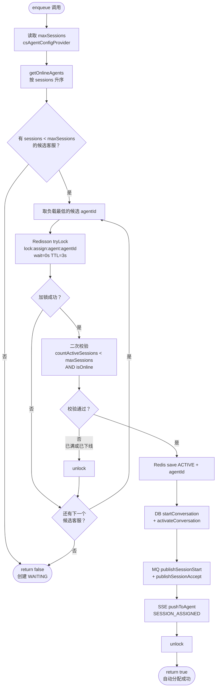
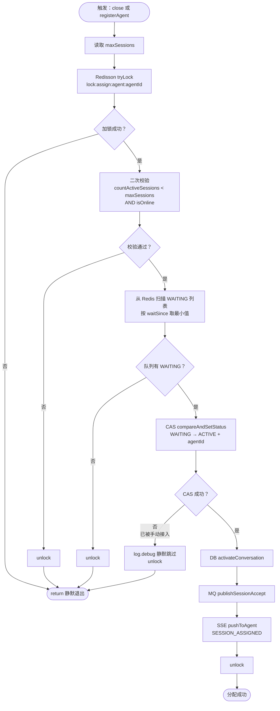
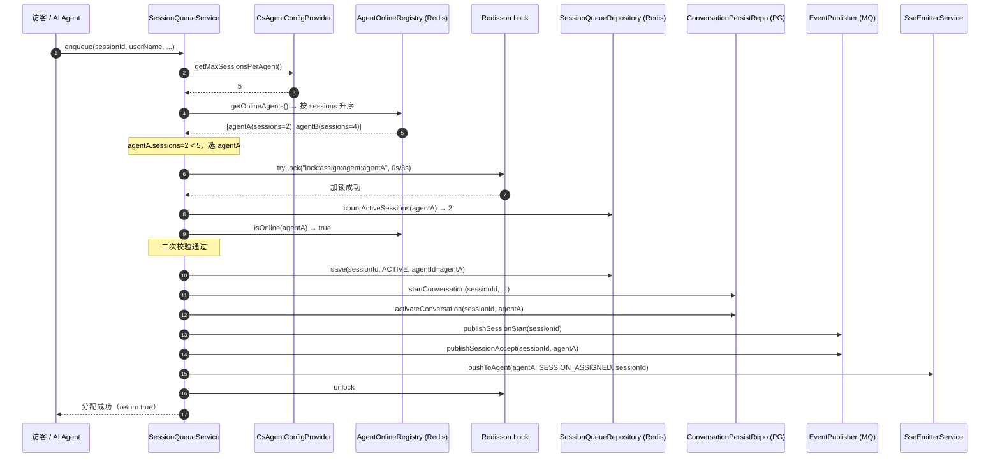
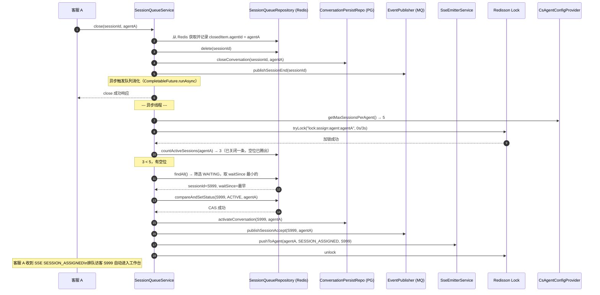

# 客服会话人工分配改造设计

## 1. 背景 & 目标

### 背景

当前系统采用纯 pull 模式：访客转人工后进入 WAITING 队列，客服在工作台看到队列后手动点击接入。这导致两个问题：

1. **效率低**：即使所有客服都有空余接待名额，访客仍需等待客服主动操作
2. **无容量控制**：系统没有 maxSessions 概念，客服可无限接入会话，缺乏工作负载管理

### 目标

- 当在线客服中有人的当前会话数 **低于 maxSessions 阈值**，入队时自动分配给负载最低的客服
- 当所有在线客服都 **达到或超过阈值**，会话进入 WAITING 队列
- 客服可随时 **主动接入** WAITING 中的任意会话（不受阈值限制，允许超额）
- 当客服 **结束会话** 或 **上线** 时，自动从 WAITING 队列消化排队的会话
- maxSessions 通过 `system_config` 统一配置，5 分钟内生效，无需重启

### 非目标

- 不按客服个人设置不同的 maxSessions（全局统一）
- 不改变 AI 会话（AI_CHAT 状态）的处理流程
- 不引入后台轮询调度线程
- 不限制客服的主动接入行为

# 2. 业务规则 & 状态机

## 2.1 分配规则

| 场景 | 行为 |
|---|---|
| 有在线客服且 sessions < maxSessions | 自动分配给 sessions 最少的客服（负载均衡） |
| 所有在线客服 sessions >= maxSessions | 进入 WAITING 队列 |
| 无在线客服 | 进入 WAITING 队列 |
| 客服主动接入 WAITING 会话 | 允许，不检查阈值（超额接入是客服的主动选择） |
| 客服关闭会话后腾出空位 | 自动从 WAITING 队列取出等待最久的会话分配给该客服 |
| 新客服上线（sessions = 0） | 自动从 WAITING 队列取出等待最久的会话分配给该客服 |

## 2.2 状态机变更

**原状态流转：**
```
AI_CHAT → WAITING → ACTIVE → CLOSED
```

**新增路径（自动分配）：**
```
AI_CHAT → ACTIVE   （有空余客服时，直接跳过 WAITING）
AI_CHAT → WAITING → ACTIVE → CLOSED  （全满时走原有排队路径）
```

`SessionStatus.java` 变更：

```java
// 修改前
AI_CHAT {
    @Override
    public boolean canTransitionTo(SessionStatus next) {
        return next == WAITING || next == CLOSED;
    }
}

// 修改后
AI_CHAT {
    @Override
    public boolean canTransitionTo(SessionStatus next) {
        return next == WAITING || next == ACTIVE || next == CLOSED;
    }
}
```

## 2.3 并发安全

自动分配时使用 Redisson 分布式锁 `lock:assign:agent:{agentId}`（TTL 3s），防止同一个客服被并发分配多个会话：

1. 乐观选出负载最低且 `< maxSessions` 的客服
2. 加锁后**二次校验** `activeCount(agentId) < maxSessions AND isOnline(agentId)`
3. 二次校验失败则尝试下一个客服，全部失败则降级为 WAITING

这与现有 `CsatExpiryScheduler` 使用 Redisson 的模式完全一致。

# 3. 配置层

## 3.1 system_config 新增记录

在 `cs_auth.system_config` 表插入：

```sql
INSERT INTO system_config (config_key, config_value, config_type, description, is_enabled)
VALUES (
  'cs.agent.config',
  '{"maxSessionsPerAgent": 5}',
  'CUSTOMER_SERVICE',
  '客服接待配置：maxSessionsPerAgent 为每个客服最大同时接待会话数',
  1
);
```

## 3.2 CsAgentConfig — 配置 POJO

**文件**：`conversation-service/.../infrastructure/config/CsAgentConfig.java`

```java
@Data
@NoArgsConstructor
@AllArgsConstructor
public class CsAgentConfig {

    /** 每个客服最大同时接待会话数，默认 5 */
    private int maxSessionsPerAgent = 5;

    public static CsAgentConfig defaults() {
        return new CsAgentConfig(5);
    }
}
```

## 3.3 CsAgentConfigProvider — 配置读取（复用 RoutingConfigProvider 模式）

**文件**：`conversation-service/.../infrastructure/config/CsAgentConfigProvider.java`

```java
@Component
@RequiredArgsConstructor
@Slf4j
public class CsAgentConfigProvider {

    private static final String CONFIG_KEY = "cs.agent.config";

    private final AuthClient authClient;
    private final ObjectMapper objectMapper;

    /** Caffeine 本地缓存，TTL 5 分钟，容量 1（只有一条全局配置） */
    private final Cache<String, CsAgentConfig> localCache = Caffeine.newBuilder()
            .expireAfterWrite(5, TimeUnit.MINUTES)
            .maximumSize(1)
            .build();

    public CsAgentConfig getConfig() {
        CsAgentConfig cached = localCache.getIfPresent(CONFIG_KEY);
        if (cached != null) return cached;
        try {
            String json = authClient.getSystemConfigValue(CONFIG_KEY);
            if (json != null && !json.isBlank()) {
                CsAgentConfig config = objectMapper.readValue(json, CsAgentConfig.class);
                localCache.put(CONFIG_KEY, config);
                return config;
            }
        } catch (Exception e) {
            log.warn("[CsAgentConfig] 拉取配置失败，使用默认值", e);
        }
        return CsAgentConfig.defaults(); // 不缓存降级值，下次重试
    }

    /** 便捷方法：直接获取 maxSessionsPerAgent */
    public int getMaxSessionsPerAgent() {
        return getConfig().getMaxSessionsPerAgent();
    }
}
```

## 3.4 配置生效时机

- Caffeine TTL 5 分钟，修改 `system_config` 后最多 5 分钟内所有实例自动生效
- 无需重启，无需手动刷新接口
- 多实例部署下每个实例独立缓存，窗口期内可能短暂不一致（可接受）

# 4. 核心分配逻辑

## 4.1 enqueue() 改造

**文件**：`SessionQueueService.java`

在现有 `enqueue()` 末尾，publish SESSION_START 之前，插入自动派发调用：

```java
public void enqueue(String sessionId, String userName, String transferReason, String tag) {
    // 初始化为 WAITING 状态；若自动分配成功，此 item 不会持久化到 Redis
    SessionQueueItem item = new SessionQueueItem(
            sessionId, userName, transferReason, tag,
            Instant.now().getEpochSecond(), SessionStatus.WAITING, null);

    // 优先尝试推送给有空余名额的在线客服，避免访客进入排队等待
    boolean dispatched = tryAutoDispatch(sessionId, item);

    if (!dispatched) {
        // 无空闲客服：持久化 WAITING，广播通知所有在线客服，等待手动接入
        sessionQueueRepository.save(sessionId, item);
        eventPublisher.publishSessionStart(sessionId, userName, transferReason, tag);
        sseEmitterService.broadcastQueueUpdate();
    }
}
```

## 4.2 tryAutoDispatch() 实现（拆分后）

入口方法只负责遍历候选客服，具体的加锁-校验-执行全部委托给小方法：

```java
/**
 * 尝试将会话自动分配给负载最低的空闲客服。
 * 按 sessions 升序遍历候选客服，对每个候选加锁后二次校验，
 * 第一个通过校验的客服即为目标，分配成功立即返回，不继续遍历。
 *
 * @return true=已成功自动分配；false=无空闲客服，调用方应创建 WAITING 记录
 */
private boolean tryAutoDispatch(String sessionId, SessionQueueItem item) {
    int max = csAgentConfigProvider.getMaxSessionsPerAgent();
    // 候选列表已按 sessions 升序，越靠前负载越低，优先分配
    for (OnlineAgentVO candidate : findAvailableCandidates(max)) {
        if (tryAssignNewSession(sessionId, item, candidate.id(), max)) {
            return true; // 分配成功，提前返回，不再尝试其他客服
        }
        // 此候选加锁失败或二次校验不通过，继续尝试下一个
    }
    return false; // 所有候选均不可用，降级为 WAITING
}

/**
 * 从在线客服中筛选出当前 sessions < max 的候选列表（已按负载升序）。
 * 注意：此处 sessions 为乐观读（无锁），仅做粗筛，真正的容量校验在加锁后进行。
 */
private List<OnlineAgentVO> findAvailableCandidates(int max) {
    return getOnlineAgents().stream()
            .filter(a -> a.sessions() < max) // 乐观过滤，排除明显已满的客服
            .toList();
}

/**
 * 对单个候选客服尝试加锁 → 二次校验 → 执行分配。
 * 加锁失败或校验不通过均返回 false，调用方继续尝试下一个候选。
 */
private boolean tryAssignNewSession(String sessionId, SessionQueueItem item,
                                    String agentId, int max) {
    return withAgentLock(agentId, () -> {
        // 持锁后重新计数：避免乐观读期间其他线程已将该客服填满
        if (!isAgentAvailable(agentId, max)) return false;
        doAssignNewSession(sessionId, item, agentId);
        return true;
    });
}

/**
 * 执行新会话的完整分配动作：Redis → MQ → SSE。
 * 调用前已持有分布式锁且二次校验通过，无需再做容量校验。
 *
 * <p>DB 写入不在此处直接调用，而是通过 MQ 事件驱动：
 * - SESSION_START  → ConversationMessageConsumer.handleSessionStart → startConversation
 * - SESSION_ACCEPT → ConversationMessageConsumer.handleSessionAccept → activateConversation
 * 与现有 enqueue() + accept() 路径保持一致，避免直接 DB 调用与 MQ 消费者产生重复写入。
 */
private void doAssignNewSession(String sessionId, SessionQueueItem item, String agentId) {
    // 1. 写入 Redis，状态直接为 ACTIVE，跳过 WAITING 中间态
    sessionQueueRepository.save(buildActiveItem(item, agentId));
    // 2. MQ SESSION_START：触发消费者在 DB 创建会话行（startConversation）
    //    第 5 个参数 waitSince 即为入队时间戳，与 enqueue() 路径一致
    publishSessionStart(sessionId, item.userName(), item.transferReason(),
            item.tag(), item.waitSince());
    // 3. MQ SESSION_ACCEPT + SSE SESSION_ASSIGNED：触发 activateConversation + 通知客服端
    publishAssignedEvent(sessionId, agentId);
    log.info("[AutoDispatch] 会话 {} 自动分配给客服 {}", sessionId, agentId);
}
```

## 4.3 共享 Helper 方法

以下方法由 `tryAutoDispatch` 和 `tryDispatchFromQueue` 共用：

```java
/**
 * 分布式锁通用包装：加锁 → 执行 action → 释放锁。
 * 使用 tryLock(wait=0) 非阻塞模式：加锁失败立即返回 false，
 * 不等待，避免 enqueue 请求因锁竞争而阻塞。
 * TTL=3s 是锁的最长持有时间，防止 action 内部异常导致锁泄漏。
 */
private boolean withAgentLock(String agentId, Supplier<Boolean> lockedAction) {
    RLock lock = redissonClient.getLock("lock:assign:agent:" + agentId);
    try {
        // wait=0：不排队等锁；leaseTime=3s：持锁上限，防止死锁
        if (!lock.tryLock(0, 3, TimeUnit.SECONDS)) return false;
        try {
            return lockedAction.get();
        } finally {
            // isHeldByCurrentThread 防止极端情况下 TTL 到期后重复释放他人锁
            if (lock.isHeldByCurrentThread()) lock.unlock();
        }
    } catch (InterruptedException e) {
        // 恢复中断标志，让调用链上层感知到中断
        Thread.currentThread().interrupt();
        log.warn("[AgentLock] 加锁中断，agentId={}", agentId);
        return false;
    }
}

/**
 * 持锁后二次校验：当前 ACTIVE 会话数 < max 且客服仍在线。
 * 必须在持锁后调用，否则两个条件之间存在竞态窗口。
 */
private boolean isAgentAvailable(String agentId, int max) {
    // 先检查 sessions 再检查在线状态：sessions 计算代价更低，放前面短路
    return countActiveSessions(agentId) < max && agentRegistry.isOnline(agentId);
}

/**
 * 统计指定客服当前的 ACTIVE 会话数（从 Redis List 全量扫描）。
 * findAll() 返回 List<SessionQueueItem>，直接流式过滤，无需 .values()。
 * Redis 中在线会话规模有限，全量扫描可接受；若规模增大可改为 Redis counter 优化。
 * getOnlineAgents() 内部复用此方法，消除重复扫描逻辑。
 */
private long countActiveSessions(String agentId) {
    return sessionQueueRepository.findAll().stream()
            .filter(i -> agentId.equals(i.agentId()) && i.status() == SessionStatus.ACTIVE)
            .count();
}

/**
 * 将队列项构造为 ACTIVE 状态并绑定 agentId。
 * SessionQueueItem 为不可变 record，withStatus/withAgentId 返回新实例。
 */
private SessionQueueItem buildActiveItem(SessionQueueItem item, String agentId) {
    return item.withStatus(SessionStatus.ACTIVE).withAgentId(agentId);
}

/**
 * 发布分配成功事件：MQ SESSION_ACCEPT + SSE SESSION_ASSIGNED。
 * 两条分配路径（新会话直接派发 / 排队消化）共用，确保下游行为一致。
 * SESSION_ASSIGNED 区别于客服手动接入的 SESSION_ACCEPTED，前端可据此展示不同提示。
 */
private void publishAssignedEvent(String sessionId, String agentId) {
    eventPublisher.publishSessionAccept(sessionId, agentId);
    sseEmitterService.pushToAgent(agentId, SseEvent.SESSION_ASSIGNED, sessionId);
}
```

## 4.4 SSE 新增事件类型

在 `SseEvent` 枚举（或常量类）中新增：

```java
SESSION_ASSIGNED   // 会话被系统自动分配给该客服
```

与现有 `SESSION_ACCEPTED`（客服主动接入）区分，便于前端区分来源并展示提示。

## 4.5 accept() 不变

`accept()` 方法完全不添加阈值校验，保持现有行为。客服主动接入 WAITING 会话时：
- CAS WAITING → ACTIVE（Redis）
- DB 更新 agentId + acceptedAt
- 允许超过 maxSessions，不报错

`getOnlineAgents()` 会实时返回真实 sessions 数，前端工作台可展示超额状态（UI 提示，不强制拦截）。

# 5. 排队消化（队列自动消化）

## 5.1 触发点设计

WAITING 队列的自动消化由两个事件触发，无需后台调度线程：

| 触发事件 | 触发方法 | 说明 |
|---|---|---|
| 客服关闭会话 | `close()` 末尾 | 腾出一个空位，分配给等待最久的访客 |
| 客服上线 | `registerAgent()` 末尾 | 新客服 sessions=0，直接消化队列 |

## 5.2 tryDispatchFromQueue() 实现（拆分后）

入口方法只负责取配置和触发加锁，内部逻辑全部委托给小方法：

```java
/**
 * 当指定客服腾出空位时，从 WAITING 队列中取出等待最久的会话并自动分配。
 * 仅尝试分配一条（一次空位只消化一条，避免瞬间超额）。
 * 此方法在异步线程中执行（CompletableFuture.runAsync），不阻塞主请求。
 *
 * @param agentId 刚腾出空位的客服 ID（close 释放的客服 或 新上线的客服）
 */
private void tryDispatchFromQueue(String agentId) {
    int max = csAgentConfigProvider.getMaxSessionsPerAgent();
    // 复用 withAgentLock，保证同一个 agentId 在分布式环境下串行消化，防止超额
    boolean acquired = withAgentLock(agentId, () -> {
        tryAssignOldestWaiting(agentId, max);
        return true; // withAgentLock 要求返回值；消化结果由内部日志体现
    });
    // 加锁失败说明另一实例正在处理同一 agentId 的队列消化，本次跳过（预期行为）
    if (!acquired) {
        log.debug("[QueueDrain] 加锁竞争，跳过本次消化 agentId={}", agentId);
    }
}

/**
 * 持锁后的核心逻辑：二次校验有空位，然后取最早的 WAITING 会话分配。
 * 校验不通过（已满或已下线）则直接返回，不消化队列。
 */
private void tryAssignOldestWaiting(String agentId, int max) {
    // 持锁后重新校验：close 与 tryDispatchFromQueue 是异步的，
    // 极端情况下客服已被手动接入其他会话导致再次满员
    if (!isAgentAvailable(agentId, max)) return;
    // 取等待时间最长的会话，优先保障先到的访客
    pickOldestWaiting().ifPresent(entry ->
            doDispatchWaitingSession(entry.getKey(), entry.getValue(), agentId));
}

/**
 * 从 Redis 队列中找出等待时间最长的 WAITING 会话（按 waitSince epoch 秒升序取最小值）。
 * 返回 Optional.empty() 表示队列当前无排队会话，消化动作静默跳过。
 */
private Optional<Map.Entry<String, SessionQueueItem>> pickOldestWaiting() {
    return sessionQueueRepository.findAll().entrySet().stream()
            .filter(e -> e.getValue().status() == SessionStatus.WAITING)
            .min(Comparator.comparingLong(e -> e.getValue().waitSince()));
}

/**
 * 对单条排队会话执行 CAS 激活 + DB 更新 + 事件发布。
 *
 * <p>CAS（compareAndSetStatus）确保原子性：若该会话在锁外已被客服手动接入
 * （状态已不是 WAITING），CAS 失败，此处静默跳过，不会产生重复分配。
 */
private void doDispatchWaitingSession(String sessionId, SessionQueueItem waitingItem,
                                      String agentId) {
    // CAS：仅当 Redis 中该 sessionId 状态仍为 WAITING 时才更新为 ACTIVE
    // 若客服在锁外手动 accept 了该会话，状态已变为 ACTIVE，CAS 失败
    boolean cas = sessionQueueRepository.compareAndSetStatus(
            sessionId, buildActiveItem(waitingItem, agentId));
    if (!cas) {
        // 被手动接入，无需任何补偿，该会话已正常进入 ACTIVE
        log.debug("[QueueDrain] CAS 失败，会话 {} 已被手动接入", sessionId);
        return;
    }
    // DB 只需 activate（行已存在，startConversation 在访客 enqueue 时已执行）
    conversationPersistRepository.activateConversation(sessionId, agentId);
    publishAssignedEvent(sessionId, agentId);
    log.info("[QueueDrain] 排队会话 {} 分配给客服 {}", sessionId, agentId);
}
```

## 5.3 close() 改造

在现有 `close()` 末尾，会话已从 Redis 移除、DB 已标记 CLOSED 之后，异步触发消化：

```java
public void close(String sessionId, String closedBy) {
    // ... 现有逻辑：Redis 移除、DB 关闭、MQ SESSION_END、CSAT 邀请 ...

    // 新增：异步消化排队队列（不阻塞当前请求）
    String freedAgentId = closedItem.agentId(); // 从关闭前的 Redis 记录获取
    if (freedAgentId != null) {
        CompletableFuture.runAsync(() -> tryDispatchFromQueue(freedAgentId));
    }
}
```

> `close()` 已有异步 CSAT 逻辑（`CompletableFuture.runAsync`），队列消化复用相同模式。

## 5.4 registerAgent() 改造

在现有 `registerAgent()` 末尾，客服上线注册完成后触发：

```java
public void registerAgent(String agentId, String displayName) {
    // ... 现有逻辑：写入 agentRegistry、SSE 注册 ...

    // 新增：异步消化排队队列（新客服上线，sessions=0，优先接待等待访客）
    CompletableFuture.runAsync(() -> tryDispatchFromQueue(agentId));
}
```

## 5.5 边界情况

| 场景 | 处理方式 |
|---|---|
| 消化时 WAITING 会话同时被客服手动接入 | `compareAndSetStatus` CAS 失败，静默跳过，无副作用 |
| 客服下线后触发的异步消化（极端竞态） | 持锁后二次校验 `isOnline(agentId)`，直接 return |
| 消化时 WAITING 队列为空 | `min()` 返回 empty，`ifPresent` 不执行，无操作 |
| 多实例部署，两个实例同时消化同一个 agentId | Redisson 分布式锁保证只有一个实例执行 |
| `tryDispatchFromQueue` 加锁失败（锁被另一实例持有） | `withAgentLock` 返回 false，调用方静默返回；加 `log.debug` 记录竞争事件，便于排查多实例行为 |

## 5.6 Redis-DB 最终一致性说明

自动分配路径的写入顺序为：**Redis（ACTIVE）→ MQ → DB（via 消费者）**。

这与现有 `enqueue()` + `accept()` 路径一致，属于架构层面已知的 tradeoff：

- **如果 MQ 消费者处理 `SESSION_ACCEPT` 失败**（DB 宕机、消费异常），Redis 中会话已是 ACTIVE，但 DB 缺少 `accepted_at`。此时 `isActive()` 的 DB fallback 会返回 WAITING（找不到 ACTIVE 记录），导致该会话对客服不可见，但访客侧消息仍可正常投递（Redis 热路径）。
- **自愈机制**：MQ 消费者使用重试队列，`activateConversation` 是幂等的（`UPDATE WHERE status=WAITING`），短暂故障后会自动补偿。
- **不需要额外补偿代码**：现有架构（MQ 重试 + DB 幂等）已覆盖此场景，与全系统其他分配路径行为一致。若需要更强的一致性保障，可引入 Saga 模式，但超出当前需求范围。

# 6. 文件改动清单 & SQL Migration

## 6.1 新增文件

| 文件路径 | 说明 |
|---|---|
| `conversation-service/.../infrastructure/config/CsAgentConfig.java` | 配置 POJO |
| `conversation-service/.../infrastructure/config/CsAgentConfigProvider.java` | Caffeine + AuthClient 配置读取 |

## 6.2 修改文件

### SessionStatus.java

```
AI_CHAT.canTransitionTo() 新增允许 → ACTIVE
```

### SessionQueueService.java

| 改动点 | 内容 |
|---|---|
| 注入依赖 | 新增 `CsAgentConfigProvider`、`RedissonClient` |
| `enqueue()` | 调用 `tryAutoDispatch()`，失败则走原有 WAITING 逻辑 |
| `close()` | 末尾异步调用 `tryDispatchFromQueue(freedAgentId)` |
| `registerAgent()` | 末尾异步调用 `tryDispatchFromQueue(agentId)` |
| 新增私有方法 | `tryAutoDispatch()`、`tryDispatchFromQueue()`、`countActiveSessions()` |
| `getOnlineAgents()` | 内部复用 `countActiveSessions()` 消除重复扫描 |

### SseEvent（枚举/常量类）

```
新增常量：SESSION_ASSIGNED
```

### SseEmitterService（或等效 SSE 推送类）

```
新增方法：pushToAgent(agentId, event, payload)
— 向指定单个客服推送 SSE 事件（区别于现有的 broadcastQueueUpdate 广播）
```

## 6.3 不需要修改的文件

| 文件 | 原因 |
|---|---|
| `SessionQueueController.java` | accept() 接口语义不变，不加阈值校验 |
| `SessionQueueRepository.java` | 现有 `compareAndSetStatus` CAS 方法直接复用 |
| `AgentOnlineRegistry.java` | `isOnline()` 直接复用 |
| `ConversationPersistRepository.java` | `activateConversation()` 直接复用 |
| `AgentWorkloadItemVO.java` | 字段不变，前端可自行对比 activeSessions 与 maxSessions 展示超额提示 |

## 6.4 SQL Migration（Flyway）

新建文件：`V{next}__add_cs_agent_config.sql`

```sql
-- cs_auth schema
INSERT INTO system_config (config_key, config_value, config_type, description, is_enabled, created_at, updated_at)
VALUES (
    'cs.agent.config',
    '{"maxSessionsPerAgent": 5}',
    'CUSTOMER_SERVICE',
    '客服接待配置：maxSessionsPerAgent 为每个客服最大同时接待会话数',
    1,
    NOW(),
    NOW()
);
```

> 版本号 `{next}` 替换为项目当前最大 Flyway 版本号 + 1。

## 6.5 YAML 默认值（fallback）

在 `conversation-service` 的 `application.yml` 中无需新增配置项（fallback 硬编码在 `CsAgentConfig.defaults()` 中，默认值为 5）。

如需通过 YAML 覆盖默认值，可选择在 `CsAgentConfig` 中增加 `@ConfigurationProperties` 支持，但当前需求不要求此项。

# 7. 测试方案

## 7.1 单元测试

### CsAgentConfigProviderTest

| 测试用例 | 验证点 |
|---|---|
| `getConfig_returnsRemoteValue_whenAuthClientSucceeds` | 正常拉取并反序列化 JSON |
| `getConfig_returnsDefault_whenAuthClientReturnsNull` | auth-service 返回 null 时降级为默认值 |
| `getConfig_returnsDefault_whenAuthClientThrows` | 网络异常时降级为默认值，不抛出异常 |
| `getConfig_usesCachedValue_onSecondCall` | 第二次调用命中缓存，不再调用 authClient |

### SessionQueueServiceTest — 新增用例

| 测试用例 | 验证点 |
|---|---|
| `enqueue_autoDispatch_whenAgentHasCapacity` | 有空闲客服时直接创建 ACTIVE，不创建 WAITING |
| `enqueue_fallbackToWaiting_whenAllAgentsFull` | 所有客服满时创建 WAITING |
| `enqueue_fallbackToWaiting_whenNoAgentOnline` | 无在线客服时创建 WAITING |
| `enqueue_picksLeastLoadedAgent` | 多个空闲客服时选 sessions 最少的那个 |
| `enqueue_skipsFullAgent_picksNextAvailable` | 第一个候选客服锁后二次校验失败，转向下一个 |
| `close_triggersQueueDrain_whenAgentHadSession` | 关闭会话后异步触发消化，WAITING 会话被分配 |
| `close_noQueueDrain_whenQueueEmpty` | 关闭会话后队列为空，无副作用 |
| `registerAgent_triggersQueueDrain` | 新客服上线后 WAITING 会话被分配 |
| `tryDispatchFromQueue_casFailure_silentlyIgnored` | CAS 失败（被手动接入）时静默跳过 |

### SessionStatusTest — 补充用例

| 测试用例 | 验证点 |
|---|---|
| `aiChat_canTransitionTo_active` | `AI_CHAT.canTransitionTo(ACTIVE)` 返回 true |

## 7.2 集成测试建议

**场景 1：自动分配完整流程**
1. 注册客服 A（sessions=0，maxSessions=5）
2. 调用 `enqueue()`
3. 断言：Redis 中该 sessionId 状态为 ACTIVE，agentId = A
4. 断言：DB `cs_conversation` 中 `accepted_at` 不为 null
5. 断言：SSE 收到 `SESSION_ASSIGNED` 事件

**场景 2：全满后排队 + 消化**
1. 注册客服 A，模拟已有 5 个 ACTIVE 会话
2. 调用 `enqueue()`，断言：状态为 WAITING
3. 关闭客服 A 的一个会话（`close()`）
4. 异步等待（50ms）
5. 断言：原 WAITING 会话状态变为 ACTIVE，agentId = A

**场景 3：手动超额接入**
1. 注册客服 A，模拟已有 5 个 ACTIVE 会话（已满）
2. 调用 `accept(sessionId, agentIdA)`
3. 断言：成功，状态变为 ACTIVE（不报错，允许超额）

## 7.3 并发测试

使用 `CountDownLatch` 模拟 10 个并发 `enqueue()` 请求（maxSessions=3，在线客服 2 个）：
- 断言：最多 `2 * 3 = 6` 个会话处于 ACTIVE
- 断言：其余 4 个会话处于 WAITING
- 断言：没有同一个客服超过 3 个 ACTIVE 会话（阈值不被并发突破）

## 7.4 前端适配建议

`GET /api/v1/sessions/agents/online` 接口当前返回：

```json
[{ "id": "agent1", "name": "张三", "sessions": 3 }]
```

建议在响应中增加 `maxSessions` 字段（从 `CsAgentConfigProvider` 读取），便于前端展示：

```json
[{ "id": "agent1", "name": "张三", "sessions": 3, "maxSessions": 5, "isFull": false }]
```

前端可用 `isFull` 在转接弹窗中灰化已满的客服，给客服超额接入提供视觉提示（不强制拦截）。

# 8. 流程图 & 时序图

## 8.1 tryAutoDispatch() 流程图



---

## 8.2 tryDispatchFromQueue() 流程图



---

## 8.3 自动分配时序图（enqueue → 直接派发）



---

## 8.4 排队消化时序图（close → 队列消化）


