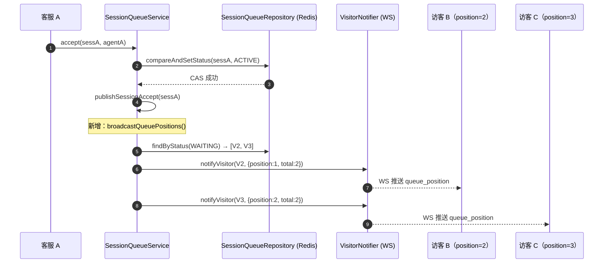
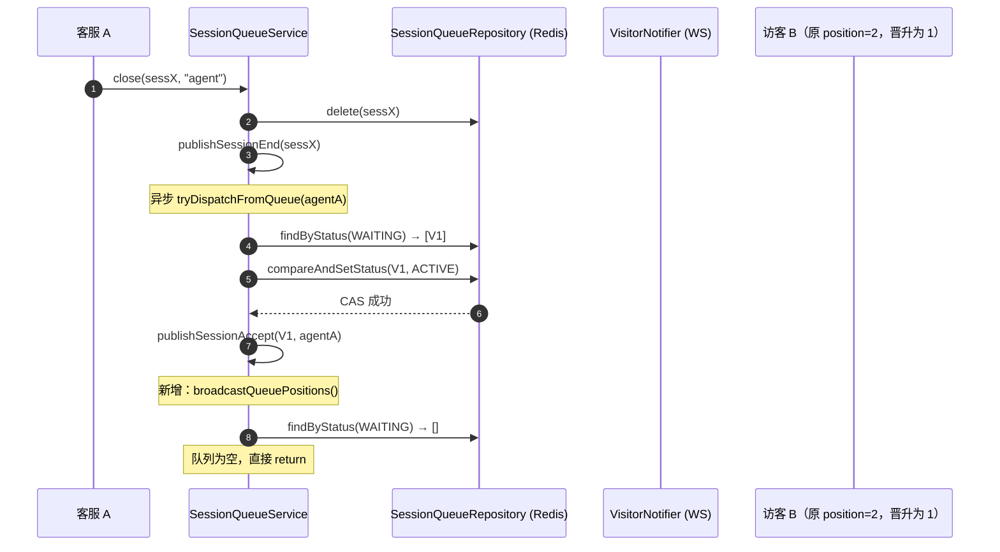

# 排队位次实时通知 — 技术改造文档

## 1. 背景 & 目标

### 背景

当前系统在访客转人工后，若所有客服满员，会话进入 WAITING 状态。访客通过 `POST /api/v1/chat/transfer` 响应得知自己处于排队中，但此后没有任何反馈直到被接入——不知道前面还有几人、不知道什么时候轮到自己，焦虑感强，容易放弃等待。

`VisitorNotifier.notifyVisitor()` 是现成的 WS 推送通道（CSAT 邀请已用此路径），可以低成本实现位次推送。

### 目标

- 每当有排队会话被接入（手动接入、自动分配、队列消化），对剩余所有 WAITING 访客推送最新排队位次
- 消息格式简洁：`{ type, position, total }`，前端可据此展示进度
- 不影响主流程：WS 未连接时静默跳过，推送失败不抛异常

### 非目标

- 不推送预计等待时间（当前无充分数据支撑）
- 不新增任何持久化字段或 MQ 事件
- 不修改访客侧 WS 协议或接口定义（沿用现有 `notifyVisitor` 机制）
- 不支持按技能组分队（当前系统无此概念）

# 2. 架构设计

## 2.1 触发时机

排队位次变化只在 **WAITING → ACTIVE** 转换时发生，系统中有三个触发点：

| 触发方法 | 场景 | 所在类 |
|---|---|---|
| `accept()` | 客服手动接入 WAITING 会话 | `SessionQueueService` |
| `doAssignNewSession()` | 入队时自动分配（有空余客服） | `SessionQueueService` |
| `doDispatchWaitingSession()` | close/registerAgent 消化排队 | `SessionQueueService` |

每个触发点执行完 ACTIVE 写入后，调用 `broadcastQueuePositions()`。

## 2.2 数据流

```
WAITING → ACTIVE 转换完成
        ↓
broadcastQueuePositions()
        ↓
queueRepository.findByStatus(WAITING)
  → 按 waitSince 升序排列（已有此方法，保证公平顺序）
        ↓
for each (i, item) in waitingList:
    visitorNotifier.notifyVisitor(item.sessionId(), {
        "type":     "queue_position",
        "position": i + 1,    // 1-based，1 = 下一个被接入
        "total":    total
    })
        ↓
WS 已连接 → 推送成功
WS 未连接 → VisitorSessionRegistry 无对应 session → 静默跳过
```

## 2.3 通信通道

访客侧的实时推送走 **WebSocket** `/ws/chat/{sessionId}`，通过现有 `VisitorNotifier` 接口：

```
SessionQueueService
    → VisitorNotifier.notifyVisitor(sessionId, payload)
        → VisitorSessionRegistry.getSession(sessionId)
            → WebSocketSession.sendMessage(json)
```

`VisitorNotifier` 已有空检查（registry 无 session 时直接 return），不需要额外处理。

## 2.4 消息格式

```json
{
  "type": "queue_position",
  "position": 2,
  "total": 4
}
```

| 字段 | 类型 | 说明 |
|---|---|---|
| `type` | String | 固定值 `"queue_position"`，前端用于区分消息类型 |
| `position` | int | 当前排位，从 1 开始，1 表示下一个被接入 |
| `total` | int | 队列中 WAITING 会话总数 |

前端处理建议：
- `position=1`：展示「你是下一位，即将被接入」
- `position>1`：展示「前面还有 N-1 人」或「你是第 N 位」
- 收到 `SESSION_ACCEPT` / `AUTO_ASSIGNED` 事件后，停止展示排队信息（已被接入）

# 3. 核心实现

## 3.1 broadcastQueuePositions()

新增私有方法，放在 `SessionQueueService` 工具方法区（`countActiveSessions` 之后）：

```java
/**
 * 广播排队位次给所有 WAITING 中的访客。
 *
 * <p>在每次有会话从 WAITING 变为 ACTIVE 后调用，确保队列中的访客看到最新位次。
 * 推送是 best-effort：WS 未连接或推送失败时静默跳过，不影响主流程。
 *
 * <p>消息格式：{@code {"type":"queue_position","position":N,"total":M}}，
 * position 从 1 开始，1 表示下一个被接入。
 */
private void broadcastQueuePositions() {
    // findByStatus 已按 waitSince 升序排列，保证位次与等待时间对应
    List<SessionQueueItem> waiting = queueRepository.findByStatus(SessionStatus.WAITING);
    if (waiting.isEmpty()) return;

    int total = waiting.size();
    for (int i = 0; i < total; i++) {
        String sessionId = waiting.get(i).sessionId();
        Map<String, Object> payload = Map.of(
                "type",     "queue_position",
                "position", i + 1,      // 1-based
                "total",    total
        );
        try {
            visitorNotifier.notifyVisitor(sessionId, payload);
        } catch (Exception e) {
            // WS 已断开或序列化失败：位次通知是 best-effort，不中断广播
            log.debug("[QueuePosition] 推送失败 sessionId={} position={}", sessionId, i + 1, e);
        }
    }
    log.info("[QueuePosition] 位次广播完成，WAITING 人数={}", total);
}
```

## 3.2 三个调用点改造

### accept()

在现有 `publishSessionAccept(...)` 之后追加：

```java
public SessionQueueItem accept(String sessionId, String agentId) {
    // ... 现有 CAS + MQ 逻辑 ...
    publishSessionAccept(sessionId, agentId, Instant.now().getEpochSecond());
    log.info("[SessionQueue] accept 成功 sessionId={}", sessionId);

    // 新增：广播剩余排队访客的位次
    broadcastQueuePositions();

    return updated;
}
```

### doAssignNewSession()

在 `publishEvent(...)` 之后追加：

```java
private SessionQueueItem doAssignNewSession(String sessionId, SessionQueueItem item, String agentId) {
    SessionQueueItem activeItem = buildActiveItem(item, agentId);
    queueRepository.save(activeItem);
    publishSessionStart(sessionId, item.userName(), item.transferReason(),
            item.tag(), item.waitSince());
    publishSessionAccept(sessionId, agentId, Instant.now().getEpochSecond());
    publishEvent(new SessionEvent(SessionEventType.AUTO_ASSIGNED, activeItem));
    log.info("[AutoDispatch] 会话 {} 自动分配给客服 {}", sessionId, agentId);

    // 新增：广播剩余排队访客的位次
    broadcastQueuePositions();

    return activeItem;
}
```

### doDispatchWaitingSession()

CAS 成功并发布事件后追加：

```java
private void doDispatchWaitingSession(String sessionId, SessionQueueItem waitingItem,
                                      String agentId) {
    SessionQueueItem activeItem = buildActiveItem(waitingItem, agentId);
    boolean cas = queueRepository.compareAndSetStatus(sessionId, activeItem);
    if (!cas) {
        log.debug("[QueueDrain] CAS 失败，会话 {} 已被手动接入", sessionId);
        return;
    }
    publishSessionAccept(sessionId, agentId, Instant.now().getEpochSecond());
    publishEvent(new SessionEvent(SessionEventType.AUTO_ASSIGNED, activeItem));
    log.info("[QueueDrain] 排队会话 {} 分配给客服 {}", sessionId, agentId);

    // 新增：广播剩余排队访客的位次
    broadcastQueuePositions();
}
```

## 3.3 依赖说明

`broadcastQueuePositions()` 使用：
- `queueRepository`：已注入，调用 `findByStatus(WAITING)`（已有方法，按 waitSince 升序）
- `visitorNotifier`：已注入，`VisitorNotifier` 接口（`VisitorSessionRegistry` 实现）
- `Map.of()`：JDK 9+，项目已使用

**无需新增任何依赖注入。**

# 4. 边界情况 & 时序图

## 4.1 边界情况

| 场景 | 处理方式 |
|---|---|
| 广播时队列为空 | `isEmpty()` 检查直接 return，不触发任何推送 |
| 访客 WS 未连接 | `VisitorSessionRegistry.getSession()` 返回 null，`notifyVisitor` 静默 return |
| 推送时 WS 连接突然断开 | `WebSocketSession.sendMessage` 抛异常，被 try/catch 捕获，log.debug 后继续广播下一个 |
| 并发两个接入（并发竞态） | 两次 `broadcastQueuePositions()` 各自独立执行，最终结果收敛正确，位次以最后一次广播为准（best-effort） |
| 访客入队时 WS 还未建立 | 访客连接 WS 后第一次收到位次是下次有人出队时；入队响应（`POST /transfer`）已包含 `status=WAITING`，前端可据此展示「排队中」初始状态 |
| `doDispatchWaitingSession` CAS 失败 | CAS 失败说明该会话已被手动接入，直接 return，不调用 `broadcastQueuePositions()`（避免广播两次） |
| `doAssignNewSession` 中新会话本身从未进入 WAITING | 该会话不在 `findByStatus(WAITING)` 结果里，广播的是其他 WAITING 访客，逻辑正确 |

## 4.2 时序图 — 手动接入场景



## 4.3 时序图 — 队列消化场景（close 触发）



# 5. 文件改动清单 & 测试方案

## 5.1 文件改动清单

### 修改文件

| 文件 | 改动内容 |
|---|---|
| `SessionQueueService.java` | 新增 `broadcastQueuePositions()` 私有方法；在 `accept()`、`doAssignNewSession()`、`doDispatchWaitingSession()` 三处末尾各调用一次 |

### 不需要修改的文件

| 文件 | 原因 |
|---|---|
| `VisitorNotifier.java` | 接口不变，`notifyVisitor(sessionId, Map)` 已支持任意 payload |
| `VisitorSessionRegistry.java` | 实现不变，WS 未连接时已有空检查 |
| `SessionQueueItem.java` | 数据模型不变 |
| `SessionEventType.java` | 不新增 MQ 事件，位次通知纯 WS push |
| 前端代码 | 仅需在聊天 WS 消息处理中新增 `type=queue_position` case（后端无强依赖） |

## 5.2 测试方案

### 单元测试 — `SessionQueueServiceQueuePositionTest`（新建）

| 测试用例 | 验证点 |
|---|---|
| `accept_broadcastsPositionToRemainingWaiting` | accept 成功后，剩余 WAITING 访客收到正确位次 |
| `accept_noNotification_whenQueueEmpty` | accept 后队列为空，`notifyVisitor` 不被调用 |
| `autoDispatch_broadcastsPositionAfterAssign` | 自动分配成功后，剩余 WAITING 访客收到更新位次 |
| `queueDrain_broadcastsPosition_afterCasSuccess` | 队列消化 CAS 成功后广播位次 |
| `queueDrain_noPosition_afterCasFailure` | CAS 失败（已被手动接入）时不广播 |
| `broadcastQueuePositions_positionOrderMatchesWaitSince` | 位次顺序按 `waitSince` 升序，最早入队的 position=1 |
| `broadcastQueuePositions_notifyFailure_continuesOtherVisitors` | 某个访客推送失败（WS 断开），不中断对其他访客的广播 |

### 关键测试代码示例

```java
@Test
@DisplayName("accept 后剩余两个 WAITING 访客收到正确位次")
void accept_broadcastsPositionToRemainingWaiting() {
    // 准备两个 WAITING 访客（按 waitSince 排序）
    SessionQueueItem w1 = new SessionQueueItem(
            "sess-w1", "V1", "", "", 1000L, SessionStatus.WAITING, null);
    SessionQueueItem w2 = new SessionQueueItem(
            "sess-w2", "V2", "", "", 2000L, SessionStatus.WAITING, null);
    SessionQueueItem active = new SessionQueueItem(
            "sess-a", "VA", "", "", 500L, SessionStatus.WAITING, null);

    when(queueRepository.findById("sess-a")).thenReturn(Optional.of(active));
    when(queueRepository.compareAndSetStatus(eq("sess-a"), any())).thenReturn(true);
    // accept 后 findByStatus(WAITING) 返回剩余的两个
    when(queueRepository.findByStatus(SessionStatus.WAITING)).thenReturn(List.of(w1, w2));

    service.accept("sess-a", "agent-A");

    // 验证位次推送正确
    verify(visitorNotifier).notifyVisitor(eq("sess-w1"),
            argThat(m -> Integer.valueOf(1).equals(m.get("position")) && Integer.valueOf(2).equals(m.get("total"))));
    verify(visitorNotifier).notifyVisitor(eq("sess-w2"),
            argThat(m -> Integer.valueOf(2).equals(m.get("position")) && Integer.valueOf(2).equals(m.get("total"))));
}

@Test
@DisplayName("某访客推送失败，不影响其他访客收到位次")
void broadcastQueuePositions_notifyFailure_continuesOtherVisitors() {
    SessionQueueItem w1 = new SessionQueueItem(
            "sess-w1", "V1", "", "", 1000L, SessionStatus.WAITING, null);
    SessionQueueItem w2 = new SessionQueueItem(
            "sess-w2", "V2", "", "", 2000L, SessionStatus.WAITING, null);

    when(queueRepository.findById("sess-a")).thenReturn(Optional.of(
            new SessionQueueItem("sess-a", "VA", "", "", 500L, SessionStatus.WAITING, null)));
    when(queueRepository.compareAndSetStatus(any(), any())).thenReturn(true);
    when(queueRepository.findByStatus(SessionStatus.WAITING)).thenReturn(List.of(w1, w2));
    // w1 推送抛异常（WS 已断开）
    doThrow(new RuntimeException("WS closed")).when(visitorNotifier)
            .notifyVisitor(eq("sess-w1"), any());

    // 不应抛异常
    assertThatNoException().isThrownBy(() -> service.accept("sess-a", "agent-A"));

    // w2 仍然收到推送
    verify(visitorNotifier).notifyVisitor(eq("sess-w2"), any());
}
```

## 5.3 验收标准

1. 客服接入一个会话后，剩余所有 WAITING 访客的 WS 连接都收到 `type=queue_position` 消息
2. 位次顺序与入队时间（`waitSince`）完全对应，最早入队的 `position=1`
3. 队列清空后不推送任何消息
4. 某个访客 WS 断开时，其他访客不受影响
5. 所有测试通过，BUILD SUCCESS
