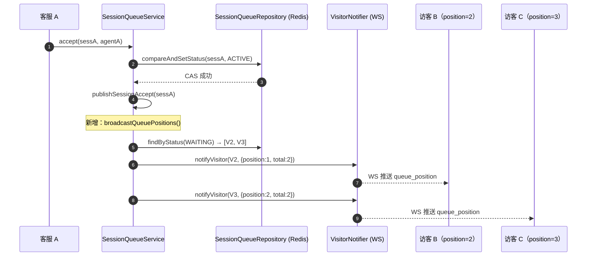
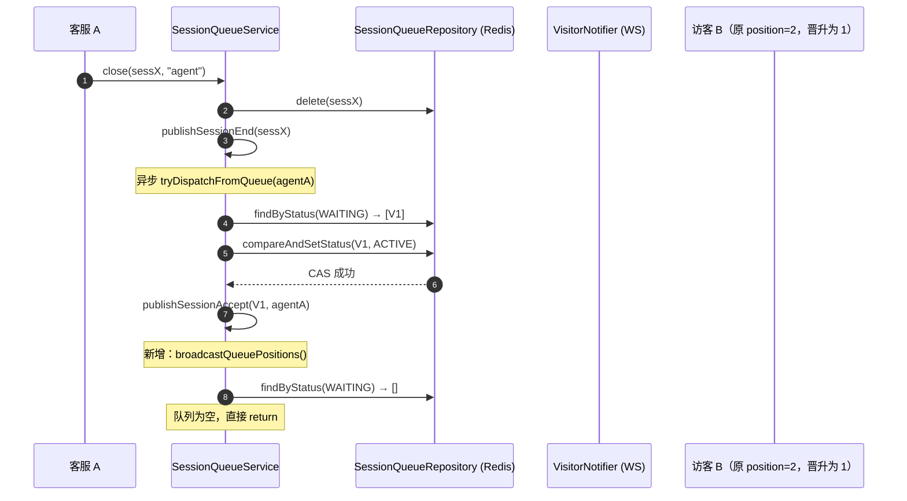

# 排队位次实时通知 — 技术改造文档

## 1. 背景 & 目标

### 背景

当前系统在访客转人工后，若所有客服满员，会话进入 WAITING 状态。访客通过 `POST /api/v1/chat/transfer` 响应得知自己处于排队中，但此后没有任何反馈直到被接入——不知道前面还有几人、不知道什么时候轮到自己，焦虑感强，容易放弃等待。

`VisitorNotifier.notifyVisitor()` 是现成的 WS 推送通道（CSAT 邀请已用此路径），可以低成本实现位次推送。

### 目标

- 每当有排队会话被接入（手动接入、自动分配、队列消化），对剩余所有 WAITING 访客推送最新排队位次
- 消息格式简洁：`{ type, position, total }`，前端可据此展示进度
- 不影响主流程：WS 未连接时静默跳过，推送失败不抛异常

### 非目标

- 不推送预计等待时间（当前无充分数据支撑）
- 不新增任何持久化字段或 MQ 事件
- 不修改访客侧 WS 协议或接口定义（沿用现有 `notifyVisitor` 机制）
- 不支持按技能组分队（当前系统无此概念）

# 2. 架构设计

## 2.1 触发时机

排队位次变化只在 **WAITING → ACTIVE** 转换时发生，系统中有**两个**触发点：

| 触发方法 | 场景 | 调用位置 |
|---|---|---|
| `accept()` | 客服手动接入 WAITING 会话 | 方法末尾，锁外 |
| `tryDispatchFromQueue()` | close/registerAgent 消化排队 | `withAgentLock` 返回后，锁释放后 |

> **注意：`doAssignNewSession()` 不在此列。** 该方法处理的是新入队时直接自动分配的情况——新会话从未进入 WAITING 状态，其他等待者的位次没有任何变化，广播无意义。
>
> **注意：广播必须在锁外调用。** `doDispatchWaitingSession()` 和 `doAssignNewSession()` 都在 Redisson 分布式锁（TTL=3s）内执行。`broadcastQueuePositions()` 需要对每个 WAITING 访客做一次 WebSocket I/O，若队列较长或连接有背压，会消耗完锁的 TTL，导致锁提前过期，破坏并发安全。因此广播调用点需要提升到锁释放之后。

每个触发点在锁释放后调用 `broadcastQueuePositions()`。

## 2.2 数据流

```
WAITING → ACTIVE 转换完成
        ↓
broadcastQueuePositions()
        ↓
queueRepository.findByStatus(WAITING)
  → 按 waitSince 升序排列（已有此方法，保证公平顺序）
        ↓
for each (i, item) in waitingList:
    visitorNotifier.notifyVisitor(item.sessionId(), {
        "type":     "queue_position",
        "position": i + 1,    // 1-based，1 = 下一个被接入
        "total":    total
    })
        ↓
WS 已连接 → 推送成功
WS 未连接 → VisitorSessionRegistry 无对应 session → 静默跳过
```

## 2.3 通信通道

访客侧的实时推送走 **WebSocket** `/ws/chat/{sessionId}`，通过现有 `VisitorNotifier` 接口：

```
SessionQueueService
    → VisitorNotifier.notifyVisitor(sessionId, payload)
        → VisitorSessionRegistry.getSession(sessionId)
            → WebSocketSession.sendMessage(json)
```

`VisitorNotifier` 已有空检查（registry 无 session 时直接 return），不需要额外处理。

## 2.4 消息格式

```json
{
  "type": "queue_position",
  "position": 2,
  "total": 4
}
```

| 字段 | 类型 | 说明 |
|---|---|---|
| `type` | String | 固定值 `"queue_position"`，前端用于区分消息类型 |
| `position` | int | 当前排位，从 1 开始，1 表示下一个被接入 |
| `total` | int | 队列中 WAITING 会话总数 |

前端处理建议：
- `position=1`：展示「你是下一位，即将被接入」
- `position>1`：展示「前面还有 N-1 人」或「你是第 N 位」
- 收到 `SESSION_ACCEPT` / `AUTO_ASSIGNED` 事件后，停止展示排队信息（已被接入）

# 3. 核心实现

## 3.1 broadcastQueuePositions()

新增私有方法，放在 `SessionQueueService` 工具方法区（`countActiveSessions` 之后）：

```java
/**
 * 广播排队位次给所有 WAITING 中的访客。
 *
 * <p>在每次有会话从 WAITING 变为 ACTIVE 后调用，确保队列中的访客看到最新位次。
 * 推送是 best-effort：WS 未连接或推送失败时静默跳过，不影响主流程。
 *
 * <p>消息格式：{@code {"type":"queue_position","position":N,"total":M}}，
 * position 从 1 开始，1 表示下一个被接入。
 *
 * <p><strong>必须在分布式锁释放后调用。</strong>
 * 此方法对每个 WAITING 访客做一次 WebSocket I/O，持锁时调用可能耗尽
 * Redisson TTL（3s），导致锁提前过期，破坏并发安全。
 */
private void broadcastQueuePositions() {
    // findByStatus 已按 waitSince 升序排列，保证位次与等待时间对应
    List<SessionQueueItem> waiting = queueRepository.findByStatus(SessionStatus.WAITING);
    if (waiting.isEmpty()) return;

    int total = waiting.size();
    for (int i = 0; i < total; i++) {
        String sessionId = waiting.get(i).sessionId();
        Map<String, Object> payload = Map.of(
                "type",     "queue_position",
                "position", i + 1,      // 1-based
                "total",    total
        );
        try {
            visitorNotifier.notifyVisitor(sessionId, payload);
        } catch (Exception e) {
            // WS 已断开或序列化失败：位次通知是 best-effort，不中断广播
            log.debug("[QueuePosition] 推送失败 sessionId={} position={}", sessionId, i + 1, e);
        }
    }
    log.info("[QueuePosition] 位次广播完成，WAITING 人数={}", total);
}
```

## 3.2 两个调用点改造

### accept()

`accept()` 本身在锁外执行，直接在末尾追加：

```java
public SessionQueueItem accept(String sessionId, String agentId) {
    // ... 现有 CAS + MQ 逻辑 ...
    publishSessionAccept(sessionId, agentId, Instant.now().getEpochSecond());
    log.info("[SessionQueue] accept 成功 sessionId={}", sessionId);

    // 新增：广播剩余排队访客的位次（锁外，无 TTL 风险）
    broadcastQueuePositions();

    return updated;
}
```

### tryDispatchFromQueue()

`doDispatchWaitingSession()` 在 `withAgentLock` 内执行（TTL=3s），不能在其内部调 I/O。
广播提升到 `tryDispatchFromQueue()` 的锁释放之后：

```java
private void tryDispatchFromQueue(String agentId) {
    int max = csAgentConfigProvider.getMaxSessionsPerAgent();
    boolean acquired = withAgentLock(agentId, () -> {
        tryAssignOldestWaiting(agentId, max);
        return true;
    });
    if (!acquired) {
        log.debug("[QueueDrain] 加锁竞争，跳过本次消化 agentId={}", agentId);
        return;
    }
    // 锁已释放后广播（避免在 TTL=3s 的锁内做 N 次 WS I/O）
    broadcastQueuePositions();
}
```

> `doDispatchWaitingSession()` 和 `tryAssignOldestWaiting()` 本身**不调用** `broadcastQueuePositions()`，广播统一由 `tryDispatchFromQueue()` 在锁外触发。

> `doAssignNewSession()` 同样**不调用** `broadcastQueuePositions()`：自动分配是新会话直接进 ACTIVE，从未进过 WAITING，其他等待者位次无变化，广播无意义。
```

## 3.3 依赖说明

`broadcastQueuePositions()` 使用：
- `queueRepository`：已注入，调用 `findByStatus(WAITING)`（已有方法，按 waitSince 升序）
- `visitorNotifier`：已注入，`VisitorNotifier` 接口（`VisitorSessionRegistry` 实现）
- `Map.of()`：JDK 9+，项目已使用

**无需新增任何依赖注入。**

# 4. 边界情况 & 时序图

## 4.1 边界情况

| 场景 | 处理方式 |
|---|---|
| 广播时队列为空 | `isEmpty()` 检查直接 return，不触发任何推送 |
| 访客 WS 未连接 | `VisitorSessionRegistry.getSession()` 返回 null，`notifyVisitor` 静默 return |
| 推送时 WS 连接突然断开 | `WebSocketSession.sendMessage` 抛异常，被 try/catch 捕获，log.debug 后继续广播下一个 |
| 并发两个接入（并发竞态） | 两次 `broadcastQueuePositions()` 各自独立执行，最终结果收敛正确，位次以最后一次广播为准（best-effort） |
| `doDispatchWaitingSession` CAS 失败 | CAS 失败说明该会话已被手动接入，`tryDispatchFromQueue` 锁内动作无实质输出，锁外的广播仍执行，此时 WAITING 列表未变（合理：已有人被手动接入但广播代价很低） |
| **已知限制：访客入队时 WS 还未建立** | 入队后到 WS 建立之前如果队列静止（无人出队），访客不会收到初始位次。入队 HTTP 响应已包含 `status=WAITING`，前端应据此展示「排队中」，并在收到第一个 `queue_position` 推送时更新具体位次 |
| **已知限制：访客 WS 断开后重连** | 重连后不会立即收到当前位次，需等下次有人出队触发广播。如需立即恢复位次，前端可在 WS 连接成功后调用 `GET /api/v1/chat/state` 确认仍在 WAITING，然后用轮询或等待下次广播 |

## 4.2 时序图 — 手动接入场景



## 4.3 时序图 — 队列消化场景（close 触发）



# 5. 文件改动清单 & 测试方案

## 5.1 文件改动清单

### 修改文件

| 文件 | 改动内容 |
|---|---|
| `SessionQueueService.java` | 新增 `broadcastQueuePositions()` 私有方法；在 `accept()`、`doAssignNewSession()`、`doDispatchWaitingSession()` 三处末尾各调用一次 |

### 不需要修改的文件

| 文件 | 原因 |
|---|---|
| `VisitorNotifier.java` | 接口不变，`notifyVisitor(sessionId, Map)` 已支持任意 payload |
| `VisitorSessionRegistry.java` | 实现不变，WS 未连接时已有空检查 |
| `SessionQueueItem.java` | 数据模型不变 |
| `SessionEventType.java` | 不新增 MQ 事件，位次通知纯 WS push |
| 前端代码 | 仅需在聊天 WS 消息处理中新增 `type=queue_position` case（后端无强依赖） |

## 5.2 测试方案

### 单元测试 — `SessionQueueServiceQueuePositionTest`（新建）

| 测试用例 | 验证点 |
|---|---|
| `accept_broadcastsPositionToRemainingWaiting` | accept 成功后，剩余 WAITING 访客收到正确位次 |
| `accept_noNotification_whenQueueEmpty` | accept 后队列为空，`notifyVisitor` 不被调用 |
| `queueDrain_broadcastsPosition_afterLockRelease` | 队列消化（tryDispatchFromQueue）锁释放后广播位次 |
| `queueDrain_stillBroadcasts_afterCasFailure` | CAS 失败（已被手动接入）时，`tryDispatchFromQueue` 仍在锁外广播（队列未变，代价低） |
| `broadcastQueuePositions_positionOrderMatchesWaitSince` | 位次顺序按 `waitSince` 升序，最早入队的 position=1 |
| `broadcastQueuePositions_notifyFailure_continuesOtherVisitors` | 某个访客推送失败（WS 断开），不中断对其他访客的广播 |
| `autoDispatch_doesNotBroadcastPosition` | 新会话自动分配（doAssignNewSession）后，不触发位次广播（WAITING 队列无变化） |

### 测试类 setUp（10 参数构造器）

测试类需适配 `feat/agent-auto-dispatch` worktree 的 10 参数构造器：

```java
@ExtendWith(MockitoExtension.class)
class SessionQueueServiceQueuePositionTest {

    @Mock SessionQueueRepository        queueRepository;
    @Mock AgentOnlineRegistry           agentRegistry;
    @Mock ConversationMessagePublisher  publisher;
    @Mock RabbitTemplate                rabbitTemplate;
    @Mock ConversationPersistRepository persistRepository;
    @Mock CsatService                   csatService;
    @Mock VisitorNotifier               visitorNotifier;
    @Mock CsAgentConfigProvider         configProvider;
    @Mock RedissonClient                redissonClient;
    @Mock RLock                         rLock;

    SessionQueueService service;

    @BeforeEach
    void setUp() throws Exception {
        // 10 参数：queueRepository, agentRegistry, publisher, rabbitTemplate,
        //   eventsExchange, persistRepository, csatService, visitorNotifier,
        //   configProvider, redissonClient
        service = new SessionQueueService(
                queueRepository, agentRegistry, publisher, rabbitTemplate,
                "test.exchange", persistRepository, csatService, visitorNotifier,
                configProvider, redissonClient);

        // Redisson stub（lenient：部分测试不需要）
        lenient().when(redissonClient.getLock(anyString())).thenReturn(rLock);
        lenient().when(rLock.tryLock(0, 3, TimeUnit.SECONDS)).thenReturn(true);
        lenient().when(rLock.isHeldByCurrentThread()).thenReturn(true);
        lenient().when(configProvider.getMaxSessionsPerAgent()).thenReturn(5);
    }
}
```

### 关键测试代码示例

```java
@Test
@DisplayName("accept 后剩余两个 WAITING 访客收到正确位次")
void accept_broadcastsPositionToRemainingWaiting() {
    SessionQueueItem w1 = new SessionQueueItem(
            "sess-w1", "V1", "", "", 1000L, SessionStatus.WAITING, null);
    SessionQueueItem w2 = new SessionQueueItem(
            "sess-w2", "V2", "", "", 2000L, SessionStatus.WAITING, null);
    SessionQueueItem active = new SessionQueueItem(
            "sess-a", "VA", "", "", 500L, SessionStatus.WAITING, null);

    when(queueRepository.findById("sess-a")).thenReturn(Optional.of(active));
    when(queueRepository.compareAndSetStatus(eq("sess-a"), any())).thenReturn(true);
    when(queueRepository.findByStatus(SessionStatus.WAITING)).thenReturn(List.of(w1, w2));

    service.accept("sess-a", "agent-A");

    verify(visitorNotifier).notifyVisitor(eq("sess-w1"),
            argThat(m -> Integer.valueOf(1).equals(m.get("position"))
                      && Integer.valueOf(2).equals(m.get("total"))));
    verify(visitorNotifier).notifyVisitor(eq("sess-w2"),
            argThat(m -> Integer.valueOf(2).equals(m.get("position"))
                      && Integer.valueOf(2).equals(m.get("total"))));
}

@Test
@DisplayName("某访客推送失败，不影响其他访客收到位次")
void broadcastQueuePositions_notifyFailure_continuesOtherVisitors() {
    SessionQueueItem w1 = new SessionQueueItem(
            "sess-w1", "V1", "", "", 1000L, SessionStatus.WAITING, null);
    SessionQueueItem w2 = new SessionQueueItem(
            "sess-w2", "V2", "", "", 2000L, SessionStatus.WAITING, null);

    when(queueRepository.findById("sess-a")).thenReturn(Optional.of(
            new SessionQueueItem("sess-a", "VA", "", "", 500L, SessionStatus.WAITING, null)));
    when(queueRepository.compareAndSetStatus(any(), any())).thenReturn(true);
    when(queueRepository.findByStatus(SessionStatus.WAITING)).thenReturn(List.of(w1, w2));
    doThrow(new RuntimeException("WS closed"))
            .when(visitorNotifier).notifyVisitor(eq("sess-w1"), any());

    assertThatNoException().isThrownBy(() -> service.accept("sess-a", "agent-A"));
    verify(visitorNotifier).notifyVisitor(eq("sess-w2"), any());
}

## 5.3 验收标准

1. 客服接入一个会话后，剩余所有 WAITING 访客的 WS 连接都收到 `type=queue_position` 消息
2. 位次顺序与入队时间（`waitSince`）完全对应，最早入队的 `position=1`
3. 队列清空后不推送任何消息
4. 某个访客 WS 断开时，其他访客不受影响
5. 所有测试通过，BUILD SUCCESS
