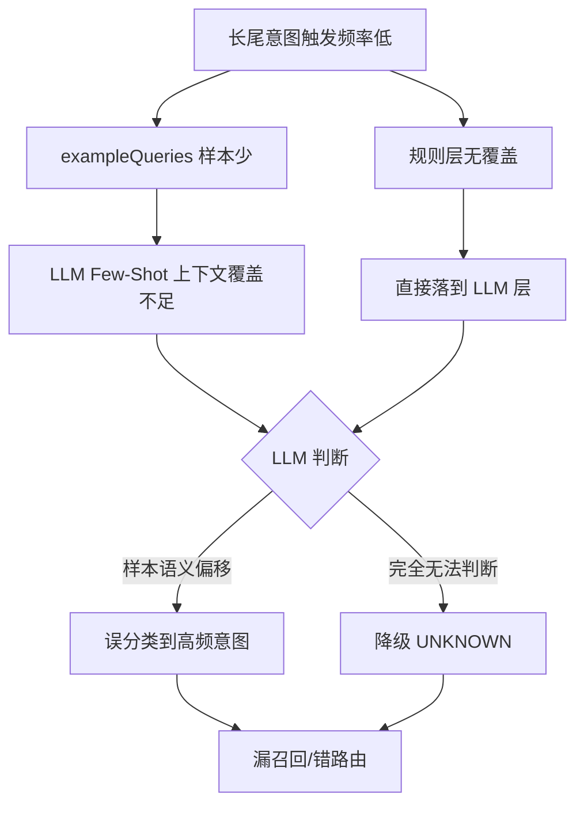
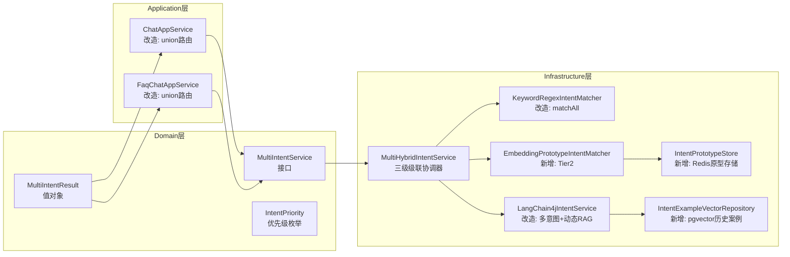
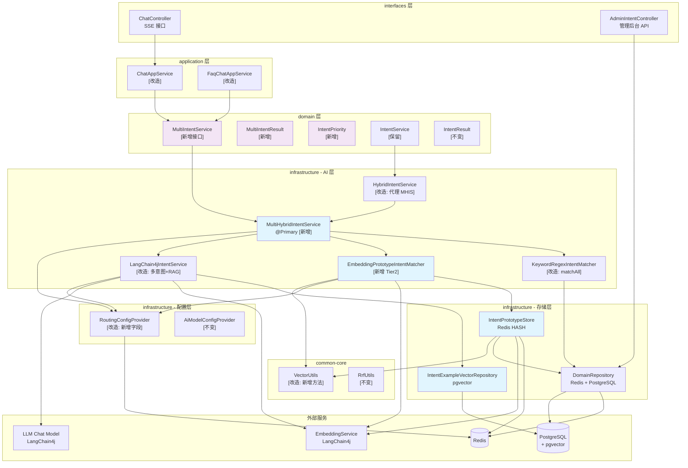

# 多意图识别与长尾增强技术方案

## 1. 背景与现状诊断

### 1.1 业务背景

ARIA 智能客服系统当前部署在生产环境中，处理用户的实时对话请求。随着业务规模扩大，出现了两类典型问题：

1. **多意图漏召回**：用户一句话包含多个意图（如"我要投诉这次订单，同时帮我查一下物流"），系统只识别出一个意图，另一个意图被静默丢弃，导致转人工逻辑未触发或业务查询未执行。

2. **长尾意图识别率低**：部分低频业务意图（如"理赔申请"、"账户注销"等）在生产环境触发频率极低，LLM Few-Shot 示例样本少，识别置信度不稳定，出现大量误识别为 `UNKNOWN` 或错分到高频意图的情况。

### 1.2 现有架构

```
用户消息
   │
   ▼
┌─────────────────────────────────────┐
│  HybridIntentService (@Primary)     │
│                                     │
│  Tier 1: KeywordRegexIntentMatcher  │◄── 关键词/正则，<1ms
│     │ 命中 → 首个命中立即返回        │    ⚠️ 问题：多规则只取第一条
│     │ 未命中 ↓                      │
│  Tier 2: LangChain4jIntentService   │◄── LLM Few-Shot，200-800ms
│     └──── 返回单个 IntentResult      │    ⚠️ 问题：Prompt 强制单意图
└─────────────────────────────────────┘
         │
         ▼
   IntentResult (单个)
   ├── intent: IntentType (枚举)
   ├── intentCode: String
   └── confidence: double
```

### 1.3 现有代码问题定位

| 问题点 | 所在文件 | 具体表现 |
|--------|---------|---------|
| 接口签名单意图 | `IntentService.java` | `classify()` 返回单个 `IntentResult`，从接口层面不支持多意图 |
| 规则层首个命中即返回 | `KeywordRegexIntentMatcher.java:66` | `for` 循环第一个命中立即 `return Optional.of(...)` |
| LLM Prompt 单意图结构 | `LangChain4jIntentService.java:61` | Prompt 要求返回 `{"intent": "...", "confidence": ...}`，JSON 结构为单对象 |
| 路由层单意图判断 | `ChatAppService.java` | `ctx.intent().requiresTransfer()` 单次布尔判断 |
| 路由层单意图判断 | `FaqChatAppService.java` | `if (ctx.intent().requiresTransfer())` 单分叉 |
| 长尾无特殊处理 | `LangChain4jIntentService.java` | Few-Shot 只注入 `IntentConfig.exampleQueries` 静态样本，无动态增强 |

### 1.4 IntentType 枚举与路由映射

```
IntentType.COMPLAINT          → requiresTransfer() = true  → 高优先级转人工
IntentType.TRANSFER_REQUEST   → requiresTransfer() = true  → 转人工
IntentType.FAQ_QUERY          → skipRag() = false          → RAG + LLM 回复
IntentType.CHITCHAT           → skipRag() = true           → 跳过 RAG 直接 LLM
IntentType.OUT_OF_SCOPE       → skipRag() = true           → 固定拒答模板
IntentType.UNKNOWN            → 降级 FAQ_QUERY 处理
```

当前 `IntentResult` 中 `intentCode` 字段（如 `"query_order"`）已预留业务级细分意图，但下游路由未消费，只透传至前端 `TransferPayload`。

### 1.5 长尾问题根因分析



根本原因：系统依赖静态 `exampleQueries` 做 Few-Shot，样本数量和质量无法随运行时间自动提升，形成"越是长尾越难识别、越难识别越无样本"的负循环。

## 2. 目标、非目标与约束

### 2.1 设计目标

| 编号 | 目标 | 成功标准 |
|------|------|---------|
| G1 | 支持多意图并行识别 | 一句话含 2 个意图时，两个意图均能被识别并正确路由，漏召回率降至 <2% |
| G2 | 长尾意图识别率提升 | 低频意图（日触发 <50 次）识别准确率从基线提升 ≥20pp |
| G3 | 性能不退化 | P99 延迟不超过现有 Tier1 命中路径的 2 倍（Tier1 命中仍 <2ms） |
| G4 | 向后兼容 | 现有 `ChatAppService`/`FaqChatAppService` 路由语义不破坏 |
| G5 | 运营可配置 | 每个意图的 embedding 阈值可通过 `system_config` 动态调整，无需重启 |
| G6 | 可观测 | 每次分类结果记录使用了哪一 Tier、置信度分布，支持离线分析 |

### 2.2 非目标

- **不引入独立 ML 训练流水线**：不部署独立的 BERT/FastText 分类模型，不引入 Python 训练服务
- **不改造知识库检索逻辑**：本方案只改动意图识别层，`KnowledgeSearchAppService` 的混合检索不在范围内
- **不重构 DomainRoutingService**：域路由是正交问题，本方案不合并两者
- **不实现意图间依赖建模（GNN/标签链）**：标签相关性建模列为 Phase 2 进阶方案
- **不替换现有关键词规则管理后台**：Tier 1 规则仍由现有运营工具管理

### 2.3 技术约束

```
约束 C1: 不引入新的外部存储 — 只使用已有 PostgreSQL + pgvector + Redis
约束 C2: 不引入新的外部服务依赖 — EmbeddingService 复用已有 LangChain4j 实现
约束 C3: 接口变更必须向后兼容 — IntentService 接口签名变更需同步更新所有调用方
约束 C4: Tier3 LLM 调用次数不增加 — 多意图场景不能因此触发多次 LLM 调用
约束 C5: Redis key 命名遵循现有规范 — 参考 CustomerServiceCacheConstant 枚举管理
```

### 2.4 优先级与分期

```
Phase 1（本方案）:
  ✅ 多意图接口改造（领域层）
  ✅ Tier 1 规则层多命中支持
  ✅ Tier 2 Embedding Prototype（长尾核心解）
  ✅ Tier 3 LLM 多意图 Prompt + 动态 RAG 注入
  ✅ 应用层路由 union 语义
  ✅ 可观测性日志埋点

Phase 2（后续迭代）:
  🔲 标签相关性建模（GNN 或标签链）
  🔲 基于历史触发数据的阈值自动调优
  🔲 意图级别的 A/B 测试路由
  🔲 多意图串行执行编排（工具链调用）
```

## 3. 架构整体对比

### 3.1 改造前架构（As-Is）

```
┌─────────────────────────────────────────────────────────────────┐
│                        ChatAppService                           │
│                                                                 │
│  streamDomain(sessionId, message, domainCode)                  │
│       │                                                         │
│       ├─ intentService.classify(message) ──────────────────┐   │
│       │                                                     │   │
│       └─ if intent.requiresTransfer()                       │   │
│              → handleTransfer()                             │   │
│          else                                               │   │
│              → domainAgentService.streamChat()              │   │
└─────────────────────────────────────────────────────────────────┘
                              │
                              ▼
┌─────────────────────────────────────────────────────────────────┐
│              HybridIntentService (@Primary)                     │
│                                                                 │
│  classify(message): IntentResult  ← 单返回值                    │
│       │                                                         │
│  Tier 1 ─ KeywordRegexIntentMatcher                            │
│       │    match(): Optional<IntentResult>                      │
│       │    ⚠️ 首个命中即返回，不继续匹配                         │
│       │                                                         │
│       └── (未命中) ──► Tier 2 ─ LangChain4jIntentService       │
│                              classify(): IntentResult           │
│                              ⚠️ Prompt 单意图结构               │
│                              ⚠️ 静态 Few-Shot 样本              │
└─────────────────────────────────────────────────────────────────┘
```

**数据流（单意图）：**
```
message → [规则] → IntentResult{FAQ_QUERY, "query_order", 1.0}
                        │
                        └─ requiresTransfer()=false → streamChat()
                        ✗ 丢失了同时存在的 COMPLAINT 意图
```

---

### 3.2 改造后架构（To-Be）

```
┌─────────────────────────────────────────────────────────────────┐
│                        ChatAppService                           │
│                                                                 │
│  streamDomain(sessionId, message, domainCode)                  │
│       │                                                         │
│       ├─ intentService.classifyMulti(message) ─────────────┐   │
│       │                                                     │   │
│       └─ MultiIntentResult.resolveRouting()                 │   │
│              → 取最高优先级意图驱动分叉                       │   │
│              → 所有意图均传给下游 Agent                      │   │
└─────────────────────────────────────────────────────────────────┘
                              │
                              ▼
┌─────────────────────────────────────────────────────────────────┐
│          MultiHybridIntentService (@Primary)  [新]              │
│                                                                 │
│  classifyMulti(message): MultiIntentResult  ← 多意图结果        │
│       │                                                         │
│  Tier 1 ─ KeywordRegexIntentMatcher [改造]                      │
│       │    matchAll(): List<IntentResult>  ← 收集所有命中        │
│       │    ✅ 遍历所有规则，不提前返回                           │
│       │                                                         │
│  Tier 2 ─ EmbeddingPrototypeIntentMatcher [新增] ◄── 长尾核心   │
│       │    match(): List<IntentResult>                          │
│       │    ✅ 原型向量余弦相似度，独立阈值                       │
│       │    ✅ 1个exampleQuery即可建原型                         │
│       │    ✅ ~30ms，不调用 LLM                                 │
│       │                                                         │
│       └── (置信度不足时) ──► Tier 3 ─ LangChain4jIntentService  │
│                              [改造]                             │
│                              classifyMulti(): MultiIntentResult │
│                              ✅ Prompt 返回 intents 数组        │
│                              ✅ 动态 RAG 注入历史案例            │
└─────────────────────────────────────────────────────────────────┘
                    │
        ┌───────────┼───────────┐
        ▼           ▼           ▼
  IntentPrototype  ExampleVector  RoutingConfig
  Store (Redis)    Repository     Provider
                   (pgvector)     (改造)
```

### 3.3 新增组件一览



### 3.4 组件职责边界

| 组件 | 层次 | 职责 | 依赖 |
|------|------|------|------|
| `MultiIntentService` | Domain | 接口定义，不含任何实现细节 | — |
| `MultiIntentResult` | Domain | 多意图结果聚合，提供路由语义方法 | `IntentResult`, `IntentPriority` |
| `IntentPriority` | Domain | 意图优先级定义，驱动路由分叉顺序 | `IntentType` |
| `MultiHybridIntentService` | Infrastructure | 三级级联协调，合并各 Tier 结果，去重 | Tier1, Tier2, Tier3 |
| `EmbeddingPrototypeIntentMatcher` | Infrastructure | Embedding 原型匹配，长尾识别核心 | `EmbeddingService`, `IntentPrototypeStore` |
| `IntentPrototypeStore` | Infrastructure | 原型向量 CRUD，Redis 存储，ConfigChange 时刷新 | Redis, `EmbeddingService` |
| `IntentExampleVectorRepository` | Infrastructure | 历史真实触发案例向量存储与检索 | pgvector |
| `KeywordRegexIntentMatcher` | Infrastructure | 改造为 `matchAll()`，返回所有命中 | `DomainRepository` |
| `LangChain4jIntentService` | Infrastructure | 多意图 Prompt + 动态 Few-Shot RAG | `EmbeddingService`, `IntentExampleVectorRepository` |

## 4. 领域模型变更

### 4.1 变更总览

```
变更前                          变更后
─────────────────────           ─────────────────────────────────────
IntentService                   MultiIntentService
  classify(String)              + classifyMulti(String)
  : IntentResult                : MultiIntentResult

IntentResult (不变)             MultiIntentResult (新增)
  intent: IntentType              intents: List<IntentResult>
  intentCode: String            + primaryIntent(): IntentResult
  confidence: double            + requiresTransfer(): boolean
  requiresTransfer(): bool      + skipRag(): boolean
  skipRag(): bool               + isEffectivelyOutOfScope(): boolean
                                + intentCodes(): List<String>

                                IntentPriority (新增)
                                  枚举，定义路由优先级顺序

                                ClassificationTierConstants (新增, infrastructure)
                                  提取魔法字符串 "RULE"/"EMBEDDING"/"LLM" 为常量

                                MultiIntentClassifier (新增, infrastructure 内部接口)
                                  Tier3 LLM 分类器抽象接口，解除 DIP 违规
```

### 4.2 IntentPriority — 路由优先级枚举

```java
/**
 * 意图路由优先级。
 *
 * <p>当用户消息包含多个意图时，{@link MultiIntentResult#primaryIntent()} 按此优先级
 * 选出"驱动分叉"的主意图。优先级数值越小，优先级越高（COMPLAINT 最高）。
 *
 * <p>设计原则：安全保障类意图（投诉、转人工）优先于服务类意图（FAQ），
 * 服务类意图优先于修饰类意图（闲聊），拒答最低。
 *
 * <p><b>维护约束：</b>{@link IntentType} 与本枚举的枚举项必须保持一一对应，同步新增/删除。
 * {@code switch} 语句的 exhaustive 检查（Java 17+）会在编译期保护该约束，
 * 如新增 {@link IntentType} 值而未同步本枚举，编译将报错。
 *
 * @see IntentType 两者枚举项必须保持同步
 */
public enum IntentPriority {
    COMPLAINT(1),
    TRANSFER_REQUEST(2),
    FAQ_QUERY(3),
    CHITCHAT(4),
    OUT_OF_SCOPE(5),
    UNKNOWN(99);

    private final int order;

    IntentPriority(int order) { this.order = order; }

    public static IntentPriority of(IntentType type) {
        return switch (type) {
            case COMPLAINT         -> COMPLAINT;
            case TRANSFER_REQUEST  -> TRANSFER_REQUEST;
            case FAQ_QUERY         -> FAQ_QUERY;
            case CHITCHAT          -> CHITCHAT;
            case OUT_OF_SCOPE      -> OUT_OF_SCOPE;
            case UNKNOWN           -> UNKNOWN;
        };
    }

    public int getOrder() { return order; }
}
```

**为什么 COMPLAINT > TRANSFER_REQUEST？**
投诉携带情绪敏感信号，必须立即转人工并打高优先级标记，不能被其他意图"压住"。`TRANSFER_REQUEST` 是用户主动要求，语义明确但紧迫度略低。

### 4.3 MultiIntentResult — 多意图结果值对象

```java
/**
 * 多意图分类结果。持有所有通过阈值的意图列表，并提供路由决策语义。
 *
 * <p>不可变值对象，线程安全。
 *
 * <p><b>注意：</b>{@code sourceTier} 字段为可观测性用途，使用字符串而非枚举，
 * 避免将基础设施层（RULE/EMBEDDING/LLM）的技术概念引入领域对象。
 *
 * @param intents         所有命中的意图，按置信度降序排列，不可为 null
 * @param sourceTier      实际命中的处理层标识（"RULE" / "EMBEDDING" / "LLM"），仅用于日志和指标
 * @param processingMs    分类耗时（毫秒），用于性能监控
 */
public record MultiIntentResult(
        List<IntentResult> intents,
        String sourceTier,
        long processingMs
) {

    /** 兜底结果 */
    public static final MultiIntentResult UNKNOWN =
            new MultiIntentResult(List.of(IntentResult.UNKNOWN), "RULE", 0L);

    /** 主意图：按 IntentPriority 取优先级最高的意图 */
    public IntentResult primaryIntent() {
        return intents.stream()
                .min(Comparator.comparingInt(r -> IntentPriority.of(r.intent()).getOrder()))
                .orElse(IntentResult.UNKNOWN);
    }

    /**
     * 任意一个意图需要转人工，则整体需要转人工。
     * 体现 union 语义：安全兜底，不因为有其他意图而忽略转人工信号。
     */
    public boolean requiresTransfer() {
        return intents.stream().anyMatch(IntentResult::requiresTransfer);
    }

    /**
     * 仅当所有意图都可跳过 RAG 时，才跳过 RAG。
     * 体现 intersection 语义：只要有一个意图需要 RAG，就执行 RAG。
     */
    public boolean skipRag() {
        return intents.stream().allMatch(IntentResult::skipRag);
    }

    /**
     * 判断是否所有有效意图均为 OUT_OF_SCOPE 或 UNKNOWN。
     *
     * <p>供 Application 层做"整体拒答"路由决策使用，将路由判断逻辑
     * 收拢在领域对象内，避免业务规则泄漏到 Application Service。
     *
     * @return true 表示没有任何可回答的有效意图，应返回拒答模板
     */
    public boolean isEffectivelyOutOfScope() {
        return intents.stream()
                .allMatch(r -> r.intent() == IntentType.OUT_OF_SCOPE
                            || r.intent() == IntentType.UNKNOWN);
    }

    /** 是否包含某个具体的业务意图 code */
    public boolean hasIntentCode(String intentCode) {
        return intents.stream().anyMatch(r -> intentCode.equalsIgnoreCase(r.intentCode()));
    }

    /** 所有业务意图 code 列表，供下游 dispatch 使用 */
    public List<String> intentCodes() {
        return intents.stream().map(IntentResult::intentCode).toList();
    }
}
```

**关键设计决策解释：**

| 方法 | 语义 | 原因 |
|------|------|------|
| `requiresTransfer()` | **union（OR）** | 转人工是安全兜底，不能因为"还有其他意图"而被忽略 |
| `skipRag()` | **intersection（AND）** | 只要有一个意图需要 RAG，就不能整体跳过，否则会漏回答 |
| `primaryIntent()` | **优先级最高** | 驱动管道分叉的"主线"路由，多意图时取最紧急的 |

### 4.4 MultiIntentService — 领域接口

```java
/**
 * 多意图识别领域服务接口。
 *
 * <p>实现在 infrastructure 层（MultiHybridIntentService），保持 DDD 分层。
 * 任何失败均返回 {@link MultiIntentResult#UNKNOWN}，不抛异常。
 *
 * <p>命名约定：
 * <ul>
 *   <li>{@code classifyMulti} — 返回多意图结果（新方法，主要入口）</li>
 * </ul>
 */
public interface MultiIntentService {
    MultiIntentResult classifyMulti(String userMessage);
}
```

### 4.4.1 IntentType 补充 fromCode() 静态工厂

**I2 修复：** 在 `IntentType` 枚举中增加静态工厂，消灭三处重复的 `try-catch` 控制流反模式：

```java
// IntentType.java 新增方法
/**
 * 从业务意图 code 字符串安全解析枚举值，不抛异常。
 *
 * <p>替代各处 {@code try { IntentType.valueOf(code) } catch (IllegalArgumentException) {...}}
 * 的反模式写法（用异常做正常控制流，违反阿里规范）。
 *
 * @param code 意图 code（大小写不敏感），null 或未知值均返回 {@link #FAQ_QUERY}
 * @return 对应枚举值，未知时返回 {@link #FAQ_QUERY}
 */
public static IntentType fromCode(String code) {
    if (code == null || code.isBlank()) {
        return FAQ_QUERY;
    }
    String upper = code.toUpperCase();
    for (IntentType t : values()) {
        if (t.name().equals(upper)) {
            return t;
        }
    }
    return FAQ_QUERY;
}
```

### 4.4.2 ClassificationTierConstants — 层级标识常量

**C1/I1 修复：** `MultiIntentResult.sourceTier` 使用字符串而非枚举（避免 domain 层引入 infra 概念），
但字符串不能散落各处。在 infrastructure 层定义常量接口统一管理：

```java
// 位置：infrastructure/ai/ClassificationTierConstants.java
/**
 * 意图分类处理层级标识常量。
 *
 * <p>供 {@link MultiHybridIntentService} 填充 {@link MultiIntentResult#sourceTier()} 字段，
 * 以及 Micrometer 指标的 tier tag 使用。不放在领域层，因为 RULE/EMBEDDING/LLM 是
 * 基础设施实现细节，领域对象不应感知。
 */
public interface ClassificationTierConstants {
    String RULE      = "RULE";
    String EMBEDDING = "EMBEDDING";
    String LLM       = "LLM";
}
```

### 4.4.3 IntentClassificationConstants — 魔法值常量

**I1 修复：** 消灭设计文档中散落的魔法数字（0.75、0.85、0.95 等）：

```java
// 位置：infrastructure/ai/IntentClassificationConstants.java
/**
 * 意图分类相关默认值常量。
 *
 * <p>所有默认值均可通过 {@code system_config} 的 {@code routing.config} 覆盖，
 * 此处仅为 Java 侧 {@link RoutingConfig.Intent} 字段的默认值来源。
 * 阿里规范：不允许在代码中直接使用魔法值。
 */
public interface IntentClassificationConstants {
    /** Tier2 Embedding 全局默认相似度阈值 */
    double DEFAULT_EMBEDDING_THRESHOLD      = 0.75;
    /** Tier2 高置信度阈值：超过此值跳过 Tier3 LLM */
    double DEFAULT_HIGH_CONFIDENCE          = 0.85;
    /** Tier3 LLM 最低置信度：低于此值的意图被过滤 */
    double DEFAULT_MIN_LLM_CONFIDENCE       = 0.50;
    /** 高置信度自动积累历史案例的最低置信度门槛 */
    double DEFAULT_AUTO_ACCUMULATE_MIN_CONF = 0.95;
    /** Caffeine 本地缓存最大条目数（意图原型）*/
    int    PROTOTYPE_CACHE_MAX_SIZE         = 200;
    /** Caffeine 本地缓存 TTL（分钟）*/
    int    PROTOTYPE_CACHE_TTL_MINUTES      = 10;
}
```

### 4.5 旧接口兼容性

`IntentService` 接口**保留不变**，`HybridIntentService` 继续作为其实现：

```
IntentService (保留)                MultiIntentService (新增)
  classify(): IntentResult            classifyMulti(): MultiIntentResult
       ↑                                    ↑
HybridIntentService (保留)        MultiHybridIntentService (新增, @Primary)
  基于 MultiHybridIntentService 代理        三级级联实现
```

**C3 修复（DIP 违规）：** `MultiHybridIntentService` 对 Tier3 依赖具体实现类 `LangChain4jIntentService`。
在 infrastructure 层新增内部接口 `MultiIntentClassifier`，解除具体依赖：

```java
// 位置：infrastructure/ai/MultiIntentClassifier.java
/**
 * 多意图 LLM 分类器内部接口（infrastructure 层）。
 *
 * <p>使 {@link MultiHybridIntentService} 依赖抽象而非具体实现，
 * 便于替换实现（如切换模型提供商）和独立单测（Mock）。
 * 接口定义在 infrastructure 层而非 domain 层，因为"LLM 调用"是基础设施关注点。
 */
public interface MultiIntentClassifier {
    /**
     * 对用户消息进行多意图分类。
     *
     * @param userMessage 用户消息
     * @return 分类结果列表，失败时返回含 {@link IntentResult#UNKNOWN} 的单元素列表，不抛异常
     */
    List<IntentResult> classifyMulti(String userMessage);
}
```

`LangChain4jIntentService` 实现此接口，`MultiHybridIntentService` 依赖接口：

```java
// MultiHybridIntentService 字段声明修改：
private final MultiIntentClassifier llmClassifier;  // ← 依赖接口，不依赖具体类
```

`LangChain4jIntentService` 同时实现 `IntentService`（旧接口）和 `MultiIntentClassifier`（新接口）：
```java
@Component
public class LangChain4jIntentService implements IntentService, MultiIntentClassifier {
    ...
}
```

`HybridIntentService` 对接口兼容性

`IntentService (保留)                MultiIntentService (新增)
  classify(): IntentResult            classifyMulti(): MultiIntentResult
       ↑                                    ↑
HybridIntentService (保留)        MultiHybridIntentService (新增, @Primary)
  基于 MultiHybridIntentService 代理        三级级联实现
                                           依赖 MultiIntentClassifier（接口）而非具体类`

```java
@Override
public IntentResult classify(String userMessage) {
    return multiIntentService.classifyMulti(userMessage).primaryIntent();
}
```

### 4.6 领域模型变更图

```
┌─────────────────────────────────────────────────────────────────┐
│                         Domain Layer                            │
│                                                                 │
│  ┌──────────────────┐    ┌─────────────────────────────────┐   │
│  │   IntentType     │    │        IntentPriority            │   │
│  │  (枚举，不变)     │◄───│  COMPLAINT(1)                   │   │
│  │  COMPLAINT       │    │  TRANSFER_REQUEST(2)            │   │
│  │  TRANSFER_REQUEST│    │  FAQ_QUERY(3)                   │   │
│  │  FAQ_QUERY       │    │  CHITCHAT(4)                    │   │
│  │  CHITCHAT        │    │  OUT_OF_SCOPE(5)                │   │
│  │  OUT_OF_SCOPE    │    │  UNKNOWN(99)                    │   │
│  │  UNKNOWN         │    └─────────────────────────────────┘   │
│  └──────────────────┘                 │                        │
│           │                           │                        │
│           ▼                           ▼                        │
│  ┌──────────────────┐    ┌─────────────────────────────────┐   │
│  │   IntentResult   │    │       MultiIntentResult          │   │
│  │  (record，不变)   │    │  intents: List<IntentResult>    │   │
│  │  intent          │◄───│  sourceTier: String             │   │
│  │  intentCode      │    │  processingMs: long             │   │
│  │  confidence      │    │  primaryIntent()                │   │
│  │  requiresTransfer│    │  requiresTransfer() [union]     │   │
│  │  skipRag()       │    │  skipRag() [intersection]       │   │
│  └──────────────────┘    │  isEffectivelyOutOfScope()      │   │
│                           │  intentCodes()                  │   │
│                           └─────────────────────────────────┘   │
│                                        │                        │
│  ┌──────────────────┐    ┌─────────────────────────────────┐   │
│  │  IntentService   │    │      MultiIntentService          │   │
│  │  (保留接口)       │    │  classifyMulti(String)          │   │
│  │  classify(String)│    │  : MultiIntentResult            │   │
│  └──────────────────┘    └─────────────────────────────────┘   │
└─────────────────────────────────────────────────────────────────┘
```

## 5. Tier 1 规则层改造

### 5.1 改造目标

现有 `KeywordRegexIntentMatcher.match()` 在首个规则命中时立即 `return`，导致同一消息中第二个意图的规则无法被触发。改造为 `matchAll()` 收集全部命中，并通过 `confidence` 去重。

### 5.2 改造前 vs 改造后

**改造前（首个命中即返回）：**
```java
// KeywordRegexIntentMatcher.java:61
public Optional<IntentResult> match(String userMessage) {
    for (IntentRuleEntry entry : loadRules()) {
        for (String kw : entry.keywords()) {
            if (lower.contains(kw.toLowerCase())) {
                return Optional.of(new IntentResult(...));  // ⚠️ 立即返回，后续规则不执行
            }
        }
    }
    return Optional.empty();
}
```

**改造后（收集所有命中）：**
```java
/**
 * 收集所有命中的意图规则（不再首个返回）。
 *
 * <p>同一意图 code 可能被多条规则命中，结果集按 intentCode 去重，
 * 保留第一次命中（sortOrder 最小）的结果。
 *
 * @return 所有命中的意图列表，按规则 sortOrder 升序，不可修改；未命中返回空列表
 */
public List<IntentResult> matchAll(String userMessage) {
    if (StringUtils.isBlank(userMessage)) {
        return List.of();
    }
    String lower = userMessage.toLowerCase();
    // LinkedHashMap 保证插入顺序，按 sortOrder 遍历，同 code 只保留第一条
    Map<String, IntentResult> resultMap = new LinkedHashMap<>();

    for (IntentRuleEntry entry : loadRules()) {
        if (resultMap.containsKey(entry.intentCode())) {
            continue;  // 该意图已命中，跳过重复规则
        }
        boolean hit = false;
        for (String kw : entry.keywords()) {
            if (lower.contains(kw.toLowerCase())) {
                log.debug("[RuleMatcher] 关键词命中 intent={} kw={}", entry.intentCode(), kw);
                hit = true;
                break;
            }
        }
        if (!hit) {
            for (Pattern p : entry.compiledPatterns()) {
                if (p.matcher(userMessage).find()) {
                    log.debug("[RuleMatcher] 正则命中 intent={} pattern={}",
                            entry.intentCode(), p.pattern());
                    hit = true;
                    break;
                }
            }
        }
        if (hit) {
            resultMap.put(entry.intentCode(),
                    new IntentResult(entry.intentType(),
                            entry.intentCode().toLowerCase(), 1.0));
        }
    }
    return List.copyOf(resultMap.values());
}

/**
 * 向后兼容方法：保留原有 match() 签名，内部调用 matchAll() 取第一个。
 * 供 HybridIntentService（兼容层）使用。
 */
public Optional<IntentResult> match(String userMessage) {
    List<IntentResult> all = matchAll(userMessage);
    return all.isEmpty() ? Optional.empty() : Optional.of(all.get(0));
}
```

### 5.3 改造点流程图

```
                    matchAll(userMessage)
                           │
                    blank? ├─ YES → return []
                           │
                    lower = userMessage.toLowerCase()
                    resultMap = LinkedHashMap (有序，code 去重)
                           │
                    for entry in loadRules() (已按 sortOrder 升序)
                           │
                    ┌──────┴──────────────────────────────┐
                    │ resultMap 已含 entry.intentCode?     │
                    │  YES → continue (跳过，不覆盖)       │
                    │  NO  ↓                               │
                    │ 遍历 keywords                        │
                    │   lower.contains(kw)?                │
                    │   YES → hit=true, break              │
                    │   NO → 遍历 compiledPatterns         │
                    │         pattern.find()?              │
                    │         YES → hit=true, break        │
                    │         NO  → 继续                   │
                    │ hit? YES → resultMap.put(code, result)│
                    └──────────────────────────────────────┘
                           │
                    return List.copyOf(resultMap.values())
```

### 5.4 向后兼容验证点

| 调用方 | 当前使用 | 改造后 | 是否破坏 |
|-------|---------|-------|---------|
| `HybridIntentService.classify()` | `ruleMatcher.match()` | 保留，内部代理 `matchAll()` | ❌ 不破坏 |
| `MultiHybridIntentService.classifyMulti()` | 新增 | 调用 `matchAll()` | ✅ 新用法 |

### 5.5 性能分析

- 改造前：命中即返回，平均遍历 N/2 条规则（N=规则总数）
- 改造后：必须遍历全部 N 条规则

**影响评估**：规则总数通常 ≤ 50 条，每次匹配为纯内存字符串操作，即使全量遍历也在 **<1ms** 内完成，不影响性能目标。Caffeine 缓存已编译的 `Pattern` 对象，无重复编译开销。

## 6. Tier 2：Embedding 原型层（长尾核心解）

### 6.1 设计思路

**原型网络（Prototype Network）** 的核心思想：
> 每个意图不再是"一堆训练样本"，而是一个**语义空间中的点（原型向量）**。分类 = 计算 query 到各原型的距离，距离最近且超过阈值的意图即为命中。

这一思路直接解决长尾问题的根因：
- **传统 Softmax 分类器**：需要大量样本才能学好决策边界，长尾意图天然吃亏
- **原型网络**：只要有 1 个 exampleQuery，就有 1 个原型向量，哪怕 1 个样本也能工作

```
长尾意图 A                    高频意图 B
exampleQueries: ["理赔申请"]   exampleQueries: ["查订单", "看看我的单子", "订单查询"]

原型 A = embed("理赔申请")      原型 B = mean(embed("查订单"),
                                              embed("看看我的单子"),
                                              embed("订单查询"))

query "我要申请理赔" 的 embedding:
  cos_sim(query, 原型A) = 0.91  ← 超过阈值 0.75，命中！
  cos_sim(query, 原型B) = 0.23  ← 未超过阈值
```

### 6.2 IntentPrototypeStore — 原型向量存储

```
Redis Key 设计：
  HASH  intent:prototypes
         field: intentCode（如 "claim_apply"）
         value: JSON { "vector": [0.12, -0.34, ...], "exampleCount": 3, "updatedAt": "..." }

  STRING  intent:prototype:version
         value: "2024-01-15T10:30:00"  // 版本号，用于感知 IntentConfig 变更
```

**为什么用 Redis HASH 而不是 pgvector？**
- 原型向量条数 = 意图数量（≤ 100），不需要向量索引，全量加载到内存计算余弦相似度更快
- 避免与 pgvector 的混合检索表产生命名冲突
- Caffeine 本地缓存兜底，Redis 不可用时降级到空列表（Tier 3 兜底）

```java
/**
 * 意图原型向量存储。
 *
 * <p>原型向量 = 该意图所有 exampleQueries 的 embedding 均值向量（L2 归一化后）。
 * 存储在 Redis HASH 中，Caffeine 本地缓存加速读取（TTL 10 分钟）。
 *
 * <p>刷新触发时机：
 * <ol>
 *   <li>应用启动后首次读取（懒加载）</li>
 *   <li>IntentConfig 发生变更（通过 {@link #refresh()} 主动触发）</li>
 *   <li>Caffeine TTL 过期自动重加载</li>
 * </ol>
 */
@Component
@RequiredArgsConstructor
@Slf4j
public class IntentPrototypeStore {

    private final RedisTemplate<String, String> redisTemplate;
    private final EmbeddingService embeddingService;
    private final DomainRepository domainRepository;
    private final ObjectMapper objectMapper;

    /** Caffeine 本地缓存：intentCode → 原型向量（已 L2 归一化） */
    private final Cache<String, float[]> localCache = Caffeine.newBuilder()
            .expireAfterWrite(10, TimeUnit.MINUTES)
            .maximumSize(200)
            .build();

    // m1修复：不在类内定义重复的字符串常量，统一引用 CustomerServiceCacheConstant
    // static final String HASH_KEY 已删除，直接使用 CustomerServiceCacheConstant.INTENT_PROTOTYPES

    /**
     * 获取所有意图的原型向量快照。
     * 优先从本地 Caffeine 缓存读取；缓存未命中时从 Redis 读取；
     * Redis 无数据时触发全量重建。
     *
     * @return intentCode → 原型向量（已归一化），不可修改
     */
    public Map<String, float[]> getAllPrototypes() {
        // 先尝试从本地缓存批量读取
        // 实际实现：从 Redis HASH 全量 hgetAll，反序列化后写入本地缓存
        ...
    }

    /**
     * 重建所有意图的原型向量，写入 Redis。
     * 遍历 __system__ 域所有意图，批量调用 EmbeddingService，计算均值并归一化。
     *
     * <p>调用方：IntentConfig 变更事件处理器、应用启动 ApplicationReadyEvent
     */
    public void rebuild() {
        DomainConfig system = domainRepository.findByCode(DomainCodes.SYSTEM_DOMAIN)
                .orElse(null);
        if (system == null) return;

        Map<String, String> protoMap = new HashMap<>();
        for (IntentConfig intent : system.intents()) {
            List<String> examples = intent.exampleQueries();
            if (examples == null || examples.isEmpty()) continue;

            List<float[]> vectors = examples.stream()
                    .map(embeddingService::encode)
                    .toList();
            float[] prototype = VectorUtils.meanAndNormalize(vectors);

            PrototypeEntry entry = new PrototypeEntry(prototype, examples.size(),
                    Instant.now().toString());
            // C7修复：writeValueAsString 抛受检异常，必须显式处理，不能让整体 rebuild() 中断
            try {
                protoMap.put(intent.code(), objectMapper.writeValueAsString(entry));
            } catch (JsonProcessingException e) {
                log.warn("[PrototypeStore] 意图 {} 原型序列化失败，跳过. error={}",
                        intent.code(), e.getMessage());
                // continue 继续处理下一个意图，不中断整体重建
            }
        }
        // 使用 CustomerServiceCacheConstant 统一管理 Redis key，避免字符串散落各处
        redisTemplate.opsForHash().putAll(CustomerServiceCacheConstant.INTENT_PROTOTYPES, protoMap);
        localCache.invalidateAll();
        log.info("[PrototypeStore] 重建原型向量 {} 个", protoMap.size());
    }

    // public 可见性：确保 Jackson 2.12+ 能正确序列化/反序列化 record
    public record PrototypeEntry(float[] vector, int exampleCount, String updatedAt) {}
}
```

### 6.3 EmbeddingPrototypeIntentMatcher — Tier 2 核心

```java
/**
 * 基于 Embedding 原型的多意图匹配器（Tier 2）。
 *
 * <p><b>算法：</b>
 * <ol>
 *   <li>将用户消息编码为 embedding 向量并 L2 归一化</li>
 *   <li>与 Redis 中所有意图原型向量逐一计算余弦相似度</li>
 *   <li>相似度超过各意图独立阈值的，全部加入结果列表</li>
 * </ol>
 *
 * <p><b>独立阈值：</b>每个意图在 {@link RoutingConfig.EmbeddingThresholds} 中可配置
 * 独立阈值，未配置时使用全局默认值（0.75）。阈值通过 system_config 动态调整。
 *
 * <p><b>长尾意图为何有效：</b>原型向量只需 1 个 exampleQuery，余弦相似度不依赖样本数量，
 * 而是依赖 embedding 模型的语义表征能力。
 */
@Component
@RequiredArgsConstructor
@Slf4j
public class EmbeddingPrototypeIntentMatcher {

    private final EmbeddingService embeddingService;
    private final IntentPrototypeStore prototypeStore;
    private final RoutingConfigProvider routingConfigProvider;

    /**
     * 返回所有相似度超过阈值的意图。
     *
     * @param userMessage 用户消息
     * @return 命中意图列表，按相似度降序，可能为空列表
     */
    public List<IntentResult> match(String userMessage) {
        if (StringUtils.isBlank(userMessage)) return List.of();

        Map<String, float[]> prototypes = prototypeStore.getAllPrototypes();
        if (prototypes.isEmpty()) {
            log.debug("[EmbeddingMatcher] 原型库为空，跳过 Tier2");
            return List.of();
        }

        float[] queryVector = embeddingService.encode(userMessage);
        float[] queryNorm = VectorUtils.normalize(queryVector);

        double globalThreshold = routingConfigProvider.getConfig()
                .getIntent().getEmbeddingGlobalThreshold();  // 默认 0.75

        Map<String, Double> intentThresholds = routingConfigProvider.getConfig()
                .getIntent().getEmbeddingThresholds();  // intentCode → 独立阈值

        List<IntentResult> results = new ArrayList<>();
        for (Map.Entry<String, float[]> entry : prototypes.entrySet()) {
            String intentCode = entry.getKey();
            float[] protoNorm = entry.getValue();

            double similarity = VectorUtils.cosineSimilarity(queryNorm, protoNorm);
            double threshold = intentThresholds.getOrDefault(intentCode, globalThreshold);

            if (similarity >= threshold) {
                // 使用 IntentType.fromCode() 静态工厂，避免用异常做控制流（阿里规范）
                IntentType type = IntentType.fromCode(intentCode);
                results.add(new IntentResult(type, intentCode, similarity));
                // SLF4J 占位符只支持 {}，格式化通过 String.format 实现
                log.debug("[EmbeddingMatcher] 命中 intent={} sim={} threshold={}",
                        intentCode, String.format("%.4f", similarity), threshold);
            }
        }

        results.sort(Comparator.comparingDouble(IntentResult::confidence).reversed());
        return results;
    }
}
```

### 6.4 Embedding Tier 2 决策流程图

```
EmbeddingPrototypeIntentMatcher.match(userMessage)
         │
    blank? ──YES──► return []
         │
    prototypes = store.getAllPrototypes()
    empty? ──YES──► return [] (降级到 Tier3)
         │
    queryVec = embeddingService.encode(userMessage)
    queryNorm = L2归一化(queryVec)
         │
    results = []
         │
    for each (intentCode, protoNorm) in prototypes:
         │
    sim = cosine_similarity(queryNorm, protoNorm)
         │
    threshold = intentThresholds[intentCode]
              ?? globalThreshold (0.75)
         │
    sim >= threshold?
    ├──YES──► results.add(IntentResult(type, intentCode, sim))
    └──NO───► skip
         │
    sort results by confidence DESC
         │
    return results
```

### 6.5 VectorUtils 与 VectorMathUtils

现有 `VectorUtils` 职责是 `float[]` 与 pgvector 字符串格式互转（如 `toStr(float[])`）。
新增的向量数学运算方法职责不同，**新建 `VectorMathUtils` 类**承载，保持单一职责：

```java
// 位置：ai-common/common-core/src/main/java/com/aria/common/core/util/VectorMathUtils.java

/**
 * 向量数学运算工具类。
 *
 * <p>与 {@link VectorUtils}（格式转换）的职责分离：
 * 本类负责向量的数学操作（归一化、余弦相似度、均值），
 * {@link VectorUtils} 负责 float[] 与 pgvector 字符串格式互转。
 */
public final class VectorMathUtils {

    private VectorMathUtils() {}

    /**
     * 计算多个向量的均值并进行 L2 归一化，用于构建意图原型向量。
     *
     * @param vectors 输入向量列表，不可为空
     * @return 均值后 L2 归一化的向量
     * @throws IllegalArgumentException 若 vectors 为空
     */
    public static float[] meanAndNormalize(List<float[]> vectors) { ... }

    /**
     * 对向量进行 L2 归一化（使向量模长为 1）。
     *
     * @param v 输入向量
     * @return 归一化后的新向量（不修改原向量）
     */
    public static float[] normalize(float[] v) { ... }

    /**
     * 计算两个已归一化向量的余弦相似度。
     *
     * <p><b>前置条件：</b>入参向量必须已经 L2 归一化，此时余弦相似度等于点积，计算更高效。
     *
     * @param a 已归一化向量 a
     * @param b 已归一化向量 b
     * @return 余弦相似度，范围 [-1.0, 1.0]
     */
    public static double cosineSimilarity(float[] a, float[] b) { ... }
}
```

### 6.6 配置参数

新增到 `RoutingConfig.Intent`（通过 `system_config` 动态下发）：

```json5
{
  "intent": {
    "embeddingEnabled": true,           // 是否启用 Tier2（灰度开关）
    "embeddingGlobalThreshold": 0.75,   // 全局默认阈值
    "embeddingThresholds": {            // 意图级独立阈值（可覆盖全局）
      "claim_apply": 0.80,              // 理赔：提高阈值，减少误召回
      "account_cancel": 0.82,           // 注销：敏感操作，宁缺勿滥
      "chitchat": 0.65                  // 闲聊：降低阈值，不做严格限制
    }
  }
}
```

**阈值调优方法（PR 曲线法）：**
1. 从日志中取 1000 条历史消息（含人工标注意图）
2. 对每个意图绘制"阈值 → Precision/Recall"曲线
3. 选 F1 最大处作为该意图的阈值初始值
4. 上线后按 P99 误识别率持续微调

## 7. Tier 3：LLM 多意图增强

### 7.1 改造目标

现有 `LangChain4jIntentService` 存在两个问题：
1. Prompt 要求返回单 JSON 对象 `{"intent": "...", "confidence": ...}`
2. Few-Shot 只注入 `IntentConfig.exampleQueries` 静态样本，长尾意图样本质量差

改造为：
1. Prompt 改为返回 intents 数组 `{"intents": [...]}`
2. 新增动态 RAG 注入：从 pgvector 检索历史真实触发案例，注入到 Few-Shot

### 7.2 动态 Few-Shot RAG — IntentExampleVectorRepository

```java
/**
 * 意图触发历史案例向量仓储。
 *
 * <p>存储结构（PostgreSQL + pgvector）：
 * <pre>
 *   表名：intent_example_vectors
 *   字段：id, intent_code, message_text, embedding vector(1536),
 *         confirmed_by(人工确认者), created_at
 * </pre>
 *
 * <p><b>数据来源：</b>
 * <ol>
 *   <li>人工标注：客服坐席接单后在工单系统标注意图，同步到此表</li>
 *   <li>自动积累：Tier3 LLM 高置信度（>0.95）分类结果自动入库，人工抽样复核</li>
 * </ol>
 *
 * <p><b>为什么长尾意图有效：</b>即使长尾意图历史案例只有 5-10 条，
 * 向量检索也能找到语义最近邻，注入到 LLM Few-Shot 比静态样本更贴近当前 query 语义。
 */
@Repository
@RequiredArgsConstructor
public class IntentExampleVectorRepository {

    private final JdbcTemplate jdbcTemplate;
    private final EmbeddingService embeddingService;

    /**
     * 检索与 query 语义最相似的历史案例，按意图 code 分组返回。
     *
     * <p><b>参数绑定说明：</b>{@code float[]} 不能直接绑定为 pgvector 参数，
     * 需先通过 {@link VectorUtils#toStr(float[])} 转换为 {@code "[0.1,0.2,...]"} 格式字符串，
     * 再以 {@code ?::vector} 形式传入 SQL。SQL 中 {@code ?} 出现两次，需传入同一字符串两次。
     *
     * @param queryEmbedding query 的 embedding 向量（float[]，内部自动序列化为 pgvector 字符串）
     * @param topK           每个意图返回的最大案例数（建议 2-3）
     * @param limit          检索候选总数
     * @return intentCode → 历史案例文本列表
     */
    public Map<String, List<String>> findSimilarByIntent(
            float[] queryEmbedding, int topK, int limit) {
        // I7修复：float[] 必须先序列化为 pgvector 字符串格式，且同一参数绑定两次
        String vecStr = VectorUtils.toStr(queryEmbedding);
        String sql = """
                SELECT intent_code, message_text,
                       1 - (embedding <=> ?::vector) AS similarity
                FROM intent_example_vectors
                ORDER BY embedding <=> ?::vector
                LIMIT ?
                """;
        // 按 intentCode 分组，每组取 topK 条
        // vecStr 传两次对应 SQL 中两个 ?::vector 参数
        ...
    }

    /**
     * 保存新的意图触发案例（高置信度自动积累）。
     */
    public void save(String intentCode, String messageText, float[] embedding,
                     boolean autoConfirmed) { ... }
}
```

**数据库表结构（Flyway 迁移脚本）：**

```sql
-- V{next}__create_intent_example_vectors.sql
CREATE TABLE IF NOT EXISTS intent_example_vectors (
    id              BIGSERIAL PRIMARY KEY,
    intent_code     VARCHAR(100) NOT NULL,
    message_text    TEXT NOT NULL,
    embedding       vector(1536) NOT NULL,
    confirmed_by    VARCHAR(50),                    -- NULL 表示自动积累
    auto_confirmed  BOOLEAN NOT NULL DEFAULT FALSE,
    created_at      TIMESTAMPTZ NOT NULL DEFAULT NOW()
);

CREATE INDEX IF NOT EXISTS idx_intent_example_vectors_embedding
    ON intent_example_vectors USING ivfflat (embedding vector_cosine_ops)
    WITH (lists = 50);

CREATE INDEX IF NOT EXISTS idx_intent_example_vectors_intent_code
    ON intent_example_vectors (intent_code);
```

### 7.3 LangChain4jIntentService 改造

**Prompt 改造（单意图 → 多意图数组）：**

```java
// 改造前
"""
{"intent": "<意图>", "confidence": <0.0到1.0的小数>}
"""

// 改造后
"""
{"intents": [{"intent": "<意图1>", "confidence": <置信度>}, ...]}
注意：
1. 如果消息只有一个意图，intents 数组只有一个元素
2. 如果消息包含多个不同意图，按置信度从高到低列出所有意图
3. 置信度总和不必为 1（各意图独立评分）
4. 最多返回 3 个意图，置信度低于 0.5 的不要返回
"""
```

**动态 RAG 注入逻辑：**

```java
String buildPrompt(List<IntentConfig> intents, String userMessage) {
    // 1. 静态意图定义（同原有逻辑）
    StringBuilder sb = new StringBuilder(MULTI_INTENT_SYSTEM_HEADER);
    for (IntentConfig intent : intents) {
        appendIntentDefinition(sb, intent);
    }

    // 2. 动态 RAG：检索历史案例注入 Few-Shot
    if (ragEnabled) {
        float[] queryVec = embeddingService.encode(userMessage);
        Map<String, List<String>> historicalExamples =
                exampleVectorRepo.findSimilarByIntent(queryVec, topK=2, limit=20);

        if (!historicalExamples.isEmpty()) {
            sb.append("\n历史真实案例（仅供参考，不要过度依赖）：\n");
            historicalExamples.forEach((code, examples) -> {
                sb.append("- ").append(code).append("：");
                sb.append(String.join("、", examples)).append("\n");
            });
        }
    }

    sb.append(MULTI_INTENT_JSON_FORMAT_INSTRUCTION);
    return sb.toString();
}
```

### 7.4 高置信度自动积累流程

```
LLM 返回 MultiIntentResult
         │
    for each IntentResult in intents:
         │
    confidence >= autoAccumulateMinConfidence?
    ├──NO──► skip（不积累，置信度不够）
    └──YES──►
         │
    异步任务（@Async，不阻塞主路径）：
         │
    exampleVectorRepo.saveIfAbsent(
        intentCode, messageText,
        embedding, autoConfirmed=true
    )
    ──► 数据库层：INSERT INTO intent_example_vectors ... ON CONFLICT DO NOTHING
        （I4修复：原子操作防止并发双写，不依赖应用层的"先查后插"）
         │
    记录积累日志（供人工抽样复核）
```

**数据飞轮效应：**
```
初期：长尾意图历史案例少 → LLM Few-Shot 质量一般
    ↓
运行一段时间后：高置信度案例自动积累
    ↓
中期：历史案例增多 → 动态 RAG 注入质量提升 → LLM 识别更准
    ↓
LLM 更准 → 更多高置信度案例积累 → 正向循环（数据飞轮）
```

### 7.5 parseResponse 改造（单 → 多）

```java
// 改造后 parseResponse
List<IntentResult> parseMultiResponse(String response, double minConfidence) {
    String json = extractJson(response.trim());
    JsonNode root = objectMapper.readTree(json);
    JsonNode intentsNode = root.path("intents");

    if (intentsNode.isMissingNode() || !intentsNode.isArray()) {
        // 兜底：尝试解析旧格式单意图
        return List.of(parseSingleResponse(root, minConfidence));
    }

    List<IntentResult> results = new ArrayList<>();
    for (JsonNode node : intentsNode) {
        String intentStr = node.path("intent").asText("UNKNOWN").toUpperCase();
        double confidence = node.path("confidence").asDouble(0.0);
        if (confidence < minConfidence) continue;

    // I2修复：去掉 try-catch 用异常做控制流的反模式，统一使用 IntentType.fromCode() 静态工厂
        IntentType type = IntentType.fromCode(intentStr);
        results.add(new IntentResult(type, intentStr.toLowerCase(), confidence));
    }
    return results.isEmpty() ? List.of(IntentResult.UNKNOWN) : results;
}

/**
 * 兼容旧格式单意图 JSON 的解析（兜底）。
 *
 * <p>当 LLM 返回旧格式 {@code {"intent":"...", "confidence":0.9}} 时调用。
 *
 * @param root          已解析的 JSON 根节点
 * @param minConfidence 最低置信度阈值
 * @return 单元素列表；解析失败返回 {@code [IntentResult.UNKNOWN]}
 */
private IntentResult parseSingleResponse(JsonNode root, double minConfidence) {
    String intentStr = root.path("intent").asText("UNKNOWN").toUpperCase();
    double confidence = root.path("confidence").asDouble(0.0);
    if (confidence < minConfidence) {
        return IntentResult.UNKNOWN;
    }
    IntentType type = IntentType.fromCode(intentStr);
    return new IntentResult(type, intentStr.toLowerCase(), confidence);
}
```

### 7.6 Tier 3 处理流程图

```
LangChain4jIntentService.classifyMulti(userMessage)
         │
    加载 __system__ 域意图列表
         │
    domain == null or intents.isEmpty?
    ──YES──► return [IntentResult.UNKNOWN]
         │
    buildPrompt(intents, userMessage)
    ├── 静态意图定义 + few-shot 示例
    └── 动态 RAG 注入（若 ragEnabled）
            │
        queryVec = embed(userMessage)
        historicalExamples = findSimilarByIntent(queryVec, topK=2)
        注入到 Prompt
         │
    LLM chat(systemPrompt + userMessage)
         │
    response = LLM 返回文本
         │
    parseMultiResponse(response, minConfidence)
    ├── 解析 {"intents": [...]} 数组
    ├── 过滤 confidence < minConfidence
    └── 映射 IntentType
         │
    高置信度结果异步入库（autoAccumulate）
         │
    return List<IntentResult>
```

## 8. 三级级联协调器

### 8.1 协调器设计原则

```
原则 1: Tier1 结果完整性优先
  规则层有命中 → 一定纳入最终结果（置信度=1.0，最可信）
  但不阻止 Tier2 补充规则层未覆盖的语义意图

原则 2: Tier2 按需触发
  Tier1 已覆盖所有意图 → 跳过 Tier2（节省 30ms 的 embedding 调用）
  Tier1 未命中 或 Tier1 命中但疑似遗漏 → 触发 Tier2

原则 3: Tier3 作为最后兜底
  Tier1 + Tier2 总体置信度不足时才触发 LLM
  触发条件：all(confidence < minEmbeddingConfidence) and 未命中转人工意图

原则 4: 结果去重合并
  同一 intentCode 可能被多个 Tier 命中，保留置信度最高的那个
  去重后按 IntentPriority 排序

原则 5: 异常互不影响
  任意 Tier 抛异常 → 记录警告日志 → 跳到下一 Tier
  全部失败 → 返回 MultiIntentResult.UNKNOWN
```

### 8.2 MultiHybridIntentService 实现

```java
/**
 * 多意图三级级联协调器（@Primary），实现 MultiIntentService 接口。
 *
 * <p>级联策略：
 * <pre>
 *   Tier 1: KeywordRegexIntentMatcher.matchAll()  [<1ms, 必执行]
 *   Tier 2: EmbeddingPrototypeIntentMatcher        [~30ms, 按需]
 *   Tier 3: LangChain4jIntentService              [200-800ms, 兜底]
 * </pre>
 *
 * <p>Tier2/Tier3 的跳过条件：
 * <ul>
 *   <li>Tier2 跳过条件：{@code routingConfig.intent.embeddingEnabled=false}</li>
 *   <li>Tier3 跳过条件：结果集已足够可信（包含高置信度意图或 requiresTransfer=true）</li>
 * </ul>
 */
@Primary
@Component
@RequiredArgsConstructor
@Slf4j
public class MultiHybridIntentService implements MultiIntentService {

    private final KeywordRegexIntentMatcher ruleMatcher;
    private final EmbeddingPrototypeIntentMatcher embeddingMatcher;
    private final LangChain4jIntentService llmClassifier;
    private final RoutingConfigProvider routingConfigProvider;
    private final MeterRegistry meterRegistry;  // 注入 Micrometer，记录分类延迟和命中分布

    @Override
    public MultiIntentResult classifyMulti(String userMessage) {
        long start = System.currentTimeMillis();
        try {
            return doClassify(userMessage, start);
        } catch (Exception e) {
            log.error("[MultiHybrid] 意图分类异常，降级 UNKNOWN. msg={}", userMessage, e);
            return MultiIntentResult.UNKNOWN;
        }
    }

    private MultiIntentResult doClassify(String userMessage, long start) {
        RoutingConfig.Intent intentConfig = routingConfigProvider.getConfig().getIntent();
        Map<String, IntentResult> merged = new LinkedHashMap<>();

        // ── Tier 1: 规则层（必执行）──────────────────────────────────
        // sourceTier 使用字符串常量而非枚举，避免将基础设施概念引入领域对象
        String reachedTier = ClassificationTierConstants.RULE;
        try {
            List<IntentResult> ruleResults = ruleMatcher.matchAll(userMessage);
            ruleResults.forEach(r -> merged.put(r.intentCode(), r));
            if (!ruleResults.isEmpty()) {
                log.debug("[MultiHybrid] Tier1 命中 {} 个意图: {}",
                        ruleResults.size(), intentCodes(ruleResults));
            }
        } catch (Exception e) {
            log.warn("[MultiHybrid] Tier1 规则层异常，跳过. msg={}", userMessage, e);
        }

        // ── Tier 2: Embedding 原型层（按需）────────────────────────────
        if (intentConfig.isEmbeddingEnabled()) {
            try {
                reachedTier = ClassificationTierConstants.EMBEDDING;  // 使用常量，避免魔法字符串
                List<IntentResult> embResults = embeddingMatcher.match(userMessage);
                // 必须在 putIfAbsent 前统计新增数量，否则统计结果恒为 0
                long newCount = embResults.stream()
                        .filter(r -> !merged.containsKey(r.intentCode())).count();
                // 合并：Tier1 已命中的 intentCode，Tier2 不覆盖（Tier1 置信度=1.0 更可信）
                embResults.forEach(r -> merged.putIfAbsent(r.intentCode(), r));
                if (newCount > 0) {
                    log.debug("[MultiHybrid] Tier2 新增 {} 个意图", newCount);
                }
            } catch (Exception e) {
                log.warn("[MultiHybrid] Tier2 Embedding 层异常，跳过. msg={}", userMessage, e);
            }
        }

        // ── Tier 3: LLM 兜底（仅在置信度不足时触发）───────────────────
        if (shouldFallbackToLlm(merged, intentConfig)) {
            try {
                reachedTier = ClassificationTierConstants.LLM;  // 使用常量，避免魔法字符串
                List<IntentResult> llmResults = llmClassifier.classifyMulti(userMessage);
                // LLM 结果：仅补充，不覆盖 Tier1/Tier2 已有的高置信度结果
                llmResults.forEach(r -> merged.merge(r.intentCode(), r,
                        (existing, newR) -> existing.confidence() >= newR.confidence()
                                ? existing : newR));
                log.debug("[MultiHybrid] Tier3 LLM 补充后共 {} 个意图", merged.size());
            } catch (Exception e) {
                log.warn("[MultiHybrid] Tier3 LLM 层异常，使用已有结果. msg={}", userMessage, e);
            }
        }

        List<IntentResult> finalResults = merged.isEmpty()
                ? List.of(IntentResult.UNKNOWN)
                : List.copyOf(merged.values());

        long elapsed = System.currentTimeMillis() - start;
        log.info("[MultiHybrid] 分类完成 tier={} intents={} cost={}ms",
                reachedTier, intentCodes(finalResults), elapsed);

        return new MultiIntentResult(finalResults, reachedTier, elapsed);
    }

    /**
     * 判断是否需要降级到 LLM。
     *
     * <p>满足以下任一条件则跳过 LLM：
     * <ul>
     *   <li>已有需要转人工的意图（最紧急，不需要 LLM 确认）</li>
     *   <li>已有置信度 >= embeddingHighConfidence（0.85）的意图</li>
     * </ul>
     */
    private boolean shouldFallbackToLlm(Map<String, IntentResult> merged,
                                         RoutingConfig.Intent config) {
        if (merged.isEmpty()) return true;

        // 已包含转人工意图 → 跳过 LLM
        boolean hasTransfer = merged.values().stream().anyMatch(IntentResult::requiresTransfer);
        if (hasTransfer) return false;

        // 已有高置信度意图 → 跳过 LLM
        double highConfThreshold = config.getEmbeddingHighConfidence(); // 默认 0.85
        boolean hasHighConf = merged.values().stream()
                .anyMatch(r -> r.confidence() >= highConfThreshold);
        return !hasHighConf;
    }

    private List<String> intentCodes(List<IntentResult> results) {
        return results.stream().map(IntentResult::intentCode).toList();
    }
}
```

### 8.3 级联决策流程图

```
classifyMulti(userMessage)
       │
       ▼
┌──────────────────────────────────────────────────────────┐
│  Tier 1: KeywordRegexIntentMatcher.matchAll()  [必执行]   │
│  输出: ruleResults (可能为空)                             │
│  merged.putAll(ruleResults)                              │
└──────────────────────────────────────────────────────────┘
       │
  embeddingEnabled?
  ├── NO ──────────────────────────────────────────────┐
  └── YES                                              │
       ▼                                              │
┌──────────────────────────────────────────────────────┐ │
│  Tier 2: EmbeddingPrototypeIntentMatcher  [~30ms]    │ │
│  merged.putIfAbsent(embResults)  ← 不覆盖 Tier1      │ │
└──────────────────────────────────────────────────────┘ │
       │                                                  │
       ├◄─────────────────────────────────────────────────┘
       │
  shouldFallbackToLlm(merged)?
  判断：hasTransfer=false AND 无高置信度(>=0.85)意图
  ├── NO（已足够可信）──────────────────────────────────┐
  └── YES                                              │
       ▼                                              │
┌──────────────────────────────────────────────────────┐ │
│  Tier 3: LangChain4jIntentService  [200-800ms]       │ │
│  merged.merge(llmResults) ← 高置信度覆盖低置信度      │ │
└──────────────────────────────────────────────────────┘ │
       │                                                  │
       ├◄────────────────────────────────────────────────┘
       ▼
  merged.isEmpty? → [IntentResult.UNKNOWN]
  NOT empty → List.copyOf(merged.values())
       │
       ▼
  MultiIntentResult(intents, tier, processingMs)
```

### 8.4 典型场景走查

**场景 1：用户消息含两个意图，规则层全命中**
```
输入: "我要投诉这次服务，同时转接人工"
Tier1: COMPLAINT(1.0) + TRANSFER_REQUEST(1.0) → merged={complaint, transfer_request}
shouldFallbackToLlm: hasTransfer=true → 跳过 Tier2/3
输出: MultiIntentResult{[COMPLAINT(1.0), TRANSFER_REQUEST(1.0)], RULE, <1ms}
primaryIntent → COMPLAINT（优先级最高）
requiresTransfer → true（union语义）
```

**场景 2：长尾意图，规则层无覆盖**
```
输入: "我想申请理赔"
Tier1: 无命中（规则库未配置"理赔"关键词）
Tier2: claim_apply(0.91) → merged={claim_apply}
shouldFallbackToLlm: hasHighConf(0.91>=0.85)=true → 跳过 Tier3
输出: MultiIntentResult{[FAQ_QUERY/claim_apply(0.91)], EMBEDDING, ~30ms}
```

**场景 3：复合意图，Tier2 识别出 Tier1 遗漏的意图**
```
输入: "查一下我的物流，顺便想取消这个订单"
Tier1: query_logistics(1.0)
Tier2: query_logistics(0.88) → putIfAbsent跳过（Tier1已有）
       cancel_order(0.81) → 新增
merged: {query_logistics(1.0), cancel_order(0.81)}
shouldFallbackToLlm: hasHighConf=true → 跳过 Tier3
输出: MultiIntentResult{[query_logistics(1.0), cancel_order(0.81)], EMBEDDING, ~35ms}
```

**场景 4：全部失败兜底**
```
输入: "哈哈哈哈" （无语义规律）
Tier1: 无命中
Tier2: 所有相似度 < 0.75 → 无命中
Tier3: LLM → CHITCHAT(0.95)
输出: MultiIntentResult{[CHITCHAT(0.95)], LLM, ~300ms}
```

## 9. 应用层路由改造

### 9.1 改造范围

```
改造文件：
  - ChatAppService.java          (ai-conversation/application/service/)
  - FaqChatAppService.java       (ai-conversation/application/service/)

新增注入：
  - MultiIntentService（替换 IntentService）

路由语义变更：
  旧：单意图 boolean 判断（if intent.requiresTransfer()）
  新：多意图 union 语义（if multiResult.requiresTransfer()）
```

### 9.2 ChatAppService 改造

**改造前：**
```java
// ChatAppService.java (改造前)
private final IntentService intentService;  // 旧注入

private Flux<ChatEvent> streamDomain(String sessionId, String message, String domainCode) {
    return Mono.fromCallable(() -> {
                String activeDomain = domainSessionService.resolveActiveDomain(
                        sessionId, message, domainCode);
                IntentResult intent = intentService.classify(message);       // ← 单意图
                return new DomainRouteContext(activeDomain, intent);
            })
            .subscribeOn(Schedulers.boundedElastic())
            .flatMapMany(ctx -> {
                if (ctx.intent().requiresTransfer()) {                        // ← 单意图判断
                    return faqChatService.handleTransfer(sessionId, ctx.intent());
                }
                return domainAgentService.streamChat(sessionId, ctx.activeDomain(), message);
            });
}

private record DomainRouteContext(String activeDomain, IntentResult intent) {}
```

**改造后：**
```java
// ChatAppService.java (改造后)
private final MultiIntentService multiIntentService;  // ← 新注入

private Flux<ChatEvent> streamDomain(String sessionId, String message, String domainCode) {
    return Mono.fromCallable(() -> {
                String activeDomain = domainSessionService.resolveActiveDomain(
                        sessionId, message, domainCode);
                MultiIntentResult multiIntent = multiIntentService.classifyMulti(message); // ← 多意图
                return new DomainRouteContext(activeDomain, multiIntent);
            })
            .subscribeOn(Schedulers.boundedElastic())
            .flatMapMany(ctx -> {
                MultiIntentResult multi = ctx.multiIntent();
                if (multi.requiresTransfer()) {                               // ← union 语义
                    // 取主意图（优先级最高）驱动转人工
                    return faqChatService.handleTransfer(sessionId, multi.primaryIntent());
                }
                // 多意图 codes 传给 Agent，供 Agent 内部调度使用
                return domainAgentService.streamChat(
                        sessionId, ctx.activeDomain(), message, multi.intentCodes());
            });
}

private record DomainRouteContext(String activeDomain, MultiIntentResult multiIntent) {}
```

### 9.3 FaqChatAppService 改造

**改造前路由（三个分叉）：**
```java
// 改造前
private Flux<ChatEvent> buildEventStream(String sessionId, String message, FaqContext ctx) {
    if (ctx.intent().requiresTransfer()) {
        return handleTransfer(sessionId, ctx.intent());
    }
    if (ctx.intent().intent() == IntentType.OUT_OF_SCOPE) {
        return Flux.just(ChatEvent.token(OUT_OF_SCOPE_REPLY, objectMapper));
    }
    return buildLlmStream(sessionId, message, ctx);
}

record FaqContext(String domain, IntentResult intent) {}  // 改造前
```

**改造后路由（union 语义）：**
```java
// 改造后
private Flux<ChatEvent> buildEventStream(String sessionId, String message, FaqContext ctx) {
    MultiIntentResult multi = ctx.multiIntent();

    // 1. 任意意图要求转人工 → 转人工（union语义，安全优先）
    if (multi.requiresTransfer()) {
        return handleTransfer(sessionId, multi.primaryIntent());
    }

    // 2. 所有有效意图均为 OUT_OF_SCOPE 或 UNKNOWN → 拒答
    //    注意：如果同时有 FAQ_QUERY 意图，不能整体拒答
    //    路由判断逻辑收拢在 MultiIntentResult.isEffectivelyOutOfScope() 内，
    //    避免业务规则泄漏到 Application Service
    if (multi.isEffectivelyOutOfScope()) {
        return Flux.just(ChatEvent.token(OUT_OF_SCOPE_REPLY, objectMapper));
    }

    // 3. 其余情况：走 LLM + RAG，将多意图 codes 透传给 LLM Prompt
    return buildLlmStream(sessionId, message, ctx);
}

record FaqContext(String domain, MultiIntentResult multiIntent) {}  // 改造后
```

### 9.4 多意图路由决策图

```
               MultiIntentResult
                      │
          ┌───────────▼────────────┐
          │  requiresTransfer()?   │ ← union语义：任意意图需转人工
          │  (COMPLAINT or         │
          │   TRANSFER_REQUEST     │
          │   in intents)          │
          └───────────┬────────────┘
                      │
            ┌─────────┴──────────┐
           YES                   NO
            │                    │
            ▼                    ▼
     handleTransfer()    allMatch(OUT_OF_SCOPE | UNKNOWN)?
     primaryIntent()              │
     驱动转人工          ┌────────┴───────────┐
                        YES                  NO
                         │                   │
                         ▼                   ▼
                  OUT_OF_SCOPE_REPLY    buildLlmStream()
                  固定拒答模板          RAG + LLM 回复
                                        + multiIntent.intentCodes()
                                          透传给 LLM Prompt
```

### 9.5 DomainAgentService 接口扩展

```java
// DomainAgentService.java 接口新增重载
public interface DomainAgentService {
    /** 原有方法（保留，内部调用新重载） */
    Flux<ChatEvent> streamChat(String sessionId, String domainCode, String message);

    /**
     * 新增重载：携带多意图 codes，Agent 可根据意图做精细化回复。
     *
     * @param intentCodes 当前消息的所有意图 code 列表（如 ["query_logistics", "cancel_order"]）
     */
    Flux<ChatEvent> streamChat(String sessionId, String domainCode,
                                String message, List<String> intentCodes);
}
```

**为什么要把 intentCodes 透传给 Agent？**

Agent 内部构建 System Prompt 时，可以根据意图 codes 动态调整指令：

```
// Agent System Prompt 中的意图提示片段
当前用户消息包含以下意图：[query_logistics, cancel_order]
请同时回答物流查询和订单取消两个问题，不要遗漏任何一个。
```

这比让 Agent 自己猜测用户意图更可靠，也让多意图的每一个子问题都能得到回答。

### 9.6 改造文件清单

| 文件 | 改造类型 | 核心变更 |
|------|---------|---------|
| `ChatAppService.java` | 修改 | `IntentService` → `MultiIntentService`；`DomainRouteContext` 字段更换 |
| `FaqChatAppService.java` | 修改 | `FaqContext.intent` → `FaqContext.multiIntent`；OUT_OF_SCOPE 判断逻辑更新 |
| `DomainAgentService.java` | 修改 | 新增 `streamChat(... intentCodes)` 重载 |
| `DomainAgentServiceImpl.java` | 修改 | 实现新重载，注入 intentCodes 到 Agent System Prompt |

## 10. 配置、阈值与可观测性

### 10.1 RoutingConfig 扩展

在 `system_config` 表中，`routing.config` JSON 新增以下字段（通过 `RoutingConfigProvider` 动态下发，5 分钟缓存）：

```json5
{
  "intent": {
    // 已有字段
    "embeddingEnabled": true,
    "embeddingThreshold": 0.75,
    "minLlmConfidence": 0.5,
    "maxExamplesToInject": 3,

    // 新增字段
    "multiIntentEnabled": true,            // 总开关：false 时退化为单意图模式
    "embeddingGlobalThreshold": 0.75,      // Tier2 全局默认阈值
    "embeddingHighConfidence": 0.85,       // 超过此值则跳过 Tier3 LLM
    "embeddingThresholds": {               // 意图级独立阈值（覆盖全局）
      "claim_apply":    0.80,
      "account_cancel": 0.82,
      "chitchat":       0.65
    },
    "llmRagEnabled": true,                 // 是否开启 Tier3 动态 RAG 注入
    "llmRagTopK": 2,                       // 每个意图注入的历史案例数
    "autoAccumulateEnabled": true,         // 是否开启高置信度自动积累
    "autoAccumulateMinConfidence": 0.95    // 自动积累的最低置信度
  }
}
```

**对应 Java 结构扩展（`RoutingConfig.Intent`）：**

```java
// RoutingConfig.java 内部类 Intent 新增字段
@Data
public static class Intent {
    // 已有（保留，供旧调用方兼容）
    private boolean embeddingEnabled = true;
    // I6修复：旧字段 embeddingThreshold 与新字段 embeddingGlobalThreshold 语义重叠。
    // 统一使用 embeddingGlobalThreshold，此处将旧字段标记为 @Deprecated，
    // 由 EmbeddingPrototypeIntentMatcher 和 HybridIntentService 均改为读取新字段。
    @Deprecated
    private double embeddingThreshold = 0.75;  // ← 已废弃，改用 embeddingGlobalThreshold
    private double minLlmConfidence = 0.5;
    private int maxExamplesToInject = 3;

    // 新增
    private boolean multiIntentEnabled = true;
    /** Tier2 全局默认阈值，替代已废弃的 embeddingThreshold */
    private double embeddingGlobalThreshold = 0.75;
    private double embeddingHighConfidence = 0.85;
    private Map<String, Double> embeddingThresholds = new HashMap<>();
    private boolean llmRagEnabled = true;
    private int llmRagTopK = 2;
    private boolean autoAccumulateEnabled = true;
    private double autoAccumulateMinConfidence = 0.95;
}
```

### 10.2 Redis Key 命名规范

遵循 `CustomerServiceCacheConstant` 枚举管理，新增以下常量：

```java
// CustomerServiceCacheConstant.java 新增
/** Tier2 意图原型向量 HASH，field=intentCode，value=PrototypeEntry JSON */
String INTENT_PROTOTYPES = "intent:prototypes";

/** 原型向量版本号，IntentConfig 变更时更新 */
String INTENT_PROTOTYPE_VERSION = "intent:prototype:version";
```

> **注意（m2 修复）：** 历史案例向量表名 `intent_example_vectors` 属于数据库表常量，
> 应定义在 `IntentExampleVectorRepository` 内部作为 `private static final String TABLE_NAME`，
> 而不是混入 Redis 缓存常量接口。

### 10.3 IntentConfig 变更触发原型重建

`IntentConfig` 由运营在管理后台修改后，需要同步触发 `IntentPrototypeStore.rebuild()`，否则 Tier2 使用的原型向量与最新配置不一致。

**触发链路：**

```
运营修改 IntentConfig（POST /admin/domains/{code}/intents）
         │
  DomainRepository.evict(domainCode)    ← 已有逻辑，清除 Redis 域缓存
         │
  ApplicationEventPublisher.publishEvent(new IntentConfigChangedEvent(domainCode))  ← 新增
         │
  IntentPrototypeStoreRefreshListener.onEvent(event)  ← 新增监听器
         │
  IntentPrototypeStore.rebuild()         ← 异步执行，不阻塞 HTTP 响应
  KeywordRegexIntentMatcher 缓存自动 TTL 失效（已有 5 分钟 TTL）
```

**事件定义（简洁）：**

> **DDD 说明（C4 修复）：** `IntentConfigChangedEvent` 描述的是意图配置这一领域概念发生变更，
> 属于领域事件，放在 `domain/event/` 包；`IntentPrototypeStoreRefreshListener` 属于
> 基础设施层对领域事件的响应，放在 `infrastructure/event/` 包。

```java
// 位置：domain/event/IntentConfigChangedEvent.java
public record IntentConfigChangedEvent(String domainCode) {}

// 位置：infrastructure/event/IntentPrototypeStoreRefreshListener.java
@Component
@RequiredArgsConstructor
@Slf4j
public class IntentPrototypeStoreRefreshListener {
    private final IntentPrototypeStore store;

    /**
     * 监听意图配置变更事件，异步触发原型向量重建。
     *
     * <p><b>线程池说明：</b>使用专用线程池 {@code prototypeRebuildExecutor}（需配置
     * Bean），避免使用 SimpleAsyncTaskExecutor（每次新建线程，高并发时线程膨胀）。
     * 在 Spring @Configuration 类中配置：
     * <pre>{@code
     *   @Bean("prototypeRebuildExecutor")
     *   public Executor prototypeRebuildExecutor() {
     *       ThreadPoolTaskExecutor exec = new ThreadPoolTaskExecutor();
     *       exec.setCorePoolSize(1);
     *       exec.setMaxPoolSize(2);
     *       exec.setQueueCapacity(5);
     *       exec.setThreadNamePrefix("proto-rebuild-");
     *       exec.initialize();
     *       return exec;
     *   }
     * }</pre>
     */
    @Async("prototypeRebuildExecutor")
    @EventListener
    public void onEvent(IntentConfigChangedEvent event) {
        log.info("[PrototypeStore] 检测到 IntentConfig 变更，触发原型重建 domain={}",
                event.domainCode());
        store.rebuild();
    }
}
```

### 10.4 可观测性设计

#### 10.4.1 结构化日志（已在代码中埋点）

每次 `classifyMulti()` 完成后输出：

> **m7 修复：** `MultiIntentService.classifyMulti(String)` 接口只接收 `userMessage`，不传 `sessionId`。
> 日志中的 `session_id` 通过 **MDC（Mapped Diagnostic Context）** 注入：
> `ChatAppService` 在调用 `classifyMulti()` 前执行 `MDC.put("sessionId", sessionId)`，
> 响应结束后在 `finally` 中 `MDC.remove("sessionId")`。
> Logback 配置 `%X{sessionId}` 即可自动带入所有日志输出，无需修改接口签名。

```json
{
  "logger": "MultiHybridIntentService",
  "level": "INFO",
  "message": "[MultiHybrid] 分类完成",
  "tier": "EMBEDDING",
  "intents": ["query_logistics", "cancel_order"],
  "confidences": [1.0, 0.81],
  "cost_ms": 35,
  "session_id": "sess_xxx"
}
```

#### 10.4.2 Micrometer 指标（新增）

```java
// 在 MultiHybridIntentService 中注入 MeterRegistry
private final MeterRegistry meterRegistry;

// 每次分类后记录（reachedTier 已是字符串常量，直接作为 tag）
Counter.builder("intent.classification.total")
    .tag("tier", reachedTier)
    .tag("intent_count", String.valueOf(finalResults.size()))
    .register(meterRegistry).increment();

Timer.builder("intent.classification.latency")
    .tag("tier", reachedTier)
    .register(meterRegistry)
    .record(elapsed, TimeUnit.MILLISECONDS);
```

**可观测指标一览：**

| 指标名 | 类型 | 含义 | 告警阈值 |
|-------|------|------|---------|
| `intent.classification.total{tier}` | Counter | 各 Tier 命中次数分布 | — |
| `intent.classification.latency{tier}` | Timer | 各 Tier 分类延迟 | P99 > 1000ms 告警 |
| `intent.classification.multi_count` | Histogram | 每次多意图数量分布 | — |
| `intent.prototype.rebuild.total` | Counter | 原型重建触发次数 | — |
| `intent.example.accumulate.total` | Counter | 历史案例自动积累次数 | — |
| `intent.tier3.fallback.rate` | Gauge | Tier3 触发比率 | >30% 说明 Tier2 覆盖不足 |

#### 10.4.3 Admin API 新增（供运营监控）

```
GET /admin/intent/prototypes        → 查看所有意图原型向量的构建状态（exampleCount, updatedAt）
POST /admin/intent/prototypes/rebuild → 手动触发原型重建（变更 exampleQueries 后立即生效）
GET /admin/intent/examples?intentCode=xxx → 查看某意图的历史案例积累情况
DELETE /admin/intent/examples/{id}  → 删除误积累的案例
```

### 10.5 灰度开关与回滚策略

| 开关 | 作用 | 回滚方式 |
|------|------|---------|
| `multiIntentEnabled=false` | 退化为单意图（取 primaryIntent，走老流程） | 直接修改 system_config，5 分钟内生效 |
| `embeddingEnabled=false` | 跳过 Tier2，只走 Tier1 + Tier3 | 同上 |
| `llmRagEnabled=false` | Tier3 使用静态 Few-Shot | 同上 |
| `autoAccumulateEnabled=false` | 停止历史案例自动积累 | 同上 |

**多意图退化模式的代码实现：**
```java
// MultiHybridIntentService.classifyMulti() 开头
if (!intentConfig.isMultiIntentEnabled()) {
    // 退化为单意图，保持与旧 HybridIntentService 完全相同行为
    IntentResult single = legacyClassify(userMessage);
    return new MultiIntentResult(List.of(single),
            MultiIntentResult.ClassificationTier.RULE, 0L);
}
```

## 11. 端到端时序图

### 11.1 主流程时序图（多意图正常路径）

```
用户           ChatAppService    MultiHybridIntentService    KeywordRegex    EmbeddingMatcher    LLM
 │                   │                    │                      │                 │               │
 │ 发送消息           │                    │                      │                 │               │
 │──────────────────►│                    │                      │                 │               │
 │                   │ classifyMulti(msg) │                      │                 │               │
 │                   │───────────────────►│                      │                 │               │
 │                   │                    │ matchAll(msg)         │                 │               │
 │                   │                    │─────────────────────►│                 │               │
 │                   │                    │                      │ 遍历所有规则      │               │
 │                   │                    │                      │ 收集全部命中      │               │
 │                   │                    │◄─────────────────────│                 │               │
 │                   │                    │ [rule1, rule2]        │                 │               │
 │                   │                    │                      │                 │               │
 │                   │                    │ (embeddingEnabled=true)                │               │
 │                   │                    │ match(msg)           │                 │               │
 │                   │                    │────────────────────────────────────── ►│               │
 │                   │                    │                      │       encode(msg)│               │
 │                   │                    │                      │       (~20ms)    │               │
 │                   │                    │                      │   cosineSim(all) │               │
 │                   │                    │                      │       (~5ms)     │               │
 │                   │                    │◄───────────────────────────────────────│               │
 │                   │                    │ [emb_intent1(0.89)]  │                 │               │
 │                   │                    │                      │                 │               │
 │                   │                    │ shouldFallbackToLlm?                   │               │
 │                   │                    │ hasHighConf(0.89>=0.85)=true → 跳过LLM │               │
 │                   │                    │                      │                 │               │
 │                   │                    │ 去重合并 + 排序        │                 │               │
 │                   │◄───────────────────│                      │                 │               │
 │                   │ MultiIntentResult  │                      │                 │               │
 │                   │ {[rule1,rule2,emb1], EMBEDDING, 35ms}     │                 │               │
 │                   │                    │                      │                 │               │
 │                   │ resolveRouting()   │                      │                 │               │
 │                   │ requiresTransfer?  │                      │                 │               │
 │                   │ ──NO──► domainAgentService.streamChat(    │                 │               │
 │                   │          intentCodes=[rule1,rule2,emb1])  │                 │               │
 │                   │                    │                      │                 │               │
 │◄──────────────────│ SSE stream         │                      │                 │               │
 │ 收到回复           │                    │                      │                 │               │
```

---

### 11.2 长尾意图识别时序图（Tier2 Embedding 核心路径）

```
用户消息: "我想申请理赔"  （规则库未配置此关键词）

MultiHybridIntentService    KeywordRegex    EmbeddingMatcher    IntentPrototypeStore    Redis
        │                       │                 │                     │                │
        │ matchAll()            │                 │                     │                │
        │──────────────────────►│                 │                     │                │
        │                       │ 遍历所有规则      │                     │                │
        │                       │ 无命中            │                     │                │
        │◄──────────────────────│                 │                     │                │
        │ []                    │                 │                     │                │
        │                       │                 │                     │                │
        │ match(msg)            │                 │                     │                │
        │────────────────────────────────────────►│                     │                │
        │                       │                 │ getAllPrototypes()   │                │
        │                       │                 │────────────────────►│                │
        │                       │                 │                     │ HGETALL        │
        │                       │                 │                     │ intent:prototypes
        │                       │                 │                     │───────────────►│
        │                       │                 │                     │◄───────────────│
        │                       │                 │                     │ {claim_apply:[0.12...],
        │                       │                 │                     │  query_order:[...], ...}
        │                       │                 │◄────────────────────│                │
        │                       │                 │ map<code, vector>   │                │
        │                       │                 │                     │                │
        │                       │                 │ embed("我想申请理赔") │                │
        │                       │                 │ → queryVec          │                │
        │                       │                 │ normalize(queryVec) │                │
        │                       │                 │                     │                │
        │                       │                 │ for each prototype: │                │
        │                       │                 │ cosine(q, claim_apply) = 0.91 ✅     │
        │                       │                 │ cosine(q, query_order) = 0.21 ❌     │
        │                       │                 │ ...                 │                │
        │◄────────────────────────────────────────│                     │                │
        │ [claim_apply(0.91)]   │                 │                     │                │
        │                       │                 │                     │                │
        │ shouldFallbackToLlm?  │                 │                     │                │
        │ 0.91 >= 0.85 → false → 跳过 Tier3       │                     │                │
        │                       │                 │                     │                │
        │ return MultiIntentResult                │                     │                │
        │ {[FAQ_QUERY/claim_apply(0.91)], EMBEDDING, 32ms}              │                │
```

---

### 11.3 LLM 兜底时序图（Tier3，含动态 RAG 注入）

```
用户消息: "我要注销账号"（规则无覆盖，Tier2 置信度 0.72 < 阈值 0.82）

MultiHybridIntentService    EmbeddingMatcher    LangChain4jIntentService    pgvector    LLM
        │                       │                        │                     │          │
        │ matchAll() → []        │                        │                     │          │
        │                       │                        │                     │          │
        │ match(msg)            │                        │                     │          │
        │──────────────────────►│                        │                     │          │
        │ [account_cancel(0.72)] │                        │                     │          │
        │◄──────────────────────│                        │                     │          │
        │                       │                        │                     │          │
        │ shouldFallbackToLlm?  │                        │                     │          │
        │ 0.72 < 0.85 → true    │                        │                     │          │
        │                       │                        │                     │          │
        │ classifyMulti(msg)    │                        │                     │          │
        │───────────────────────────────────────────────►│                     │          │
        │                       │                        │ embed(msg)          │          │
        │                       │                        │────────────────────►│          │
        │                       │                        │                     │ ivfflat  │
        │                       │                        │                     │ 向量检索  │
        │                       │                        │◄────────────────────│          │
        │                       │                        │ {account_cancel:    │          │
        │                       │                        │   ["我想删除账户",   │          │
        │                       │                        │    "注销我的账号"]}  │          │
        │                       │                        │                     │          │
        │                       │                        │ buildPrompt()       │          │
        │                       │                        │ + 静态意图定义       │          │
        │                       │                        │ + 动态 RAG 注入      │          │
        │                       │                        │                     │          │
        │                       │                        │ chat(prompt + msg)  │          │
        │                       │                        │────────────────────────────────►│
        │                       │                        │                     │          │ 生成
        │                       │                        │◄───────────────────────────────│
        │                       │                        │ {"intents":[        │          │
        │                       │                        │   {"intent":"account_cancel",  │
        │                       │                        │    "confidence":0.94}]}        │
        │                       │                        │                     │          │
        │                       │                        │ parseMultiResponse()│          │
        │                       │                        │ 过滤 < 0.5          │          │
        │                       │                        │                     │          │
        │                       │                        │ autoAccumulate:     │          │
        │                       │                        │ 0.94 >= 0.95? NO    │          │
        │                       │                        │ 不积累（低于门槛）   │          │
        │◄───────────────────────────────────────────────│                     │          │
        │ [account_cancel(0.94)] │                        │                     │          │
        │                       │                        │                     │          │
        │ merge(Tier2: 0.72, Tier3: 0.94)                │                     │          │
        │ → 取 Tier3 高置信度结果 │                        │                     │          │
        │                       │                        │                     │          │
        │ return MultiIntentResult                        │                     │          │
        │ {[FAQ_QUERY/account_cancel(0.94)], LLM, 380ms} │                     │          │
```

---

### 11.4 复合意图转人工时序图（COMPLAINT + FAQ_QUERY）

```
用户消息: "我要投诉这次服务，同时帮我查一下物流"

ChatAppService    MultiHybridIntentService    KeywordRegex    EmbeddingMatcher
     │                    │                       │                 │
     │ classifyMulti()    │                       │                 │
     │───────────────────►│                       │                 │
     │                    │ matchAll()             │                 │
     │                    │──────────────────────►│                 │
     │                    │                       │ "投诉" → COMPLAINT(1.0) ✅
     │                    │                       │ "查物流" → 未配置关键词  │
     │                    │◄──────────────────────│                 │
     │                    │ [COMPLAINT(1.0)]       │                 │
     │                    │                       │                 │
     │                    │ match()               │                 │
     │                    │────────────────────────────────────────►│
     │                    │                       │      query_logistics(0.88) ✅
     │                    │◄───────────────────────────────────────│
     │                    │ [query_logistics(0.88)]│                 │
     │                    │                       │                 │
     │                    │ shouldFallbackToLlm?  │                 │
     │                    │ hasTransfer(COMPLAINT)=true → 跳过LLM   │
     │                    │                       │                 │
     │                    │ merged: {complaint(1.0), query_logistics(0.88)}
     │                    │                       │                 │
     │◄───────────────────│                       │                 │
     │ MultiIntentResult  │                       │                 │
     │ {[COMPLAINT(1.0), query_logistics(0.88)], EMBEDDING, 30ms}  │
     │                    │                       │                 │
     │ requiresTransfer() → true（union语义）       │                 │
     │                    │                       │                 │
     │ handleTransfer(primaryIntent=COMPLAINT)     │                 │
     │                    │                       │                 │
     ├──► 高优先级转人工队列 │                       │                 │
     │    + TransferPayload.intentCodes=           │                 │
     │      ["complaint","query_logistics"]        │                 │
     │                    │                       │                 │
     ▼                    │                       │                 │
  SSE: 转人工通知          │                       │                 │
  ("您的投诉已受理，正在为您转接专属坐席")          │                 │
```

---

### 11.5 原型向量构建时序图（IntentConfig 变更触发）

```
运营后台    AdminIntentController    DomainRepository    EventPublisher    PrototypeListener    IntentPrototypeStore    EmbeddingService    Redis
   │               │                      │                   │                  │                     │                     │              │
   │ 修改意图配置   │                      │                   │                  │                     │                     │              │
   │──────────────►│                      │                   │                  │                     │                     │              │
   │               │ evict(domainCode)     │                   │                  │                     │                     │              │
   │               │─────────────────────►│                   │                  │                     │                     │              │
   │               │                      │ DEL intent:domain:cache              │                     │                     │              │
   │               │                      │──────────────────────────────────────────────────────────────────────────────────────────────►│
   │               │                      │                   │                  │                     │                     │              │
   │               │ publishEvent(IntentConfigChangedEvent)   │                  │                     │                     │              │
   │               │───────────────────────────────────────►  │                  │                     │                     │              │
   │               │                      │                   │ onEvent() @Async │                     │                     │              │
   │               │                      │                   │─────────────────►│                     │                     │              │
   │               │ 200 OK               │                   │                  │ rebuild()           │                     │              │
   │◄──────────────│                      │                   │                  │────────────────────►│                     │              │
   │ 修改成功       │                      │                   │                  │                     │ findByCode(__system__)             │
   │（不等待重建）  │                      │                   │                  │                     │───────────────────────────────────►│
   │               │                      │                   │                  │                     │◄───────────────────────────────────│
   │               │                      │                   │                  │                     │ for each intent:    │              │
   │               │                      │                   │                  │                     │ encode(exampleQuery)│              │
   │               │                      │                   │                  │                     │────────────────────►│              │
   │               │                      │                   │                  │                     │◄────────────────────│              │
   │               │                      │                   │                  │                     │ meanAndNormalize()  │              │
   │               │                      │                   │                  │                     │ HSET intent:prototypes             │
   │               │                      │                   │                  │                     │────────────────────────────────────►│
   │               │                      │                   │                  │                     │ localCache.invalidateAll()          │
   │               │                      │                   │                  │                     │                     │              │
   │               │                      │                   │                  │ 重建完成（异步）      │                     │              │
```

---

### 11.6 系统整体组件依赖图



## 12. 迁移计划与兼容性

### 12.1 迁移步骤概览

```
Step 1: 领域层 + 基础设施新增（无破坏，并行运行）
  ├── 新增 MultiIntentResult, MultiIntentService, IntentPriority
  ├── 新增 MultiHybridIntentService（@Primary 注解暂不加）
  ├── 新增 EmbeddingPrototypeIntentMatcher
  ├── 新增 IntentPrototypeStore
  ├── 新增 IntentExampleVectorRepository + Flyway 迁移脚本
  └── 新增 VectorUtils 工具方法

Step 2: 改造现有类（低风险，保持接口兼容）
  ├── KeywordRegexIntentMatcher: 新增 matchAll()，保留 match()
  ├── LangChain4jIntentService: 新增 classifyMulti()，保留 classify()
  └── RoutingConfig.Intent: 新增字段（有默认值，向后兼容）

Step 3: 集成测试验证（特性开关 multiIntentEnabled=false）
  ├── 部署后保持 multiIntentEnabled=false
  ├── 验证 Tier1/Tier2/Tier3 各层单独工作正常
  └── 构建原型向量，验证 Embedding 相似度结果

Step 4: HybridIntentService 接入 MultiHybridIntentService
  ├── HybridIntentService 改为代理 MultiHybridIntentService
  └── @Primary 仍在 HybridIntentService（对 IntentService 调用方透明）

Step 5: 应用层切换（开启 multiIntentEnabled=true）
  ├── ChatAppService: IntentService → MultiIntentService
  ├── FaqChatAppService: 路由逻辑更新
  └── 逐步开启，先在 UAT 验证

Step 6: 收集数据，调优阈值
  ├── 开启 autoAccumulateEnabled=true
  ├── 一周后分析 tier3.fallback.rate，调整 embeddingHighConfidence
  └── 对高频漏识别意图单独调低阈值
```

### 12.2 新增文件清单

```
ai-conversation/conversation-service/src/main/java/com/aria/conversation/
├── domain/
│   ├── model/
│   │   ├── IntentPriority.java               [新增] 意图路由优先级枚举
│   │   └── MultiIntentResult.java            [新增] 多意图结果值对象（sourceTier: String）
│   ├── service/
│   │   └── MultiIntentService.java           [新增] 多意图领域接口
│   └── event/
│       └── IntentConfigChangedEvent.java     [新增] 领域事件（C4 DDD修复，domain层）
└── infrastructure/
    ├── ai/
    │   ├── MultiHybridIntentService.java          [新增] 三级级联协调器
    │   ├── EmbeddingPrototypeIntentMatcher.java   [新增] Tier2 实现
    │   ├── MultiIntentClassifier.java             [新增] Tier3 内部接口（C3 DIP修复）
    │   ├── ClassificationTierConstants.java       [新增] Tier 标识字符串常量（C1/I1修复）
    │   └── IntentClassificationConstants.java     [新增] 分类魔法值常量（I1修复）
    ├── prototype/
    │   └── IntentPrototypeStore.java              [新增] 原型向量 Redis 存储
    ├── example/
    │   └── IntentExampleVectorRepository.java     [新增] 历史案例 pgvector 存储
    └── event/
        └── IntentPrototypeStoreRefreshListener.java [新增] 事件监听（infra层）

ai-common/common-core/src/main/java/com/aria/common/core/util/
└── VectorMathUtils.java                 [新增] 向量数学工具（均值/归一化/余弦，m3职责分离修复）

ai-conversation/conversation-service/src/main/resources/db/migration/
└── V{next}__create_intent_example_vectors.sql  [新增] Flyway 迁移脚本（C6路径修复）
```

### 12.3 改造文件清单

```
ai-conversation/conversation-service/src/main/java/com/aria/conversation/
├── infrastructure/ai/
│   ├── KeywordRegexIntentMatcher.java   [改造] 新增 matchAll()，保留 match()
│   ├── LangChain4jIntentService.java    [改造] 新增 classifyMulti()，Prompt 多意图
│   └── HybridIntentService.java         [改造] 代理 MultiHybridIntentService
├── application/service/
│   ├── ChatAppService.java              [改造] 注入 MultiIntentService，union 路由
│   └── FaqChatAppService.java           [改造] FaqContext 字段更换，OUT_OF_SCOPE 判断
├── domain/service/
│   └── DomainAgentService.java          [改造] 新增 streamChat(...intentCodes) 重载

ai-common/common-web/src/main/java/com/aria/common/web/ai/
└── RoutingConfig.java                   [改造] Intent 内部类新增字段（有默认值）
```

### 12.4 数据库变更

```sql
-- 1 张新表，通过 Flyway 自动迁移
-- 表：intent_example_vectors
-- 索引：ivfflat (embedding vector_cosine_ops) + btree (intent_code)

-- 无现有表结构改动
-- 无现有数据迁移（全量新数据）
```

### 12.5 兼容性矩阵

| 调用场景 | 兼容性 | 说明 |
|---------|-------|------|
| 现有 `IntentService.classify()` 调用方 | ✅ 完全兼容 | `HybridIntentService` 保留接口，内部代理 |
| 现有 `KeywordRegexIntentMatcher.match()` | ✅ 完全兼容 | 保留原方法签名 |
| 现有 `LangChain4jIntentService.classify()` | ✅ 完全兼容 | 保留原方法，新增 `classifyMulti()` |
| `RoutingConfig` 反序列化 | ✅ 向后兼容 | 新字段有默认值，旧 JSON 缺失时使用默认 |
| Redis `intent:prototypes` key | ✅ 全新 key | 与现有 key 命名空间无冲突 |
| `intent_example_vectors` 表 | ✅ 全新表 | 无现有表结构影响 |

### 12.6 回滚方案

**紧急回滚（5 分钟内生效，无需重新部署）：**
```
system_config 表：routing.config 的 intent.multiIntentEnabled 设为 false
→ MultiHybridIntentService 立即退化为单意图模式
→ 所有路由行为回归到改造前状态
```

**代码回滚（需重新部署）：**
```
git revert <commit> 或 kubectl rollout undo deployment/conversation-service
→ 由于 HybridIntentService 保留了原有接口，Spring 容器重新扫描后自动生效
→ intent_example_vectors 表保留（不删除历史数据，再次部署后可继续使用）
```

### 12.7 测试要点

| 测试场景 | 验证点 |
|---------|-------|
| 单意图消息 | 结果与改造前完全一致（回归测试） |
| 双意图消息（规则层全覆盖） | 两个意图均返回，`requiresTransfer` union 正确 |
| 双意图消息（Tier2 补充一个） | Tier1 结果不被覆盖，Tier2 结果正确合并 |
| 长尾意图（只有 1 个 example） | Tier2 命中，置信度高于阈值 |
| COMPLAINT + FAQ_QUERY 复合 | primaryIntent=COMPLAINT，requiresTransfer=true |
| OUT_OF_SCOPE + FAQ_QUERY 复合 | 不触发拒答，走 LLM+RAG |
| embeddingEnabled=false | 跳过 Tier2，直接 Tier1→Tier3 |
| multiIntentEnabled=false | 退化为单意图，primaryIntent 结果与旧代码一致 |
| 原型重建触发 | IntentConfig 变更后，5 分钟内 Tier2 结果更新 |
| 高置信度自动积累 | confidence>=0.95 的案例写入 intent_example_vectors |
| Tier3 动态 RAG 注入 | LLM Prompt 中包含历史案例，识别准确率提升 |
